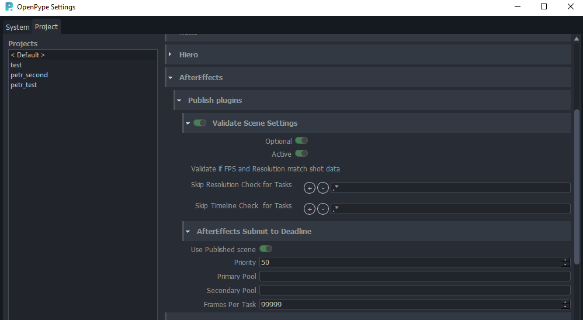

import Tabs from '@theme/Tabs';
import TabItem from '@theme/TabItem';

## AfterEffects settings

There is a couple of settings that could configure publishing process for **AfterEffects**.
All of them are Project based, eg. each project could have different configuration.

Location: Settings > Project > AfterEffects

## Publish plugins

### Validate Scene Settings

#### Skip Resolution Check for Tasks

Set regex pattern(s) to look for in a Task name to skip resolution check against values from DB.

#### Skip Timeline Check for Tasks

Set regex pattern(s) to look for in a Task name to skip `frameStart`, `frameEnd` check against values from DB.

### AfterEffects Submit to Deadline

* `Use Published scene` - Set to True (green) when Deadline should take published scene as a source instead of uploaded local one.
* `Priority` - priority of job on farm
* `Primary Pool` - here is list of pool fetched from server you can select from.
* `Secondary Pool`
* `Frames Per Task` - number of sequence division between individual tasks (chunks)
making one job on farm.

## Worfkile Builder

Obsolete way how to present artist with a template when they are working on new task.

## Templated Workfile Build Settings

This more advanced way allows creating more elaborate workfile templates with placeholders for loaded items or to create publishable item via Creator.

Workfile template must be prepared separately via Tray and in the host, then its location could be set for combination of:
- `Task types` (specific template for `animation`, different for `layout` etc.)
- `Task names` (regex supported )

Additional options:
- `Keep placeholders` - when template gets populated should placeholders be deleted? (In most cases yes.)
- `Create first version` - if template should be used and populated for version `v001` of a workfile automatically
