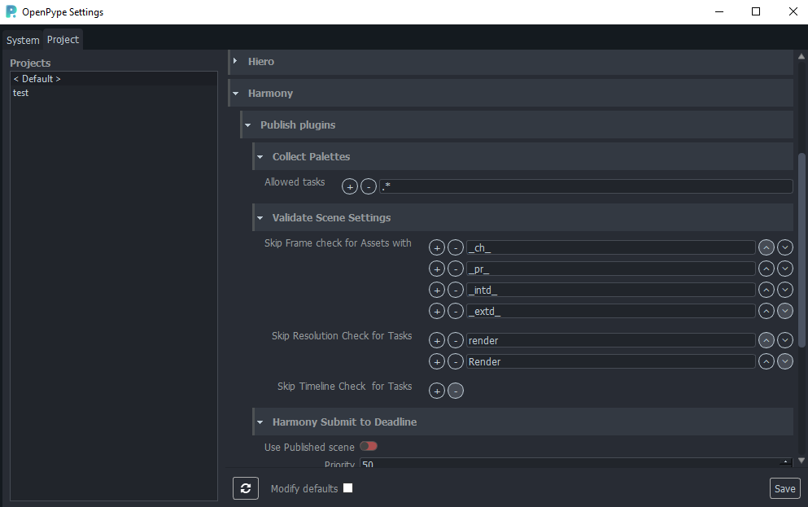

import Tabs from '@theme/Tabs';
import TabItem from '@theme/TabItem';

## ToonBoom Harmony settings

There is a couple of settings that could configure publishing process for **ToonBoom Harmony**.
All of them are Project based, eg. each project could have different configuration.

Location: Settings > Project > Harmony

## Publish plugins

### Collect Palettes

#### Allowed tasks

Set regex pattern(s) only for task names when publishing of Palettes should occur.

Use ".*" for publish Palettes for ALL tasks.

### Validate Scene Settings

#### Skip Frame check for Assets with

Set regex pattern(s) to find in Asset name to skip checks of `frameEnd` value from DB.

#### Skip Resolution Check for Tasks

Set regex pattern(s) to find in Task name to skip resolution check against values from DB.

#### Skip Timeline Check for Tasks

Set regex pattern(s) to find in Task name to skip `frameStart`, `frameEnd` check against values from DB.

### Harmony Submit to Deadline

* `Use Published scene` - Set to True (green) when Deadline should take published scene as a source instead of uploaded local one.
* `Priority` - priority of job on farm
* `Primary Pool` - here is list of pool fetched from server you can select from.
* `Secondary Pool`
* `Frames Per Task` - number of sequence division between individual tasks (chunks)
making one job on farm.

