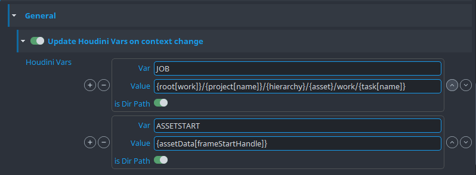
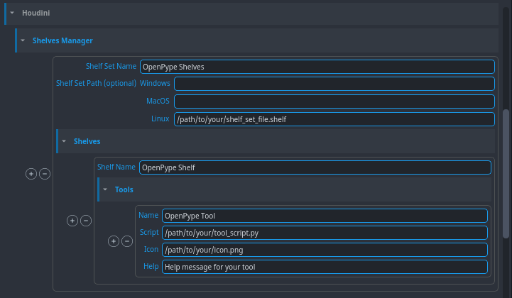

## General Settings
### Houdini Vars

Allows admins to have a list of vars (e.g. JOB) with (dynamic) values that will be updated on context changes, e.g. when switching to another asset or task.

Using template keys is supported but formatting keys capitalization variants is not, e.g. `{Asset}` and `{ASSET}` won't work

:::note
If `Treat as directory` toggle is activated, Openpype will consider the given value is a path of a folder.

If the folder does not exist on the context change it will be created by this feature so that the path will always try to point to an existing folder.
:::

Disabling `Update Houdini vars on context change` feature will leave all Houdini vars unmanaged and thus no context update changes will occur.

> If `$JOB` is present in the Houdini var list and has an empty value, OpenPype will set its value to `$HIP`

:::note
For consistency reasons we always force all vars to be uppercase.
e.g. `myvar` will be `MYVAR`
:::

## Shelves Manager
You can add your custom shelf set into Houdini by setting your shelf sets, shelves and tools in **Houdini -> Shelves Manager**.

The Shelf Set Path is used to load a .shelf file to generate your shelf set. If the path is specified, you don't have to set the shelves and tools.
