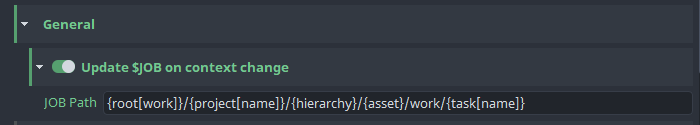

## General Settings
### JOB Path
you can add your studios preffered JOB Path, JOB value will be checked and updated on file save and open.
Disableing this option will effectivly turn off this feature.

JOB Path can be:
- Arbitrary hardcoded path
- Openpype template path
    > This allows dynamic values for assets or shots. 
    > Using template keys is supported but formatting keys capitalization variants is not,
    >   e.g. {Asset} and {ASSET} won't work
- empty
    > In this case, JOB will be synced to HIP

## Shelves Manager
You can add your custom shelf set into Houdini by setting your shelf sets, shelves and tools in **Houdini -> Shelves Manager**.

The Shelf Set Path is used to load a .shelf file to generate your shelf set. If the path is specified, you don't have to set the shelves and tools.
