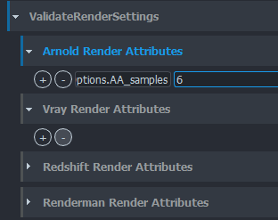
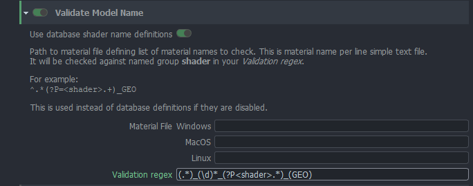
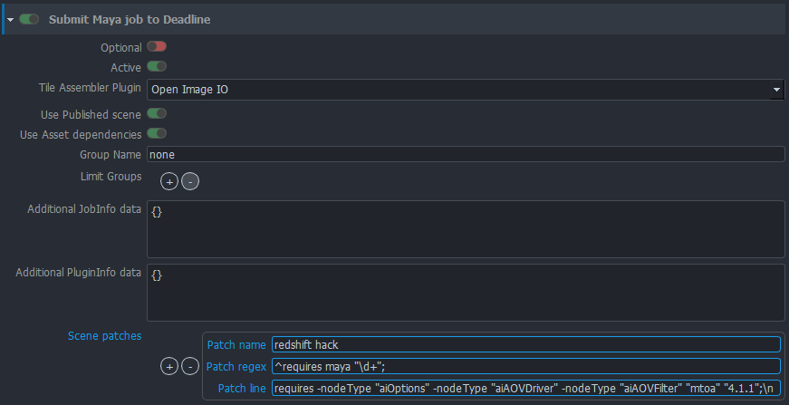
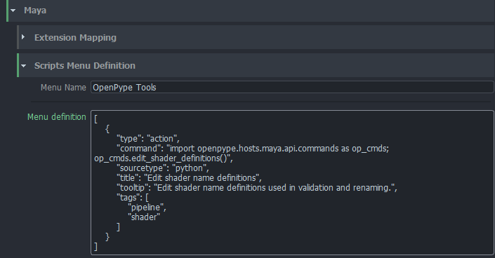
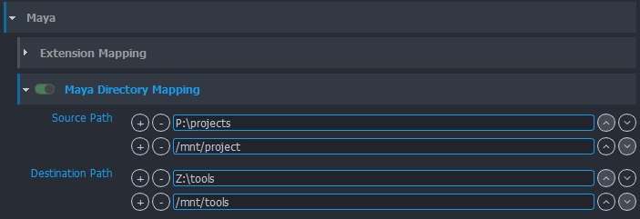

## Publish Plugins

### Render Settings Validator 

`ValidateRenderSettings`

Render Settings Validator is here to make sure artists will submit renders
we correct settings. Some of these settings are needed by OpenPype but some
can be defined by TD using [OpenPype Settings UI](admin_settings.md).

OpenPype enforced settings include:

- animation must be enabled in output
- render prefix must start with `maya/<scene>` to make sure renders are in
correct directory
- there must be `<renderlayer>` or its equivalent in different renderers in
file prefix
- if multiple cameras are to be rendered, `<camera>` token must be in file prefix

For **Vray**:
- AOV separator must be set to `_` (underscore)

For **Redshift**:
- all AOVs must follow `<BeautyPath>/<BeautyFile>_<RenderPass>` image file prefix
- AOV image format must be same as the one set in Output settings

For **Renderman**:
- both image and directory prefixes must comply to `<layer>_<aov>.<f4>.<ext>` and `<ws>/renders/maya/<scene>/<layer>` respectively

For **Arnold**:
- there shouldn't be `<renderpass>` token when merge AOVs option is turned on


Additional check can be added via Settings - **Project Settings > Maya > Publish plugin > ValidateRenderSettings**.
You can add as many options as you want for every supported renderer. In first field put node type and attribute
and in the second required value.



In this example we've put `aiOptions.AA_samples` in first one and `6` to second to enforce
Arnolds Camera (AA) samples to 6.

Note that `aiOptions` is not the name of node but rather its type. For renderers there is usually
just one instance of this node type but if that is not so, validator will go through all its
instances and check the value there. Node type for **VRay** settings is `VRaySettingsNode`, for **Renderman**
it is `rmanGlobals`, for **Redshift** it is `RedshiftOptions`.

### Model Name Validator 

`ValidateRenderSettings`

This validator can enforce specific names for model members. It will check them against **Validation Regex**.
There is special group in that regex - **shader**. If present, it will take that part of the name as shader name
and it will compare it with list of shaders defined either in file name specified in **Material File** or from
database file that is per project and can be directly edited from Maya's *OpenPype Tools > Edit Shader name definitions* when
**Use database shader name definitions** is on. This list defines simply as one shader name per line.



For example - you are using default regex `(.*)_(\d)*_(?P<shader>.*)_(GEO)` and you have two shaders defined
in either file or database `foo` and `bar`.

Object named `SomeCube_0001_foo_GEO` will pass but `SomeCube_GEO` will not and `SomeCube_001_xxx_GEO` will not too.

#### Top level group name
There is a validation for top level group name too. You can specify whatever regex you'd like to use. Default will
pass everything with `_GRP` suffix. You can use *named capturing groups* to validate against specific data. If you
put `(?P<asset>.*)` it will try to match everything captured in that group against current asset name. Likewise you can
use it for **subset** and **project** - `(?P<subset>.*)` and `(?P<project>.*)`.

**Example**

You are working on asset (shot) `0030_OGC_0190`. You have this regex in **Top level group name**:
```regexp
.*?_(?P<asset>.*)_GRP
```

When you publish your model with top group named like `foo_GRP` it will fail. But with `foo_0030_OGC_0190_GRP` it will pass.

:::info About regex
All regexes used here are in Python variant.
:::

### Maya > Deadline submitter
This plugin provides connection between Maya and Deadline. It is using [Deadline Webservice](https://docs.thinkboxsoftware.com/products/deadline/10.0/1_User%20Manual/manual/web-service.html) to submit jobs to farm.


You can set various aspects of scene submission to farm with per-project settings in **Setting UI**.

 - **Optional** will mark sumission plugin optional
 - **Active** will enable/disable plugin
 - **Tile Assembler Plugin** will set what should be used to assemble tiles on Deadline. Either **Open Image IO** will be used 
or Deadlines **Draft Tile Assembler**.
 - **Use Published scene** enable to render from published scene instead of scene in work area. Rendering from published files is much safer.
 - **Use Asset dependencies** will mark job pending on farm until asset dependencies are fulfilled - for example Deadline will wait for scene file to be synced to cloud, etc.
 - **Group name** use specific Deadline group for the job.
 - **Limit Groups** use these Deadline Limit groups for the job.
 - **Additional `JobInfo` data** JSON of additional Deadline options that will be embedded in `JobInfo` part of the submission data.
 - **Additional `PluginInfo` data** JSON of additional Deadline options that will be embedded in `PluginInfo` part of the submission data.
 - **Scene patches** - configure mechanism to add additional lines to published Maya Ascii scene files before they are used for rendering.
This is useful to fix some specific renderer glitches and advanced hacking of Maya Scene files. `Patch name` is label for patch for easier orientation.
`Patch regex` is regex used to find line in file, after `Patch line` string is inserted. Note that you need to add line ending.

## Custom Menu
You can add your custom tools menu into Maya by extending definitions in **Maya -> Scripts Menu Definition**.


:::note Work in progress
This is still work in progress. Menu definition will be handled more friendly with widgets and not
raw json.
:::

## Multiplatform path mapping
You can configure path mapping using Maya `dirmap` command. This will add bi-directional mapping between
list of paths specified in **Settings**. You can find it in **Settings -> Project Settings -> Maya -> Maya Directory Mapping**

