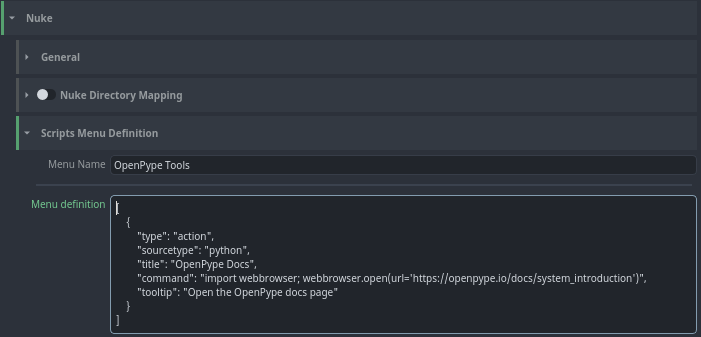
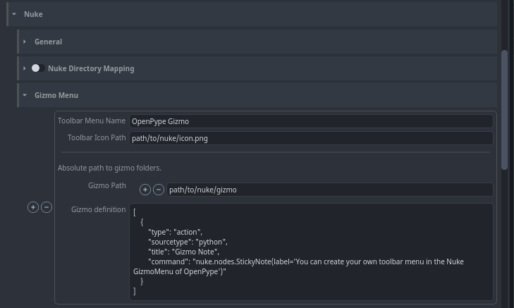

## Custom Menu
You can add your custom tools menu into Nuke by extending definitions in **Nuke -> Scripts Menu Definition**.

:::note Work in progress
This is still work in progress. Menu definition will be handled more friendly with widgets and not
raw json.
:::

## Gizmo Menu
You can add your custom toolbar menu into Nuke by setting your gizmo path and extending definitions in **Nuke -> Gizmo Menu**.

