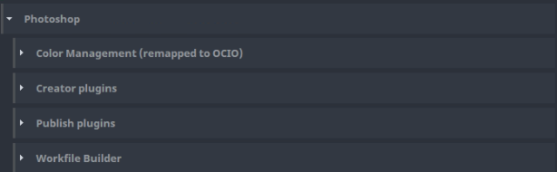

import Tabs from '@theme/Tabs';
import TabItem from '@theme/TabItem';

## Photoshop settings

There is a couple of settings that could configure publishing process for **Photoshop**.
All of them are Project based, eg. each project could have different configuration.

Location: Settings > Project > Photoshop

## Color Management (ImageIO)

Placeholder for Color Management. Currently not implemented yet.

## Creator plugins

Contains configurable items for creators used during publishing from Photoshop.

### Create Image

Provides list of [variants](artist_concepts.md#variant) that will be shown to an artist in Publisher. Default value `Main`.

### Create Flatten Image

Provides simplified publishing process. It will create single `image` instance for artist automatically. This instance will
produce flatten image from all visible layers in a workfile.

- Review - should be separate review created for this instance

### Create Review

Creates single `review` instance automatically. This allows artists to disable it if needed.

### Create Workfile

Creates single `workfile` instance automatically. This allows artists to disable it if needed.

## Publish plugins

Contains configurable items for publish plugins used during publishing from Photoshop.

### Collect Color Coded Instances

Used only in remote publishing!

Allows to create automatically `image` instances for configurable highlight color set on layer or group in the workfile.

#### Create flatten image
  - Flatten with images - produce additional `image` with all published `image` instances merged
  - Flatten only - produce only merged `image` instance
  - No - produce only separate `image` instances

#### Subset template for flatten image

Template used to create subset name automatically (example `image{layer}Main` - uses layer name in subset name)

### Collect Review

Disable if no review should be created

### Collect Version

If enabled it will push version from workfile name to all published items. Eg. if artist is publishing `test_asset_workfile_v005.psd`
produced `image` and `review` files will contain `v005` (even if some previous version were skipped for particular family).

### Validate Containers

Checks if all imported assets to the workfile through `Loader` are in latest version. Limits cases that older version of asset would be used.

If enabled, artist might still decide to disable validation for each publish (for special use cases).
Limit this optionality by toggling `Optional`.
`Active` toggle denotes that by default artists sees that optional validation as enabled.

### Validate naming of subsets and layers

Subset cannot contain invalid characters or extract to file would fail

#### Regex pattern of invalid characters

Contains weird characters like `/`, `/`, these might cause an issue when file (which contains subset name) is created on OS disk.

#### Replacement character

Replace all offending characters with this one. `_` is default.

### Extract Image

Controls extension formats of published instances of `image` family. `png` and `jpg` are by default.

### Extract Review

Controls output definitions of extracted reviews to upload on Asset Management (AM).

#### Makes an image sequence instead of flatten image

If multiple `image` instances are produced, glue created images into image sequence (`mov`) to review all of them separetely.
Without it only flatten image would be produced.

#### Maximum size of sources for review

Set Byte limit for review file. Applicable if gigantic `image` instances are produced, full image size is unnecessary to upload to AM.

#### Extract jpg Options

Handles tags for produced `.jpg` representation. `Create review` and `Add review to Ftrack` are defaults.

#### Extract mov Options

Handles tags for produced `.mov` representation. `Create review` and `Add review to Ftrack` are defaults.

### Workfile Builder

Allows to open prepared workfile for an artist when no workfile exists. Useful to share standards, additional helpful content in the workfile.

Could be configured per `Task type`, eg. `composition` task type could use different `.psd` template file than `art` task.
Workfile template must be accessible for all artists.
(Currently not handled by [SiteSync](module_site_sync.md))
