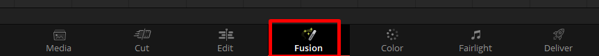
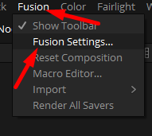
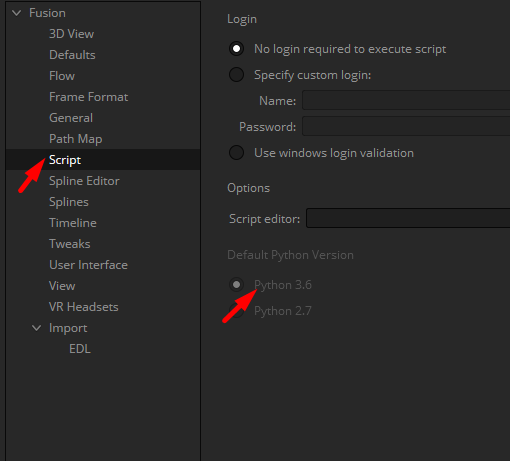

import Tabs from '@theme/Tabs';
import TabItem from '@theme/TabItem';

## Resolve requirements
Due to the way resolve handles python and python scripts there are a few steps required steps needed to be done on any machine that will be using OpenPype with resolve.

### Installing Resolve's own python 3.6 interpreter.
Resolve uses a hardcoded method to look for the python executable path. All of tho following paths are defined automatically by Python msi installer. We are using Python 3.6.2.

<Tabs
  groupId="platforms"
  defaultValue="win"
  values={[
    {label: 'Windows', value: 'win'},
    {label: 'Linux', value: 'linux'},
    {label: 'Mac', value: 'mac'},
  ]}>

<TabItem value="win">

`%LOCALAPPDATA%\Programs\Python\Python36`

</TabItem>
<TabItem value="linux">

`/opt/Python/3.6/bin`

</TabItem>
<TabItem value="mac">

`~/Library/Python/3.6/bin`

</TabItem>
</Tabs>


### Installing PySide2 into python 3.6 for correct gui work

OpenPype is using its own window widget inside Resolve, for that reason PySide2 has to be installed into the python 3.6 (as explained above).

<Tabs
  groupId="platforms"
  defaultValue="win"
  values={[
    {label: 'Windows', value: 'win'},
    {label: 'Linux', value: 'linux'},
    {label: 'Mac', value: 'mac'},
  ]}>

<TabItem value="win">

paste to any terminal of your choice

```bash
%LOCALAPPDATA%\Programs\Python\Python36\python.exe -m pip install PySide2
```

</TabItem>
<TabItem value="linux">

paste to any terminal of your choice

```bash
/opt/Python/3.6/bin/python -m pip install PySide2
```

</TabItem>
<TabItem value="mac">

paste to any terminal of your choice

```bash
~/Library/Python/3.6/bin/python -m pip install PySide2
```

</TabItem>
</Tabs>

<div class="row markdown">

### Set Resolve's Fusion settings for Python 3.6 interpereter

<div class="col col--6 markdown">


As it is shown in below picture you have to go to Fusion Tab and then in Fusion menu find Fusion Settings. Go to Fusion/Script and find Default Python Version and switch to Python 3.6

</div>

<div class="col col--6 markdown">





</div>
</div>