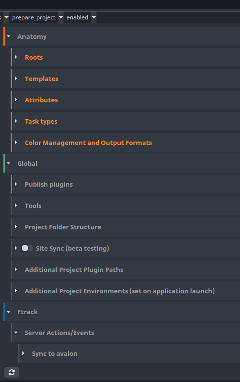
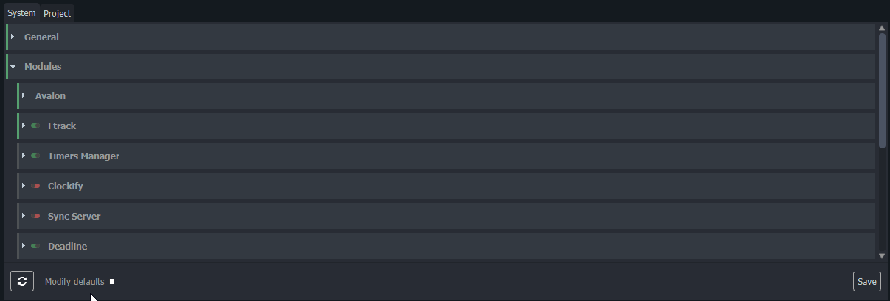
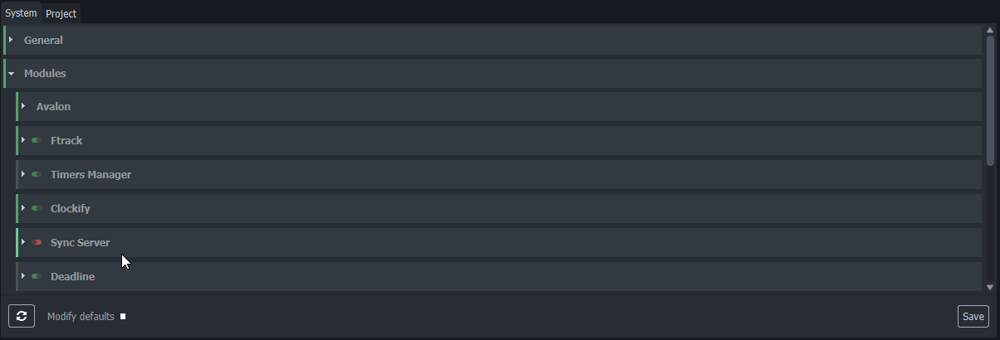
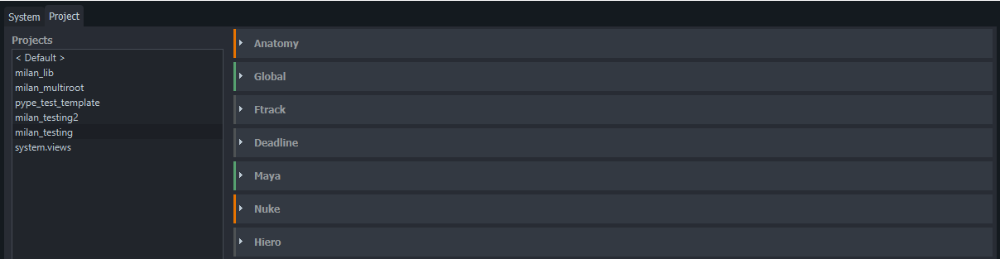
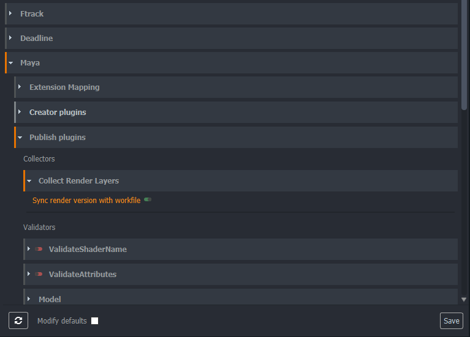

import Tabs from '@theme/Tabs';
import TabItem from '@theme/TabItem';

OpenPype stores all of it's settings and configuration in the mongo database. To make the configuration as easy as possible we provide a robust GUI where you can access and change everything that is configurable

**Settings** GUI can be started from the tray menu Admin -> Studio Settings.

Please keep in mind that these settings are set-up for the full studio and not per-individual. If you're looking for individual artist settings, you can head to 
[Local Settings](admin_settings_local.md) section in the artist documentation.

## Categories

We use simple colour coding to show you any changes to the settings:
- **Grey**: [OpenPype default](#openpype-defaults)
- **Green**: [Studio default](#openpype-defaults)
- **Orange**: [Project Override](#project-overrides)
- **Blue**: Changed and unsaved value

You'll find that settings are split into categories:

### System

System sections contains all settings that can be configured on a studio level, but cannot
be changed on a per-project basis. These include mostly high level options like path to
mongo database, toggling major modules on and off and configuring studio wide application
availability. 

### Project

Project tab contains most of OpenPype settings and all of them can be configured and overridden on a per-project basis if need be. This includes most of the workflow behaviors 
like what formats to export, naming conventions, publishing validations, automatic assets loaders and a lot more. 

We recommend to try to keep as many configurations as possible on a studio level and only override selectively, because micromanaging all of the project settings might become cumbersome down the line. Most of the settings can be safely adjusted and locked on a project
after the production started.

## Understanding Overrides

Most of the individual settings can be set and overridden on multiple levels. 

### OpenPype defaults
When you first open settings all of the values and categories will be marked with a 
light **grey labels** or a **grey vertical bar** on the left edge of the expandable category. 

That means, the value has been left at OpenPype Default. If the default changes in future 
OpenPype versions, these values will be reflect the change after you deploy the new version.

### Studio defaults

Any values that you change and then press save in the bottom right corner, will be saved
as studio defaults. This means they will stay at those values even if you update your pype. 
To make it clear which settings are set by you specifically, they are marked with a **green 
edge** and **green labels**, once set.

To set studio default, just change the value in the system tab and press save. If you want
to keep the value but add the option to your studio default to protect it from potential
future updates, you ran `right click` and choose `add to studio default`, then press save.

In the Project settings tab, you need to select the **( Default )** project on the left, to set your studio defaults for projects. The rest works the same as in the System tab.

You can also reset any settings to OpenPype default by doing `right click` and `remove from studio default`

### Project Overrides

Many settings are useful to be adjusted on a per-project basis. To identify project
overrides, they are marked with **orange edge** and **orange labels** in the settings GUI.

To set project overrides proceed the same way as with the Studio defaults, but first select 
a particular project you want to be configuring on the left hand side of the Project Settings tab. 

Here you can see all three overrides at the same time. Deadline has not studio changes at all, Maya has some studio defaults configures and Nuke also contains project specific overrides.

Override colours work as breadcrumbs to allow quick identification of what was changed and where. As you can see on this image, Orange colour is propagated up the hierarchy even though only a single value (sync render version with workfile toggle), was changed.

