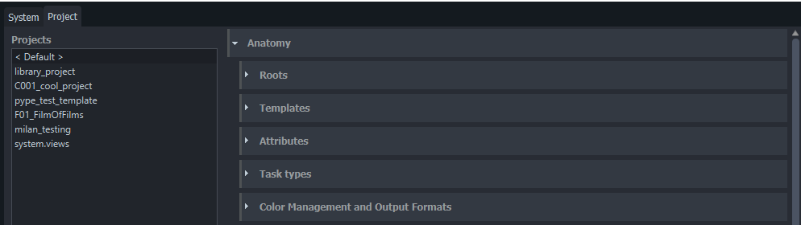
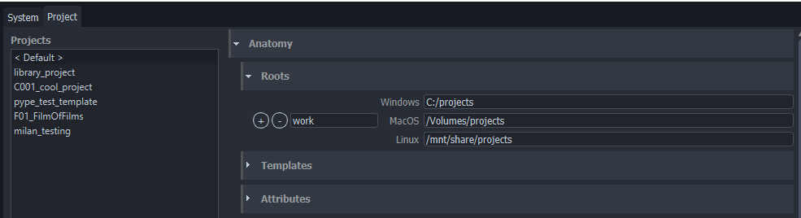
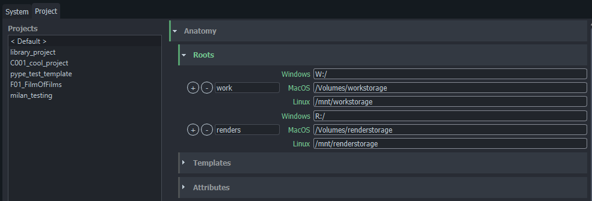
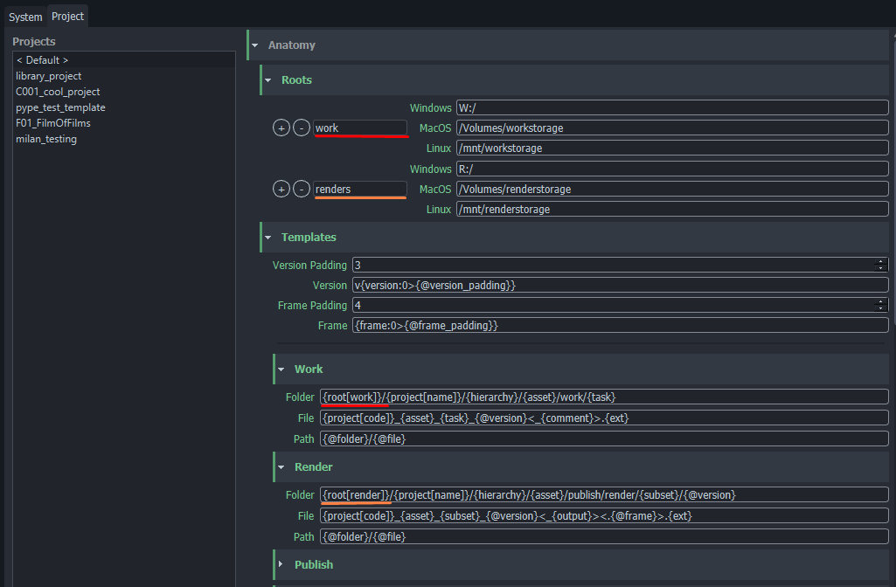

import Tabs from '@theme/Tabs';
import TabItem from '@theme/TabItem';

Project Anatomy is the most important configuration piece for each project you work on with openPype. 

It defines: 
- Project Root folders
- File naming conventions
- Folder structure templates
- Default project attributes
- Task Types
- Applications and Tool versions
- Colour Management
- File Formats 

Anatomy is the only configuration that is always saved as project override. This is to make sure, that any updates to OpenPype or Studio default values, don't affect currently running productions.

## Roots

Roots define where files are stored with path to shared folder.  It is required to set root path for each platform you are using in studio. All paths must point to same folder!

It is possible to set multiple roots when necessary. That may be handy when you need to store specific type of data on another disk.

Note how multiple roots are used here, to push different types of files to different shared storage.

## Templates

Templates define project's folder structure and filenames. 

We have a few required anatomy templates for OpenPype to work properly, however we keep adding more when needed.

### Available template keys

| Context key | Description |
| --- | --- |
| `root[name]` | Path to root folder |
| `project[name]` | Project's full name |
| `project[code]` | Project's code |
| `hierarchy` | All hierarchical parents as subfolders |
| `asset` | Name of asset or shot |
| `task[name]` | Name of task |
| `task[type]` | Type of task |
| `task[short]` | Short name of task type (eg. 'Modeling' > 'mdl') |
| `parent` | Name of hierarchical parent |
| `version` | Version number |
| `subset` | Subset name |
| `family` | Main family name |
| `ext` | File extension |
| `representation` | Representation name |
| `frame` | Frame number for sequence files. |
| `output` |  |
| `comment` |  |

| Date-Time key | Example result | Description |
| --- | --- | --- |
| `d` | 1, 30 | Short day of month |
| `dd` | 01, 30 | Day of month with 2 digits. |
| `ddd` | Mon | Shortened week day name. |
| `dddd` | Monday | Full week day name. |
| `m` | 1, 12 | Short month number. |
| `mm` | 01, 12 | Month number with 2 digits. |
| `mmm` | Jan | Shortened month name. |
| `mmmm` | January | Full month name. |
| `yy` | 20 | Shortened year. |
| `yyyy` | 2020 | Full year. |
| `H` | 4, 17 | Shortened 24-hour number. |
| `HH` | 04, 17 | 24-hour number with 2 digits. |
| `h` | 5 | Shortened 12-hour number. |
| `hh` | 05 | 12-hour number with 2 digits. |
| `ht` | AM, PM | Midday part. |
| `M` | 0 | Shortened minutes number. |
| `MM` | 00 | Minutes number with 2 digits. |
| `S` | 0 | Shortened seconds number. |
| `SS` | 00 | Seconds number with 2 digits. |

## Attributes

## Task Types

## Colour Management and Formats