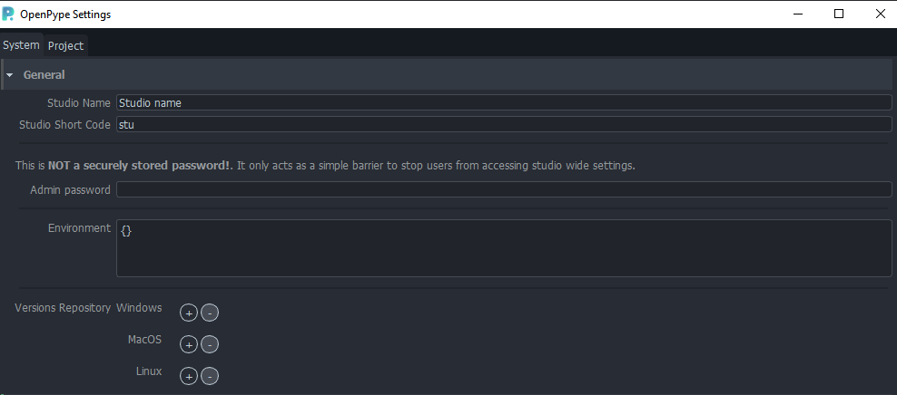
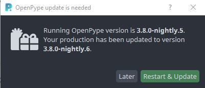
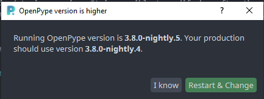
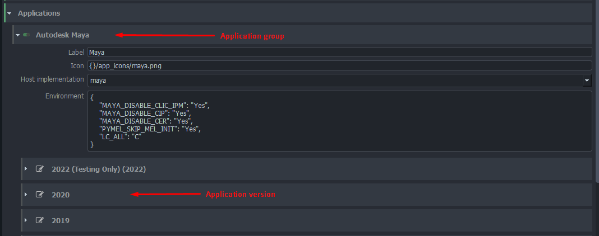
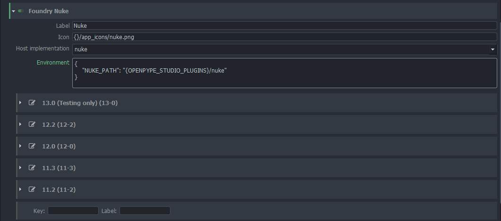
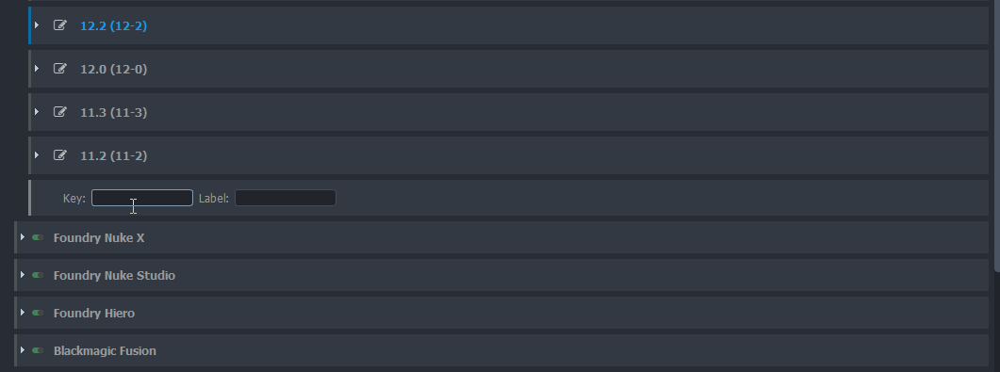
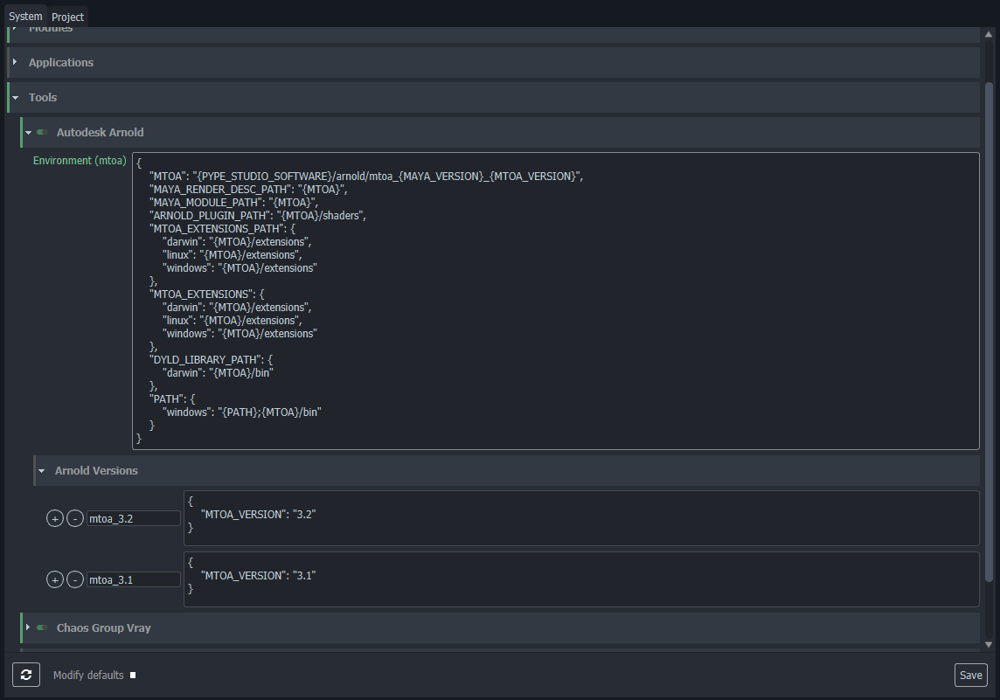

import Tabs from '@theme/Tabs';
import TabItem from '@theme/TabItem';

## General

Settings applicable to the full studio.



**`Studio Name`** - Full name of the studio (can be used as variable on some places)

**`Studio Code`** - Studio acronym or a short code (can be used as variable on some places)

**`Admin Password`** - After setting admin password, normal user won't have access to OpenPype settings
and Project Manager GUI. Please keep in mind that this is a studio wide password and it is meant purely
as a naive barier to prevent artists from accidental setting changes.

**`Environment`** - Globally applied environment variables that will be appended to any OpenPype process in the studio.

**`Disk mapping`** - Platform dependent configuration for mapping of virtual disk(s) on an artist's OpenPype machines before OP starts up. 
Uses `subst` command, if configured volume character in `Destination` field already exists, no re-mapping is done for that character(volume).

### OpenPype deployment control
**`Versions Repository`** - Location where automatic update mechanism searches for zip files with
OpenPype update packages. To read more about preparing OpenPype for automatic updates go to [Admin Distribute docs](admin_distribute.md#2-openpype-codebase)

**`Production version`** - Define what is current production version. When value is not set then latest version available in versions repository is resolved as production version.

**`Staging version`** - Define what is current staging version. When value is not set then latest staging version available in versions repository is resolved as staging version.

For more information about Production and Staging go to [Distribute](admin_distribute.md#staging-vs-production).

**Production version** and **Staging version** fields will define which version will be used in studio. Filling explicit version will force new OpenPype processes to use it. That gives more control over studio deployment especially when some workstations don't have access to version repository (e.g. remote users). It can be also used to downgrade studio version when newer version have production breaking bug.

When fields are not filled the latest version in versions repository is used as studio version. That makes updating easier as it is not needed to modify settings but workstations without access to versions repository can't find out which OpenPype version should be used.

If version repository is not set or is not accessible for workstation the latest available version on workstation is used or version inside build.

**`Version check interval`** - OpenPype tray application check if currently used OpenPype version is up to date with production/staging version. It is possible to modify how often the validation is triggered in minutes. It is possible to set the interval to `0`. That will turn off version validations but it is not recommend.

A dialog asking for restart is shown when OpenPype tray application detect that different version should be used.



## Modules

Configuration of OpenPype modules. Some can only be turned on and off, others have
their own attributes that need to be set, before they become fully functional.

### Avalon

**`Avalon Mongo Timeout`** - You might need to change this if your mongo connection is a bit slow. Making the 
timeout longer will give Avalon better chance to connect.

**`Thumbnail Storage Location`** - simple disk storage path, where all thumbnails will be stored. 

### Ftrack

**`Server`** - URL of your ftrack server.

Additional Action paths

**`Action paths`** - Directories containing your custom ftrack actions.

**`Event paths`** - Directories containing your custom ftrack event plugins.

**`Intent`** - Special ftrack attribute that mark the intention of individual publishes. This setting will be reflected
in publisher as well as ftrack custom attributes

**`Custom Attributes`** - Write and Read permissions for all OpenPype required ftrack custom attributes. The values should be
ftrack roles names.

### Sync Server

Disable/Enable OpenPype site sync feature

### Standalone Publisher

Disable/Enable Standalone Publisher option

### Deadline

**`Deadline Rest URL`** - URL to deadline webservice that. This URL must be reachable from every 
workstation that should be submitting render jobs to deadline via OpenPype.

### Muster

**`Muster Rest URL`** - URL to Muster webservice that. This URL must be reachable from every 
workstation that should be submitting render jobs to muster via OpenPype.

**`templates mapping`** - you can customize Muster templates to match your existing setup here. 

### Clockify

**`Workspace Name`** - name of the clockify workspace where you would like to be sending all the timelogs.

### Timers Manager

**`Max Idle Time`** - Duration (minutes) of inactivity, after which currently running timer will be stopped.

**`Dialog popup time`** - Time in minutes, before the end of Max Idle ti, when a notification will alert 
the user that their timer is about to be stopped.

### Idle Manager

Service monitoring the activity, which triggers the Timers Manager timeouts.

### Logging 

Module that allows storing all logging into the database for easier retrieval and support.

## Applications

In this section you can manage what Applications are available to your studio, locations of their 
executables and their additional environments. In OpenPype context each application that is integrated is 
also called a `Host` and these two terms might be used interchangeably in the documentation.

Each Host is made of two levels. 
1. **Application group** - This is the main name of the application and you can define extra environments
that are applicable to all versions of the given application. For example any extra Maya scripts that are not
version dependent, can be added to `Maya` environment here.
2. **Application versions** - Here you can define executables (per platform) for each supported version of 
the DCC and any default arguments (`--nukex` for instance). You can also further extend it's environment. 



### Environments

Please keep in mind that the environments are not additive by default, so if you are extending variables like 
`PYTHONPATH`, or `PATH` make sure that you add themselves to the end of the list. 

For instance:

```json
{
    "PYTHONPATH": [
        "my/path/to/python/scripts",
        "{PYTHONPATH}"
    ]
}
```

### Adding versions

It is possible to add new version for any supported application. There are two ways of doing it. 

1. **Add new executable** to an existing application version. This is a good way if you have multiple fully compatible versions of your DCC across the studio. Nuke is a typical example where multiple artists might have different `v#` releases of the same minor Nuke release. For example `12.2v3` and `12.3v6`. When you add both to `12.2` Nuke executables they will be treated the same in OpenPype and the system will automatically pick the first that it finds on an artist machine when launching. Their order is also the order of their priority when choosing which version to run if multiple are present.


2. **Add version** in case you want this version to be selectable individually. This is usually used for bigger releases that might not be fully compatible with previous versions. Keep in mind that if you add the latest version of an Application that is not yet part of the official OpenPype release, you might run into problems with integration. We test all the new software versions for compatibility and most often, smaller or bigger updates to OpenPype code are necessary to keep everything running.


## Tools

A tool in openPype is anything that needs to be selectively added to your DCC applications. Most often these are plugins, modules, extensions or similar depending on what your package happens to call it. 

OpenPype comes with some major CG renderers pre-configured as an example, but these and any others will need to be changed to match your particular environment.

Their environment settings are split to two levels just like applications to allow more flexibility when setting them up. 

In the image before you can see that we set most of the environment variables in the general MTOA level, and only specify the version variable in the individual versions below. Because all environments within pype setting will resolve any cross references, this is enough to get a fully dynamic plugin loading as far as your folder structure where you store the plugins is nicely organized. 


In this example MTOA will automatically will the `MAYA_VERSION`(which is set by Maya Application environment) and `MTOA_VERSION` into the `MTOA` variable. We then use the `MTOA` to set all the other variables needed for it to function within Maya. 


All of the tools defined in here can then be assigned to projects. You can also change the tools versions on any project level all the way down to individual asset or shot overrides. So if you just need to upgrade you render plugin for a single shot, while not risking the incompatibilities on the rest of the project, it is possible.