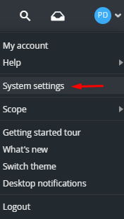
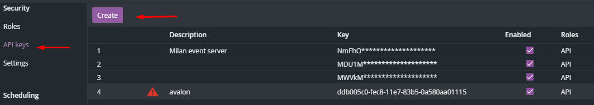
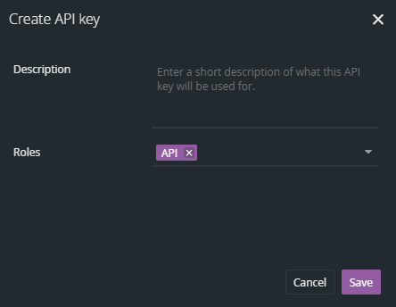
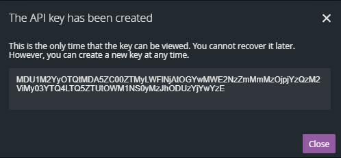
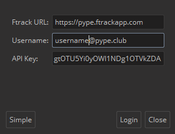
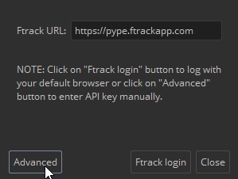

# How to use Ftrack in OpenPype

## Login to Ftrack module in OpenPype (best case scenario) 
1. Launch OpenPype and go to systray OpenPype icon.
2. *Ftrack login* window pop up on start or press **login** in **Ftrack menu** to pop up *Ftrack login* window

    

   - Press `Ftrack` button
   
        
   - Web browser opens
   
   - Sign into Ftrack if requested. If you are already signed in to Ftrack via web browser, you can jump to [Application launch](#application-launch-best-case-scenario)

    

3. Message is shown

4. Close message and you're ready to use actions - continue with [Application launch](#application-launch-best-case-scenario)

---

## Application launch (best case scenario)
1. Make sure OpenPype is running and you passed [Login to Ftrack](#login-to-ftrack-module-in-openpype-best-case-scenario) guide
   
2. Open Web browser and go to your studio Ftrack web page *(e.g. https://mystudio.ftrackapp.com/)*
   
3. Locate the task to run the application on.
   
4. Display actions for the task
    
   
5. Select application you want to launch
    - application versions may be grouped to one action. In that case, press the action to reveal versions to choose from *(like Maya in the picture)*, only applications permitted on the particular project will appear. 
    
   
6. Start working ;)

---

## Change Ftrack user
1. Log out the previous user from Ftrack Web app *(skip if new is already logged)*

    

2. Log out the previous user from Ftrack module in OpenPype tray

  

3. Follow [Login to Ftrack](#login-to-ftrack-module-in-openpype-best-case-scenario) guide

---

## Where to find API key
- Your API key can be found in Ftrack. In the upper right corner of Ftrack click on the avatar, choose System settings. 
- You shouldn't need to use your personal API key if previous steps went through correctly
  
    

- Scroll down in left panel and select `API keys`. Then pick `Create` button.
  
    

- New window will pop up. Choose the `API role` and press `Save`
  
    

- Then your new API will be created. 
  
    

- Copy them and put it into the Ftrack login window.
  
    

---
## What if...

### Ftrack login window didn't pop up and Ftrack menu is not in tray
**1. possibility - OpenPype didn't load properly**
- try to restart OpenPype

**2. possibility - Ftrack is not set in OpenPype**
- inform your administrator or supervisor

### Web browser did not open
**1. possibility - button was not pressed**
- Try to press again the `Ftrack` button in *Ftrack login* window

**2. possibility - Ftrack URL is not set or is not right**
- Check **Ftrack URL** value in *Ftrack login* window
- Inform your administrator if URL is incorrect and launch OpenPype again when administrator fix it
- The Ftrack URL can be changed in OpenPype Settings → System → Modules → Ftrack 

**3. possibility - Ftrack Web app can't be reached the way OpenPype use it**
- Enter your **Username** and [API key](#where-to-find-api-key) in *Ftrack login* window and press **Login** button

  
### Ftrack action menu is empty
**1. possibility - OpenPype is not running**
- launch OpenPype and check if it is running in systray

**2. possibility - You didn't go through Login to Ftrack guide**
- please go through [Login to Ftrack](#login-to-ftrack-module-in-openpype-best-case-scenario) guide

**3. possibility - User logged to Ftrack Web is not the same as user logged to Ftrack module in tray**
- Follow [Change user](#change-ftrack-user) guide

**4. possibility - Project doesn't have applications set correctly**
- ask your Project Manager to check if he set applications for the project
