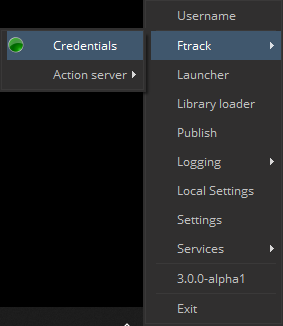
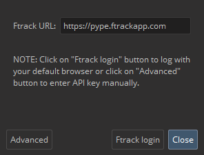
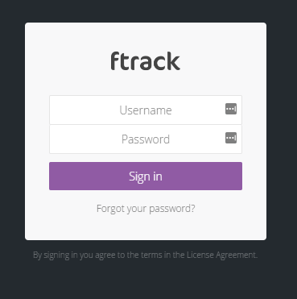
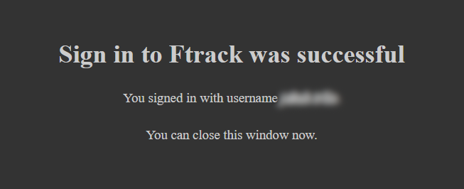
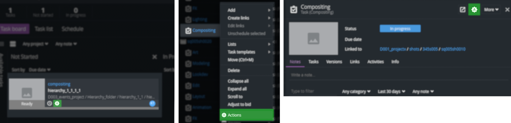
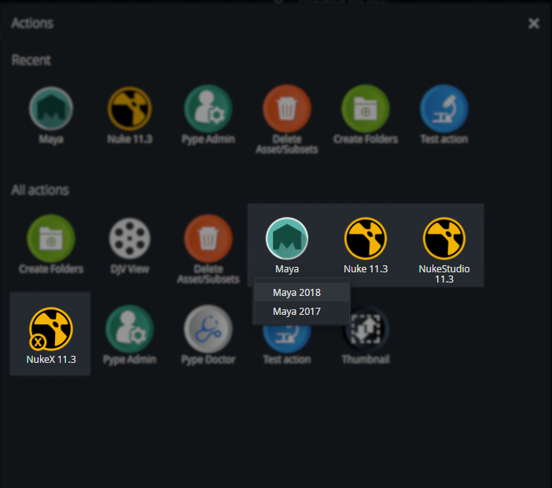
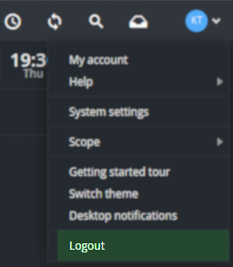
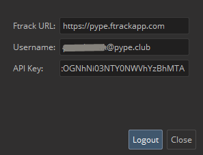

# How to use Ftrack in Pype

## Login to Ftrack module in Pype tray (best case scenario)
1. Launch Pype tray if not launched yet
2. *Ftrack login* window pop up on start
    - or press **login** in **Ftrack menu** to pop up *Ftrack login* window

    

3. Press `Ftrack` button

4. Web browser opens
5. Sign in Ftrack if you're requested

6. Message is shown

7. Close message and you're ready to use actions - continue with [Application launch](#application-launch-best-case-scenario)

---
## Application launch (best case scenario)
1. Make sure Pype tray is running and you passed [Login to Ftrack](#login-to-ftrack-module-in-pype-tray-best-case-scenario) guide
2. Open web browser and go to your studio Ftrack web page *(e.g. https://mystudio.ftrackapp.com/)*
3. Locate the task on which you want to run the application
4. Display actions for the task
    
5. Select application you want to launch
    - application versions may be grouped to one action in that case press the action to reveal versions to choose *(like Maya in the picture)*
    
6. Work

---
## Change Ftrack user
1. Log out the previous user from Ftrack Web app *(skip if new is already logged)*

2. Log out the previous user from Ftrack module in tray

3. Follow [Login to Ftrack](#login-to-ftrack-module-in-pype-tray-best-case-scenario) guide

---
## What if...

### Ftrack login window didn't pop up and Ftrack menu is not in tray
**1. possibility - Pype tray didn't load properly**
- try to restart tray

**2. possibility - Ftrack is not set in Pype**
- inform your administrator

### Web browser did not open
**1. possibility - button was not pressed**
- Try to press again the `Ftrack` button in *Ftrack login* window

**2. possibility - Ftrack URL is not set or is not right**
- Check **Ftrack URL** value in *Ftrack login* window
- Inform your administrator if URL is incorrect and launch tray again when administrator fix it

**3. possibility - Ftrack Web app can't be reached the way Pype use it**
- Enter your **Username** and [API key](#where-to-find-api-key) in *Ftrack login* window and press **Login** button

### Ftrack action menu is empty
**1. possibility - Pype tray is not running**
- launch Pype tray

**2. possibility - You didn't go through Login to Ftrack guide**
- please go through [Login to Ftrack](#login-to-ftrack-module-in-pype-tray-best-case-scenario) guide

**3. possibility - User logged to Ftrack Web is not the same as user logged to Ftrack module in tray**
- Follow [Change user](#change-user) guide

**4. possibility - Project don't have set applications**
- ask your Project Manager to check if he set applications for the project
