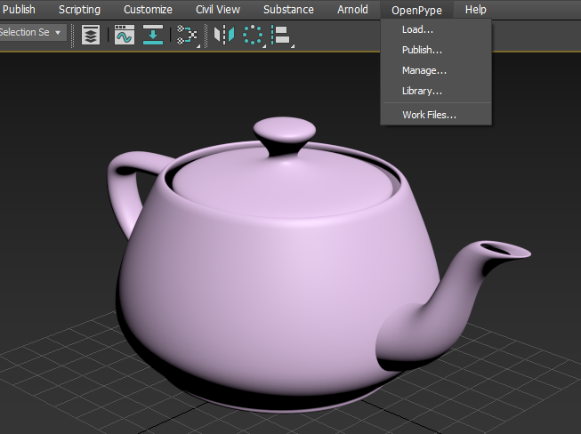

:::note Work in progress
This part of documentation is still work in progress.
:::

<!-- ## OpenPype Global Tools

-   [Set Context](artist_tools_context_manager)
-   [Work Files](artist_tools_workfiles)
-   [Create](artist_tools_creator)
-   [Load](artist_tools_loader)
-   [Manage (Inventory)](artist_tools_inventory)
-   [Publish](artist_tools_publisher)
-   [Library Loader](artist_tools_library_loader)
-->


## First Steps With OpenPype

Locate **OpenPype Icon** in the OS tray (if hidden dive in the tray toolbar).

> If you cannot locate the OpenPype icon ...it is not probably running so check [Getting Started](artist_getting_started.md) first.

By clicking the icon  ```OpenPype Menu``` rolls out.

Choose ```OpenPype Menu > Launcher``` to open the ```Launcher``` window.

When opened you can **choose** the **project** to work in from the list. Then choose the particular **asset** you want to work on then choose **task** 
and finally **run 3dsmax by its icon** in the tools.


:::note Launcher Content
The list of available projects, assets, tasks and tools will differ according to your Studio and need to be set in advance by supervisor/admin.
:::

## Running in the 3dsmax

If 3dsmax has been launched via OP Launcher there should be **OpenPype Menu** visible in 3dsmax **top header** after start.
This is the core functional area for you as a user. Most of your actions will take place here.


:::note OpenPype Menu
User should use this menu exclusively for **Opening/Saving** when dealing with work files not standard ```File Menu``` even though user still being able perform file operations via this menu but prefferably just performing quick saves during work session not saving actual workfile versions.
:::

## Working With Scene Files

In OpenPype menu first go to ```Work Files``` menu item so **Work Files  Window** shows up.

 Here you can perform Save / Load actions as you would normally do with ```File Save ``` and ```File Open``` in the standard 3dsmax ```File Menu``` and navigate to different project components like assets, tasks, workfiles etc.


You first choose particular asset and assigned task and corresponding workfile you would like to open.

If not any workfile present simply hit ```Save As``` and keep ```Subversion``` empty and hit ```Ok```.


OpenPype correctly names it and add version to the workfile. This basically happens whenever user trigger ```Save As``` action. Resulting into incremental version numbers like 

```workfileName_v001```

```workfileName_v002```

 etc. 

Basically meaning user is free of guessing what is the correct naming and other neccessities to keep everthing in order and managed.

> Note: user still has also other options for naming like ```Subversion```, ```Artist's Note``` but we won't dive into those now.

Here you can see resulting work file after ```Save As``` action.


## Understanding Context

As seen on our example OpenPype created pretty first workfile and named it ```220901_couch_modeling_v001.max``` meaning it sits in the Project ```220901``` being it ```couch``` asset and workfile being ```modeling``` task and obviously ```v001``` telling user its first existing version of this workfile.

It is good to be aware that whenever you as a user choose ```asset``` and ```task``` you happen to be in so called **context** meaning that all user actions are in relation with particular ```asset```. This could be quickly seen in host application header and ```OpenPype Menu``` and its accompanying tools.


> Whenever you choose different ```asset``` and its ```task``` in **Work Files window** you are basically changing context to the current asset/task you have chosen.


This concludes the basics of working with workfiles in 3dsmax using OpenPype and its tools. Following chapters will cover other aspects like creating multiple assets types and their publishing for later usage in the production.

---

## Creating and Publishing Instances

:::warning Important
Before proceeding further please check [Glossary](artist_concepts.md) and [What Is Publishing?](artist_publish.md) So you have clear idea about terminology.
:::


### Intro

Current OpenPype integration (ver 3.15.0) supports only ```PointCache``` and ```Camera``` families now.

**Pointcache** family being basically any geometry outputted as Alembic cache (.abc) format

**Camera** family being 3dsmax Camera object with/without animation outputted as native .max, FBX, Alembic format


---

:::note Work in progress
This part of documentation is still work in progress.
:::

## ...to be added


<!-- 
Publishing models in 3dsmax is pretty straightforward. Create your model as you
need. You might need to adhere to specifications of your studio that can be different
between studios and projects but by default your geometry does not need any
other convention.



### Creating instance

Now create **Model instance** from it to let OpenPype know what in the scene you want to
publish. Go **OpenPype → Create... → Model**.


`Asset` field is a name of asset you are working on - it should be already filled
with correct name as you've started Blender or switched context to specific asset. You
can edit that field to change it to different asset (but that one must already exists).

`Subset` field is a name you can decide on. It should describe what kind of data you
have in the model. For example, you can name it `Proxy` to indicate that this is
low resolution stuff. See [Subset](artist_concepts.md#subset).

<!-- :::note LOD support
By changing subset name you can take advantage of _LOD support_ in OpenPype. Your
asset can contain various resolution defined by different subsets. You can then
switch between them very easy using [Inventory (Manage)](artist_tools_inventory).
There LODs are conveniently grouped so they don't clutter Inventory view.

Name your subset like `main_LOD1`. Important part is that `_LOD1`. You can have as many LODs as you need.
::: -->

<!--
Read-only field just under it show final subset name, adding subset field to
name of the group you have selected.

`Use selection` checkbox will use whatever you have selected in Outliner to be
wrapped in Model instance. This is usually what you want. Click on **Create** button.

You'll notice then after you've created new Model instance, there is a new 
collection in Outliner called after your asset and subset, in our case it is
`character1_modelDefault`. The assets selected when creating the Model instance
are linked in the new collection.

And that's it, you have your first model ready to publish.

Now save your scene (if you didn't do it already). You will notice that path
in Save dialog is already set to place where scenes related to modeling task on
your asset should reside. As in our case we are working on asset called
**character1** and on task **modeling**, path relative to your project directory will be
`project_XY/assets/character1/work/modeling`. The default name for the file will
be `project_XY_asset_task_version`, so in our case 
`simonetest_character1_modeling_v001.blend`. Let's save it.


### ~~Publishing models~~

Now let's publish it. Go **OpenPype → Publish...**. You will be presented with following window:


Note that content of this window can differs by your pipeline configuration.
For more detail see [Publisher](artist_tools_publisher).

Items in left column are instances you will be publishing. You can disable them
by clicking on square next to them. White filled square indicate they are ready for
publishing, red means something went wrong either during collection phase
or publishing phase. Empty one with gray text is disabled.

See that in this case we are publishing from the scene file
`simonetest_character1_modeling_v001.blend` the Blender model named 
`character1_modelDefault`.

Right column lists all tasks that are run during collection, validation,
extraction and integration phase. White items are optional and you can disable
them by clicking on them.

Lets do dry-run on publishing to see if we pass all validators. Click on flask
icon at the bottom. Validators are run. Ideally you will end up with everything
green in validator section.

---

### ~~Fixing problems~~

For the sake of demonstration, I intentionally kept the model in Edit Mode, to
trigger the validator designed to check just this.


You can see our model is now marked red in left column and in right we have
red box next to `Mesh is in Object Mode` validator.

You can click on arrow next to it to see more details:


From there you can see in **Records** entry that there is problem with the
object `Suzanne`. Some validators have option to fix problem for you or just 
select objects that cause trouble. This is the case with our failed validator.

In main overview you can notice little A in a circle next to validator
name. Right click on it and you can see menu item `select invalid`. This
will select offending object in Blender.

Fix is easy. Without closing Publisher window we just turn back the Object Mode.
Then we need to reset it to make it notice changes we've made. Click on arrow
circle button at the bottom and it will reset the Publisher to initial state. Run
validators again (flask icon) to see if everything is ok.

It should OK be now. Write some comment if you want and click play icon button
when ready.

Publish process will now take its course. Depending on data you are publishing
it can take a while. You should end up with everything green and message
**Finished successfully ...** You can now close publisher window.

To check for yourself that model is published, open
[Asset Loader](artist_tools_loader) - **OpenPype → Load...**.
There you should see your model, named `modelDefault`.

### ~~Loading models~~

You can load model with [Loader](artist_tools_loader). Go **OpenPype → Load...**,
select your rig, right click on it and click **Link model (blend)**. 

-->


