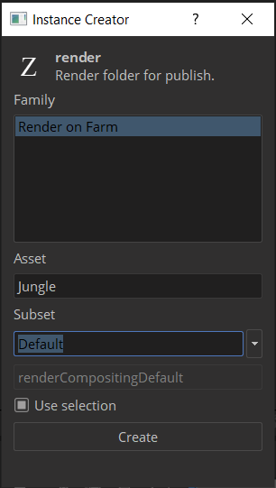
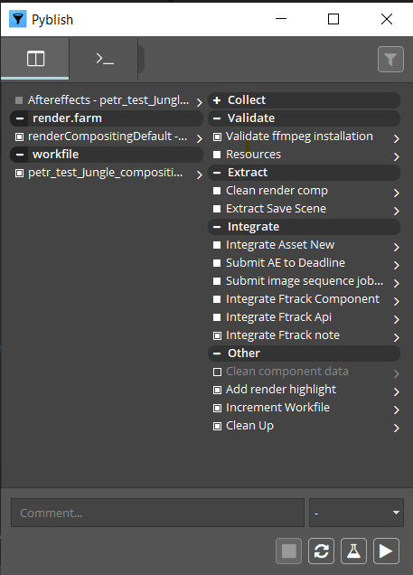

<!-- based on PS implementation, same principle and menu -->
## Available Tools

-   [Work Files](artist_tools.md#workfiles)
-   [Create](artist_tools.md#creator)
-   [Load](artist_tools.md#loader)
-   [Publish](artist_tools.md#publisher)
-   [Manage](artist_tools.md#inventory)
-   [Subset Manager](artist_tools.md#subset-manager)

## Setup

To install the extension, download, install [Anastasyi's Extension Manager](https://install.anastasiy.com/). Open Anastasyi's Extension Manager and select AfterEffects in menu. Then go to `{path to pype}hosts/aftereffects/api/extension.zxp`. 

Drag extension.zxp and drop it to Anastasyi's Extension Manager. The extension will install itself. 

## Implemented functionality

AfterEffects implementation currently allows you to import and add various media to composition (image plates, renders, audio files, video files etc.)
and send prepared composition for rendering to Deadline or render locally. 

## Usage

When you launch AfterEffects you will be met with the Workfiles app. If don't 
have any previous workfiles, you can just close this window.

Workfiles tools takes care of saving your .AEP files in the correct location and under
a correct name. You should use it instead of standard file saving dialog.

In AfterEffects you'll find the tools in the `OpenPype` extension:

 <!-- same menu as in PS -->

You can show the extension panel by going to `Window` > `Extensions` > `OpenPype`.

### Create

When you have created an composition you want to publish, you will need to tag existing composition. To do this open the `Creator` through the extensions `Create` button.

Because of current rendering limitations, it is expected that only single composition will be marked for publishing!

After Creator is successfully triggered on selected composition, it will be marked with an icon and its color
will be changed.

### Publish

#### RenderQueue

AE's Render Queue is required for publishing locally or on a farm. Artist needs to configure expected result format (extension, resolution) in the Render Queue in an Output module. Currently its expected to have only single render item and single output module in the Render Queue.

AE might throw some warning windows during publishing locally, so please pay attention to them in a case publishing seems to be stuck in a `Extract Local Render`.

When you are ready to share your work, you will need to publish it. This is done by opening the `Publish` by clicking the corresponding button in the OpenPype Panel.

 

This tool will run through checks to make sure the contents you are publishing is correct. Hit the "Play" button to start publishing.

You may encounter issues with publishing which will be indicated with red squares. If these issues are within the validation section, then you can fix the issue. If there are issues outside of validation section, please let the OpenPype team know. For More details have a look at the general [Publish](artist_tools.md#publisher) documentation.

### Load

When you want to load existing published work, you can use the `Loader` tool. You can reach it in the extension's panel.

 <!-- picture needs to be changed -->

The supported families for loading into AfterEffects are:

- `image`
- `plate`
- `render`
- `prerender`
- `review`
- `audio`
- `background` `(set of images sorted in predefined order)`

To load an item, right-click on the subset you want and choose a representation you want to load:

### Manage

Now that we have some content loaded, you can manage which version is loaded. This is done through the `Scene Manager`. You can reach it through the extension's `Manage` button.

:::note
Loaded images have to stay as smart layers in order to be updated. If you rasterize the layer, you can no longer update it to a different version using OpenPype tools.
:::

You can switch to a previous version of the image or update to the latest.

### Subset Manager

All created compositions will be shown in a simple list. If user decides, that this composition shouldn't be
published after all, right click on that item in the list and select 'Remove instance'

Removing composition directly in the AE would result to worfile contain phantom metadata which could result in
errors during publishing!