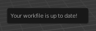
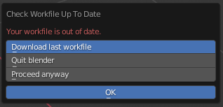
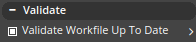
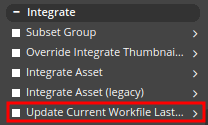

## Introduction

The Workfile Out Of Date Handling system has been developped to reduce the risk
that an artist uses a workfile that does not contain the latest changes,
then publishes it. In the event that an out of date workfile is in use,
this system will notify the user about it, prompt them to choose the appropriate action,
and ensures publishing an out of date workfile cannot be done mistakenly.

To determine if a workfile is up to date, last publish time on
the server is compared with the date and time the open workfile has been published.
Publish time is stored in the workfile during publish, therefore **this system
will only work as intended if it was active when the open workfile was published.**

This also implies **version numbers don't matter for this system**, only publish time
does. The reason for this design, is that users have the ability to increment their
local workfiles as often as they want, so local workfiles version numbers are independent
from published workfiles version numbers.

The Workfile Out Of Date Handling system will:

- Check if the workfile is up to date on load, periodically, and manually by clicking
a button in the OpenPype menu.
- Open a popup if the workfile is out of date to notify the user and prompt them
to choose an action.
- Display a warning in the OpenPype menu if the workfile is out of of date.
- Validate if the workfile is up to date during publish.
- Store publish time in the workfile during publish.

## Popup dialog

After a workfile up to date check, a popup dialog will be displayed to notify the user of the result.

If the workfile is up to date, the popup will just display `You workfile is up to date!`
and disappear when the cursor moves outside the popup.

If the workfile is out of date, another popup will display that the workfile is out of
date and ask the user to choose one of these three actions:

- `Download last workfile`: Download the last workfile and open it. Workfile version
number is incremented so the previous workfile is still accessible using the `workfiles`
menu. This is the default, and generally the recommended option.
- `Quit blender`: Just quit blender.
- `Proceed anyway`: Close the popup to keep *knowingly* using the out of date workfile.
This may be used if a rollback is required. The warning in the OpenPype menu will remain
visible and the `Validate Workfile Up To Date` validator will fail if this option is
chosen.

After the user chose their action, they can press OK.
If the user clicks out of this popup, it will reopen under their cursor so they can't
miss it or discard it without choosing an action.

## OpenPype Menu

In the OpenPype menu, you can find a `Check workfile up to date` button to manually
perform a workfile up to date check. This is the same check as the one that runs on load
and the periodic check.

When a workfile has been marked as out of date, a warning sign will appear next to the
OpenPype menu, with the mention that the workfile is out of date when the OpenPype menu
is open. This warning is clickable and has the same behaviour as the `Check workfile up
to date` button (useful if the user chose `Proceed anyway` on load then changed their mind).

1[OpenPype Menu](assets/blender_workfile_out_of_date_handling/blender_openpype_menu.png)

## Publish

Two plugins related to this sytem will run during publish:

- `Validate Workfile Up To Date`: Validate that the workfile is up to date.
If it's out of date, this validator will fail. It is optional by design to allow
rollbacks. The idea is that by disabling this validator, the user confirms that they chose
to publish even if the workfile is out of date.

- `Update Current Workfile Last Publish Time`: Stores publish time in the workfile.
This is the value used during workfile up to date checks.

## How to rollback

Even though the Workfile Out Of Date Handling system blocks publish if the workfile is
out of date, it is possible to purposedly do it anyway. This is mainly useful when a
rollback is necessary.

To do so, follow this procedure:

- When the workfile out of date popup is displayed, choose `Proceed anyway` then press OK.
- During publish, disable `Validate Workfile Up To Date`.

This should only be done when necessary. In normal use an artist should always use an
up to date workfile, `Download last workfile` is the recommended option in the popup
dialog, and the `Validate Workfile Up To Date` should remain enabled.
