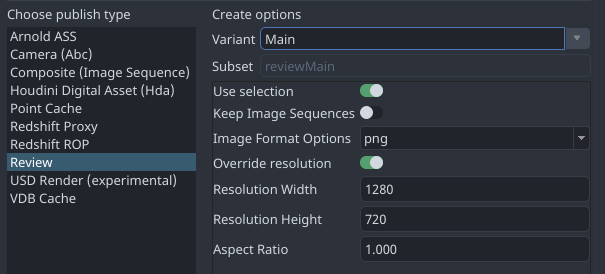
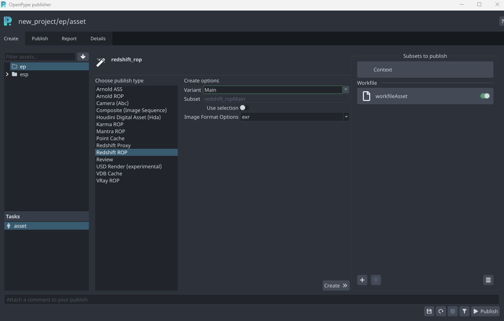
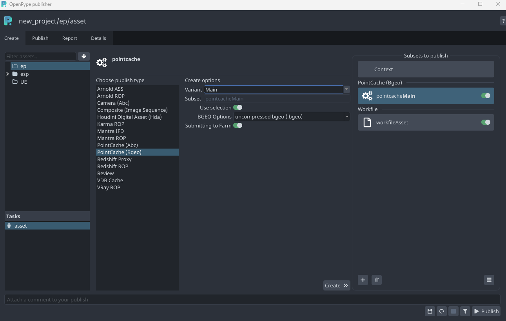
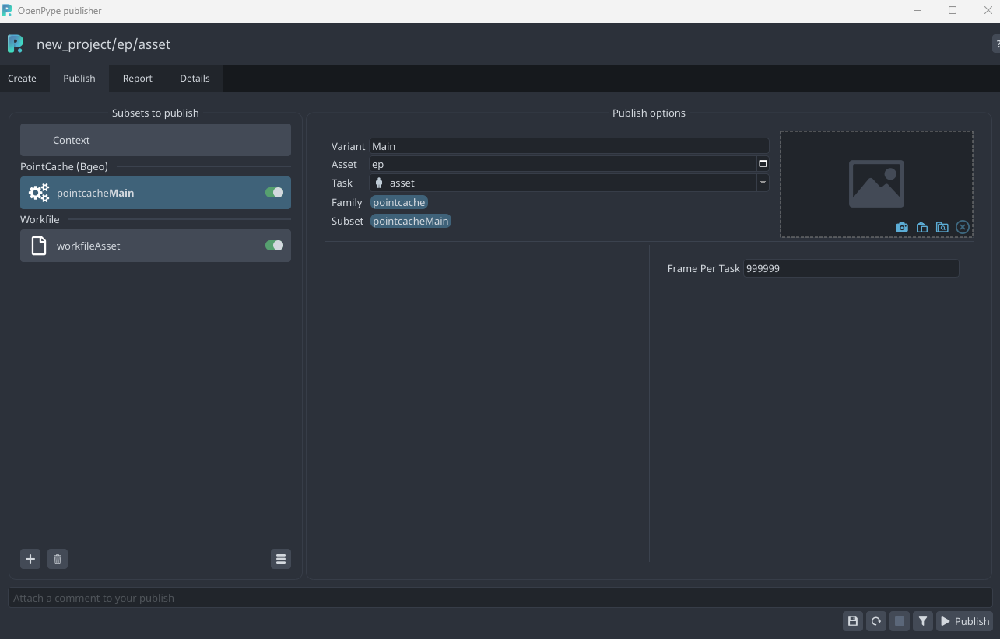
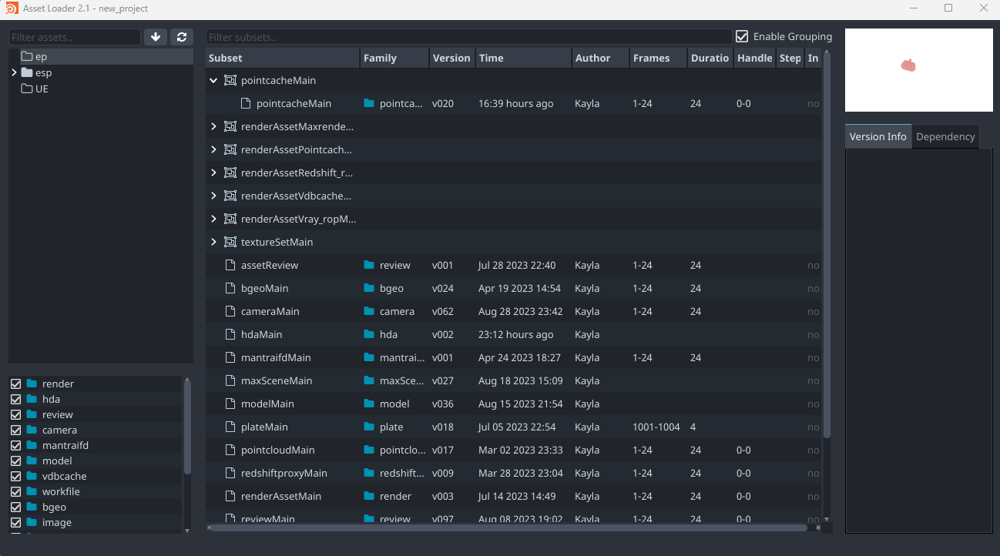
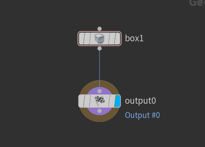
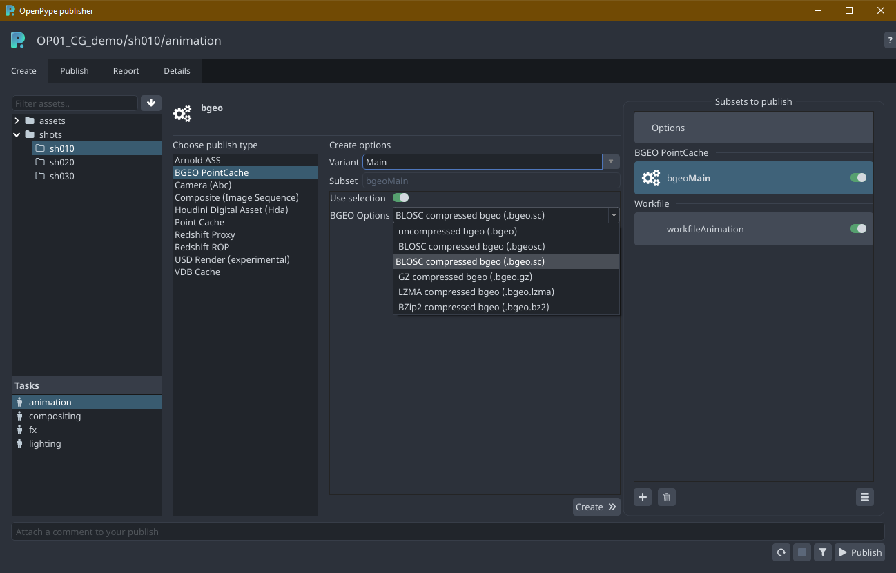
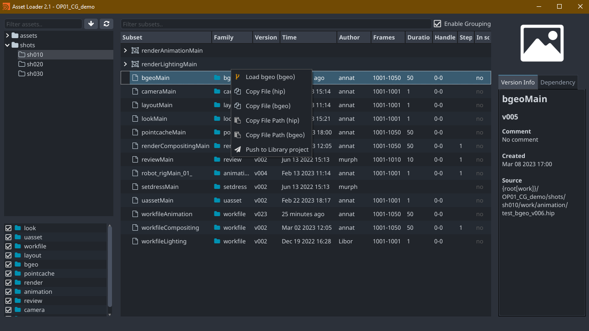

## OpenPype global tools

- [Work Files](artist_tools_workfiles)
- [Create](artist_tools_creator)
- [Load](artist_tools_loader)
- [Manage (Inventory)](artist_tools_inventory)
- [Publish](artist_tools_publisher)
- [Library Loader](artist_tools_library-loader)

## Publishing Alembic Cameras
You can publish baked camera in Alembic format.

Select your camera and go **OpenPype -> Create** and select **Camera (abc)**.
This will create Alembic ROP in **out** with path and frame range already set. This node will have a name you've
assigned in the **Creator** menu. For example if you name the subset `Default`, output Alembic Driver will be named
`cameraDefault`. After that, you can **OpenPype -> Publish** and after some validations your camera will be published
to `abc` file.

## Publishing Composites - Image Sequences
You can publish image sequences directly from Houdini's image COP networks.

You can use any COP node and publish the image sequence generated from it. For example this simple graph to generate some noise:

To publish the output of the `radialblur1` go to **OpenPype -> Create** and
select **Composite (Image Sequence)**. If you name the variant *Noise* this will create the `/out/imagesequenceNoise` Composite ROP with the frame range set.

When you hit **Publish** it will render image sequence from selected node.

:::info Use selection
With *Use selection* is enabled on create the node you have selected when creating will be the node used for published. (It set the Composite ROP node's COP path to it). If you don't do this you'll have to manually set the path as needed on e.g. `/out/imagesequenceNoise` to ensure it outputs what you want.
:::

## Publishing Point Caches (alembic)
Publishing point caches in alembic format is pretty straightforward, but it is by default enforcing better compatibility
with other DCCs, so it needs data do be exported prepared in certain way. You need to add `path` attribute so objects
in alembic are better structured. When using alembic round trip in Houdini (loading alembics, modifying then and
then publishing modifications), `path` is automatically resolved by alembic nodes.

In this example, I've created this node graph on **sop** level, and I want to publish it as point cache.

*Note: `connectivity` will add index for each primitive and `primitivewrangle1` will add `path` attribute, so it will
be for each primitive (`sphere1` and `sphere2`) as Maya is expecting - `strange_GRP/strange0_GEO/strange0_GEOShape`. How
you handle `path` attribute is up to you, this is just an example.*

Now select the `output0` node and go **OpenPype -> Create** and select **Point Cache**. It will create
Alembic ROP `/out/pointcacheStrange`

## Publishing Reviews (OpenGL)
To generate a review output from Houdini you need to create a **review** instance.
Go to **OpenPype -> Create** and select **Review**.

On create, with the **Use Selection** checkbox enabled it will set up the first
camera found in your selection as the camera for the OpenGL ROP node and other
non-cameras are set in **Force Objects**. It will then render those even if
their display flag is disabled in your scene.

## Redshift
:::note Work in progress
This part of documentation is still work in progress.
:::

## Publishing Render to Deadline
Five Renderers(Arnold, Redshift, Mantra, Karma, VRay) are supported for Render Publishing.
They are named with the suffix("_ROP")
To submit render to deadline, you need to create a **Render** instance.
Go to **Openpype -> Create** and select **Publish**. Before clicking **Create** button,
you need select your preferred image rendering format. You can also enable the **Use selection** to
select your render camera.

All the render outputs are stored in the pyblish/render directory within your project path.\
For Karma-specific render, it also outputs the USD render as default.

## Publishing cache to Deadline
Artist can publish cache to deadline which increases productivity as artist can use local machine
could be used for other tasks.
Caching on the farm is supported for:

**Arnold ASS (.ass)**
**Pointcache (.bgeo and .abc)**
**VDB (.vdb)**
**Redshift Proxy (.rs)**

To submit your cache to deadline, you need to create the instance(s) with clicking
**Submitting to Farm** and you can also enable  **Use selection** to
select the object for caching in farm.

When you go to Publish Tab and click the instance(s), you can set up your preferred
**Frame per task**.

Once you hit **Publish**, the cache would be submitted and rendered in deadline.
When the render is finished, all the caches would be located in your publish folder.
You can see them in the Loader.

## USD (experimental support)
### Publishing USD
You can publish your Solaris Stage as USD file.

This is very simple test stage. I've selected `output` **lop** node and went to **OpenPype -> Create** where I've
selected **USD**. This created `/out/usdDefault` USD ROP node.

### Publishing USD render

USD Render works in similar manner as USD file, except it will create **USD Render** ROP node in out and will publish
images produced by it. If you have selected node in Solaris Stage it will by added as **lop path** to ROP.

## Publishing VDB

Publishing VDB files works as with other data types. In this example I've created simple PyroFX explosion from
sphere. In `pyro_import` I've converted the volume to VDB:

I've selected `vdb1` and went **OpenPype -> Create** and selected **VDB Cache**. This will create
geometry ROP in `/out` and sets its paths to output vdb files. During the publishing process
whole dops are cooked.

## Publishing Houdini Digital Assets (HDA)

You can publish most of the nodes in Houdini as hda for easy interchange of data between Houdini instances or even
other DCCs with Houdini Engine.

## Creating HDA

Simply select nodes you want to include in hda and go **OpenPype -> Create** and select **Houdini digital asset (hda)**.
You can even use already existing hda as a selected node, and it will be published (see below for limitation).

:::caution HDA Workflow limitations
As long as the hda is of same type - it is created from different nodes but using the same (subset) name, everything
is ok. But once you've published version of hda subset, you cannot change its type. For example, you create hda **Foo**
from *Cube* and *Sphere* - it will create hda subset named `hdaFoo` with the same type. You publish it as version 1.
Then you create version 2 with added *Torus*. Then you create version 3 from the scratch from completely different nodes,
but still using resulting subset name `hdaFoo`. Everything still works as expected. But then you use already
existing hda as a base, for example from different artist. Its type cannot be changed from what it was and so even if
it is named `hdaFoo` it has different type. It could be published, but you would never load it and retain ability to
switch versions between different hda types.
:::

## Loading HDA

When you load hda, it will install its type in your hip file and add published version as its definition file. When
you  switch version via Scene Manager, it will add its definition and set it as preferred.

## Publishing and loading BGEO caches

There is a simple support for publishing and loading **BGEO** files in all supported compression variants.

### Creating BGEO instances

Select your SOP node to be exported as BGEO. If your selection is in the object level, OpenPype will try to find if there is an `output` node inside, the one with the lowest index will be used:

Then you can open Publisher, in Create you select **BGEO PointCache**:

You can select compression type and if the current selection should be connected to ROPs SOP path parameter. Publishing will produce sequence of files based on your timeline settings.

### Loading BGEO

Select your published BGEO subsets in Loader, right click and load them in:

