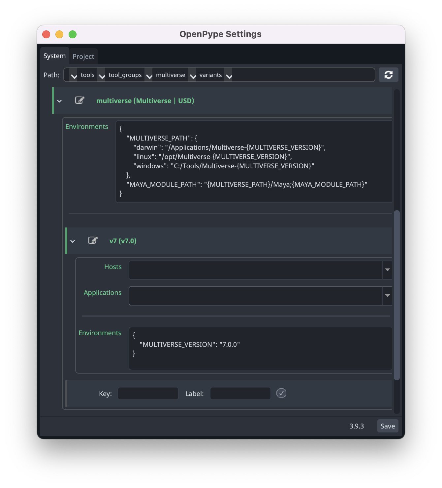
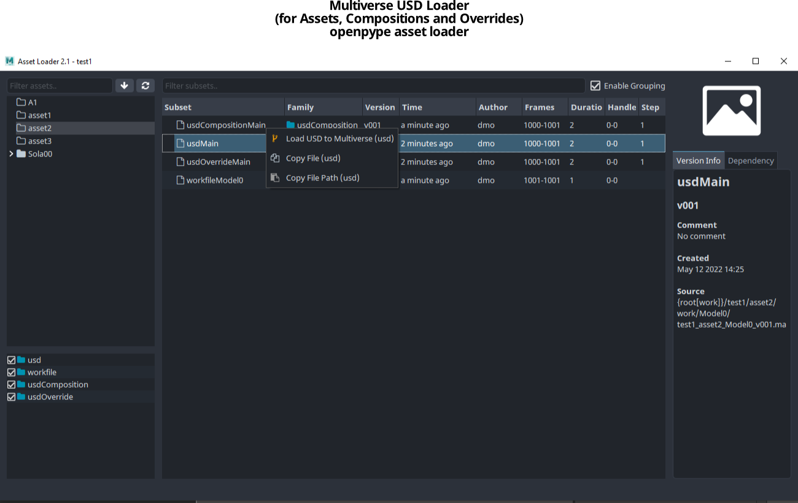
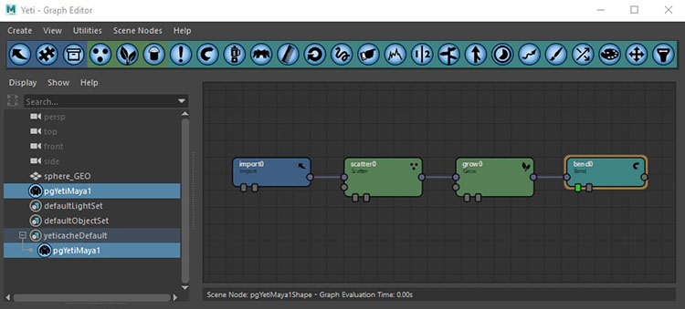
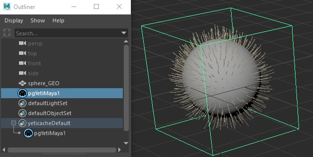
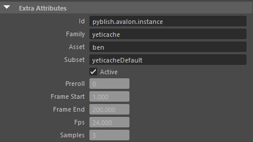
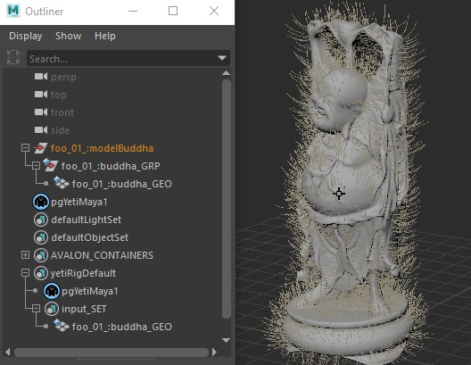
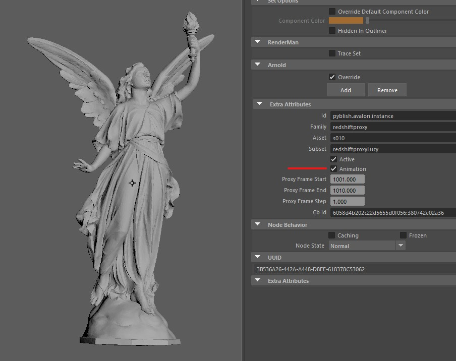
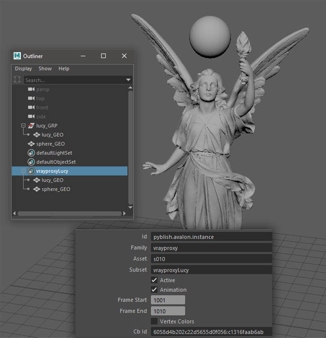
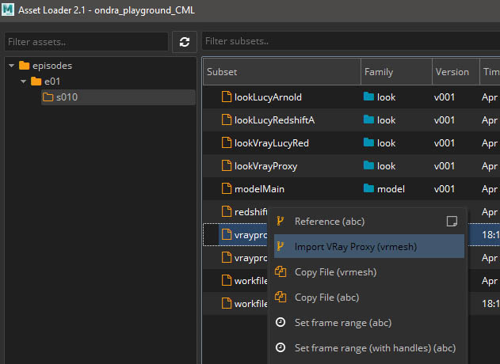

## OpenPype global tools

-   [Set Context](artist_tools.md#set-context)
-   [Work Files](artist_tools.md#workfiles)
-   [Create](artist_tools.md#creator)
-   [Load](artist_tools.md#loader)
-   [Manage (Inventory)](artist_tools.md#inventory)
-   [Publish](artist_tools.md#publisher)
-   [Library Loader](artist_tools.md#library-loader)

## Working with OpenPype in Maya

OpenPype is here to ease you the burden of working on project with lots of
collaborators, worrying about naming, setting stuff, browsing through endless
directories, loading and exporting and so on. To achieve that, OpenPype is using
concept of being _"data driven"_. This means that what happens when publishing
is influenced by data in scene. This can by slightly confusing so let's get to
it with few examples.

## Publishing models

### Intro

Publishing models in Maya is pretty straightforward. Create your model as you
need. You need to adhere to specifications of your studio that can be different
between studios and projects but by default your geometry has to be named properly.
For example `sphere_GEO` or `cube1_GEO`. Geometry needs to have freezed transformations
and must reside under one group, for example `model_GRP`.


Note that `sphere_GEO` has frozen transformations.

### Creating instance

Now create **Model instance** from it to let OpenPype know what in the scene you want to
publish. Go **OpenPype → Create... → Model**


`Asset` field is a name of asset you are working on - it should be already filled
with correct name as you've started Maya or switched context to specific asset. You
can edit that field to change it to different asset (but that one must already exists).

`Subset` field is a name you can decide on. It should describe what kind of data you
have in the model. For example, you can name it `Proxy` to indicate that this is
low resolution stuff. See [Subset](artist_concepts.md#subset).

:::note LOD support
By changing subset name you can take advantage of _LOD support_ in OpenPype. Your
asset can contain various resolution defined by different subsets. You can then
switch between them very easy using [Inventory (Manage)](artist_tools.md#inventory).
There LODs are conveniently grouped so they don't clutter Inventory view.

Name your subset like `main_LOD1`. Important part is that `_LOD1`. You can have as many LODs as you need.
:::

Read-only field just under it show final subset name, adding subset field to
name of the group you have selected.

`Use selection` checkbox will use whatever you have selected in Outliner to be
wrapped in Model instance. This is usually what you want. Click on **Create** button.

You'll notice then after you've created new Model instance, there is new set
in Outliner called after your subset, in our case it is `modelMain`.

And that's it, you have your first model ready to publish.

Now save your scene (if you didn't do it already). You will notice that path
in Save dialog is already set to place where scenes related to modeling task on
your asset should reside. As in our case we are working on asset called
**Ben** and on task **modeling**, path relative to your project directory will be
`project_XY/assets/ben/work/modeling`. Let's save our scene as `model_test_v01`.

### Publishing models

Now let's publish it. Go **OpenPype → Publish...**. You will be presented with following window:


Note that content of this window can differs by your pipeline configuration.
For more detail see [Publisher](artist_tools.md#publisher).

Items in left column are instances you will be publishing. You can disable them
by clicking on square next to them. Green square indicate they are ready for
publishing, red means something went wrong either during collection phase
or publishing phase. Empty one with gray text is disabled.

See that in this case we are publishing from scene file `model_test_v01.mb` in
Maya model named `modelMain (ben)` (next item). Publishing of workfile is
currently disabled (last item).

Right column lists all tasks that are run during collection, validation,
extraction and integration phase. White items are optional and you can disable
them by clicking on them.

Lets do dry-run on publishing to see if we pass all validators. Click on flask
icon at the bottom. Validators are run. Ideally you will end up with everything
green in validator section.

### Fixing problems

To make things interesting, I intentionally forgot to freeze transformations
on `sphere_GEO` as I know it will trigger validator designed to check just this.


You can see our model is now marked red in left column and in right we have
red box next to `Transform Zero (Freeze)` validator.

You can click on arrow next to it to see more details:


From there you can see in **Records** entry that there is problem with `sphere_GEO`.
Some validators have option to fix problem for you or just select objects that
cause trouble. This is the case with our failed validator.

In main overview you can notice little up arrow in a circle next to validator
name. Right click on it and you can see menu item `select invalid`. This
will select offending object in Maya.

Fix is easy. Without closing Publisher window we just freeze transformations.
Then we need to reset it to make it notice changes we've made. Click on arrow
circle button at the bottom and it will reset Publisher to initial state. Run
validators again (flask icon) to see if everything is ok.

It should be now. Write some comment if you want and click play icon button
when ready.

Publish process will now take its course. Depending on data you are publishing
it can take a while. You should end up with everything green and message
**Finished successfully ...** You can now close publisher window.

To check for yourself that model is published, open
[Asset Loader](artist_tools.md#loader) - **OpenPype → Load...**.
There you should see your model, named `modelMain`.

## Look development

Look development in OpenPype is easy. It helps you with versioning different
kinds of shaders and easy switching between them.

Let se how it works.

### Loading model

In this example I have already published model of Buddha. To see how to publish
model with OpenPype see [Publishing Model](artist_hosts_maya.md#publishing-models).

First of lets start with empty scene. Now go **OpenPype → Load...**


Here I am loading `modelBuddha`, its version 1 for asset **foo**.  Just right-click
on it and select **Reference (abc)**. This will load model into scene as alembic.
Now you can close Loader window.

### Creating look

Now you can create whatever look you want. Assign shaders, textures, etc. to model.
In my case, I assigned simple Arnolds _aiSurfaceShader_ and changed its color to red.


I am quite happy with it so I want to publish it as my first look.

### Publishing look

Select your model in outliner and ho **OpenPype → Create...**. From there
select **Look**. Make sure `use selection` checkbox is checked.
Mine subset name is `Main`. This will create _Look instance_ with a name **lookMain**.

Close _Creator_ window.

Now save your scene, give it some sensible name. Next, go **OpenPype → Publish**.
This process is almost identical as publishing models, only different _Validators_
and other plugins will be used.

This should be painless and cause no trouble so go ahead, click play icon button at
the bottom and it will publish your look.

:::note publishing multiple looks
You can reference same model into scene multiple times, change materials on every
instance with what you need. Then on every model create _Look instance_. When
publishing all those _Look instances_ will be published at same time.
:::

### Loading looks into models

Now lets see how look are applied. Start new empty scene, load your published
model there as before (using _Reference (abc)_). If you didn't notice until now,
there are few yellow icons in left shelf:


Those are shortcuts for **Look Manager**, [Work Files](artist_tools.md#workfiles),
[Load](artist_tools.md#loader), and [Manage (Inventory)](artist_tools.md#inventory).

Those can be found even in top menu, but that depends on your studio setup.

You are interested now in **Look Manager** - first item with brush icon. Select
your Buddha model and open **Look Manager**.


This is **Look Manager** window. Yours would be empty until you click **Get All Assets**
or **Get Assets From Selection**. You can use later to quick assign looks if you have
multiple assets loaded in scene. Click on one of those button now.

You should now see all assets and their subsets loaded in scene, and on right side
all applicable published looks.

Select you asset and on the right side right click on `Main` look. Apply it.

You notice that Buddha model is now red, materials you've published are now applied
to it.

That way you can create looks as you want and version them using OpenPype.

## Setting scene data

Maya settings concerning framerate, resolution and frame range are handled by
OpenPype. If set correctly in Ftrack, Maya will validate you have correct fps on
scene save and publishing offering way to fix it for you.

For resolution and frame range, use **OpenPype → Reset Frame Range** and
**OpenPype → Reset Resolution**


## Creating rigs with OpenPype

Creating and publishing rigs with OpenPype follows similar workflow as with
other data types. Create your rig and mark parts of your hierarchy in sets to
help OpenPype validators and extractors to check it and publish it.

### Preparing rig for publish

When creating rigs, it is recommended (and it is in fact enforced by validators)
to separate bones or driving objects, their controllers and geometry so they are
easily managed. Currently OpenPype doesn't allow to publish model at the same time as
its rig so for demonstration purposes, I'll first create simple model for robotic
arm, just made out of simple boxes and I'll publish it.


For more information about publishing models, see [Publishing models](artist_hosts_maya.md#publishing-models).

Now lets start with empty scene. Load your model - **OpenPype → Load...**, right
click on it and select **Reference (abc)**.

I've created few bones and their controllers in two separate
groups - `rig_GRP` and `controls_GRP`. Naming is not important - just adhere to
your naming conventions.

Then I've put everything into `arm_rig` group.

When you've prepared your hierarchy, it's time to create *Rig instance* in OpenPype.
Select your whole rig hierarchy and go **OpenPype → Create...**. Select **Rig**.
Set is created in your scene to mark rig parts for export. Notice that it has
two subsets - `controls_SET` and `out_SET`. Put your controls into `controls_SET`
and geometry to `out_SET`. You should end up with something like this:


### Publishing rigs

Publishing rig is done in same way as publishing everything else. Save your scene
and go **OpenPype → Publish**. When you run validation you'll mostly run at first into
few issues. Although number of them will seem to be intimidating at first, you'll
find out they are mostly minor things easily fixed.

* **Non Duplicate Instance Members (ID)** - This will most likely fail because when
creating rigs, we usually duplicate few parts of it to reuse them. But duplication
will duplicate also ID of original object and OpenPype needs every object to have
unique ID. This is easily fixed by **Repair** action next to validator name. click
on little up arrow on right side of validator name and select **Repair** form menu.

* **Joints Hidden** - This is enforcing joints (bones) to be hidden for user as
animator usually doesn't need to see them and they clutter his viewports. So
well behaving rig should have them hidden. **Repair** action will help here also.

* **Rig Controllers** will check if there are no transforms on unlocked attributes
of controllers. This is needed because animator should have ease way to reset rig
to it's default position. It also check that those attributes doesn't have any
incoming connections from other parts of scene to ensure that published rig doesn't
have any missing dependencies.

### Loading rigs

You can load rig with [Loader](artist_tools.md#loader). Go **OpenPype → Load...**,
select your rig, right click on it and **Reference** it.

## Point caches
OpenPype is using Alembic format for point caches. Workflow is very similar as
other data types.

### Creating Point Caches

To create point cache just create whatever hierarchy you want and animate it.
Select its root and Go **OpenPype → Create...** and select **Point Cache**.

After that, publishing will create corresponding **abc** files.

Example setup:


### Loading Point Caches

Loading point cache means creating reference to **abc** file with Go **OpenPype → Load...**.

Example result:


## Set dressing in Maya

Set dressing is term for easily populate complex scenes with individual parts.
OpenPype allows to version and manage those sets.

### Publishing Set dress / Layout

Working with Set dresses is very easy. Just load your assets into scene with
[Loader](artist_tools.md#loader) (**OpenPype → Load...**). Populate your scene as
you wish, translate each piece to fit your need. When ready, select all imported
stuff and go **OpenPype → Create...** and select **Set Dress** or **Layout**.
This will create set containing your selection and marking it for publishing.

:::note set dress vs layout
Currently *set dress* and *layout* are functionally identical
:::

Now you can publish is with **OpenPype → Publish**.

### Loading Set dress / Layout

You can load Set dress / Layout using [Loader](artist_tools.md#loader)
(**OpenPype → Load...**). Select you layout or set dress, right click on it and
select **Reference Maya Ascii (ma)**. This will populate your scene with all those
models you've put into layout.

## Rendering with OpenPype

OpenPype in Maya can be used for submitting renders to render farm and for their
subsequent publishing. Right now OpenPype support [AWS Thinkbox Deadline](https://www.awsthinkbox.com/deadline)
and [Virtual Vertex Muster](https://www.vvertex.com/overview/).

* For setting up Muster support see [admin section](module_muster.md)
* For setting up Deadline support see [here](module_deadline.md)

:::note Muster login
Muster is now configured so every user must log in to get authentication support. If OpenPype founds out this token is missing or expired, it will ask again for credentials.
:::

### Creating basic render setup

If you want to submit your render to farm, just follow these simple steps.

#### Preparing scene

Lets start with empty scene. First I'll pull in my favorite Buddha model.
**OpenPype → Load...**, select model and right+click to pop up context menu. From
there just click on **Reference (abc)**.

Next, I want to be sure that I have same frame range as is set on shot I am working
on. To do this just **OpenPype → Reset Frame Range**. This should set Maya timeline to same
values as they are set on shot in *Ftrack* for example.

I have my time set, so lets create some animation. We'll turn Buddha model around for
50 frames (this is length of my timeline).

Select model, go to first frame, key Y axis rotation, go to last frame, enter 360 to
**Channel Editor** Y rotation, key it and its done. If you are not sure how to do it,
you are probably reading wrong documentation.

Now let set up lights, ground and camera. I am lazy so I create Arnolds Skydome light:
**Arnold → Lights → Skydome Light**. As ground simple Plane will suffice and I'll set
my perspective view as I like and create new camera from it (`CTRL+SHIFT+C`) and rename
it from `persp1` to `mainCamera`.

One last thing, I'll assign basic *aiSurfaceShader* to my Buddha and do some little
tweaks on it.

#### Prepare scene for submission

As we have working simple scene we can start preparing it for rendering. OpenPype is fully utilizing
Render Setup layers for this. First of all, we need to create *Render instance* to tell OpenPype what
to do with renders. You can easily render locally or on render farm without it, but *Render instance*
is here to mark render layers you want to publish.

Lets create it. Go **OpenPype → Create...**. There select **Render** from list. If you keep
checked **Use selection** it will use your current Render Layers (if you have them). Otherwise,
if no render layers is present in scene, it will create one for you named **Main** and under it
default collection with `*` selector.

No matter if you use *Deadline* or *Muster*, OpenPype will try to connect to render farm and
fetch machine pool list.

:::note Muster login
This might fail on *Muster* in the event that you have expired authentication token. In that case, you'll be presented with login window. Nothing will be created in the scene until you log in again and do create **Render** again.
:::

So now my scene now looks like this:


You can see that it created `renderingMain` set and under it `LAYER_Main`. This set corresponds to
**Main** render layer in Render Setup. This was automatically created because I had not created any
render layers in scene before. If you already have layers and you use **Use selection**, they will
appear here, prefixed with `LAYER_`. Those layer set are created whenever you create new layer in
Render Setup and are deleted if you delete layer in Render Setup. However if you delete `LAYER_` set,
layer in Render Setup isn't deleted. It just means it won't be published.

Creating *Render instance* will also set image prefix in render settings to OpenPype defaults based on
renderer you use - for example if you render with Arnold, it is `maya/<Scene>/<RenderLayer>/<RenderLayer>_<RenderPass>`.

There are few setting on *Render instance* `renderingMain` in **Attributes Editor**:


Few options that needs explaining:

* `Primary Pool` - here is list of pool fetched from server you can select from.
* `Suspend publish Job` - job sent to farm will not start render automatically
but is in *waiting* state.
* `Extend Frames` - if checked it will add new frames to previous render, so you can
extend previous image sequence.
* `Override Existing Frame` - will overwrite file in destination if they exists
* `Priority` is priority of job on farm
* `Frames Per Task` is number of sequence division between individual tasks (chunks)
making one job on farm.

Now if you run publish, you notice there is in right column new item called
`Render Layers` and in it there is our new layer `Main (999_abc_0010) [1-10]`. First part is
layer name, second `(999_abc_0010)` is asset name and rest is frame range.


You see I already tried to run publish but was stopped by few errors. Lets go
through them one by one just to see what we need to set up further in scene for
successful publish.

**No Default Cameras Renderable** is telling me:

```fix
Renderable default cameras found: [u'|persp|perspShape']
```

and so can be resolved by simple change in *Main* layer render settings.
All I have to do is just remove the `persp` camera from render settings and add there correct camera.

This leaves me only with **Render Settings** error. If I click on it to see
details, I see it has problem with animation not being enabled:

```fix
Animation needs to be enabled. Use the same frame for start and end to render single frame
```

Go to **Render Settings**, select your render layer and in **Common** tab change
in **File Output** `Frame/Animation ext` to whatever you want, just not _Single Frame_.
Set **Frame Range** `Start frame` and `End frame` according your needs.

If you run into problems with *image file prefix* - this should be set correctly when
creating *Render instance*, but you can tweak it. It needs to begin with `maya/<Scene>` token
to avoid render conflicts between DCCs. It needs to have `<RenderLayer>` or `<Layer>` (vray) and
`<RenderPass>` or `<Aov>` (vray). If you have more then one renderable cameras, add `<Camera>` token.

Sane default for arnold, redshift or renderman is:

```fix
maya/<RenderLayer>/<RenderLayer>_<RenderPass>
```

and for vray:

```fix
maya/<Layer>/<Layer>
```

Doing **OpenPype → Reset Resolution** will set correct resolution on camera.

Scene is now ready for submission and should publish without errors.

:::tip what happens when I publish my render scene
When publishing is finished, job is created on farm. This job has one more dependent job connected to itself.
When render is finished, this other job triggers in and run publish again, but this time it is publishing rendered image sequence and creating quicktime movie for preview from it. Only those rendered sequences that have **beauty** AOV get preview as it doesn't make sense to make it for example from cryptomatte.
:::

### Attaching render to subset

You can create render that will be attached to another subset you are publishing, rather than being published on its own. Let's assume, you want to render a model turnaround.
In the scene from where you want to publish your model create *Render subset*. Prepare your render layer as needed and then drag
model subset (Maya set node) under corresponding `LAYER_` set under *Render instance*. During publish, it will submit this render to farm and
after it is rendered, it will be attached to your model subset.

## Render Setups

### Publishing Render Setups

OpenPype can publish whole **Render Settings** setup. You can then version in and load it to
any Maya scene. This helps TDs to distribute per asset/shots render settings for Maya.

To publish render settings, go **OpenPype → Create...** and select **Render Setup Preset**.

In your scene will appear set `rendersetup<subset>`. This one has no settings, only its presence
in scene will trigger publishing of render settings.

When you publish scene, current settings in **Render Settings** will be serialized to json file.

### Loading Render Setups

In any scene, you can load published render settings with **OpenPype → Load...**. Select your published
render setup settings, right+click on it and select **Load RenderSetup template**.

This will load and parse json file and apply all setting there to your Render Setting.

:::warning
This will overwrite all setting you already have.
:::

## Reviews

OpenPype supports creating review video for almost any type of data you want to publish.
What we call review video is actually _playblast_ or _capture_ (depending on terminology
you are familiar with) made from pre-defined camera in scene. This is very useful
in cases where you want to add turntable preview of your model for example. But it can
be used to generate preview for animation, simulations, and so on. You can either
publish review as separate subset version, or you can attach generated video to subset you
are publishing - for example attach video of turntable rotation to published model as in
following example.

### Setting scene for review extraction

Lets see how review publishing works on simple scene. We will publish model with
turntable preview video.

I'll be using Stanford University dragon model. Start with empty scene.
Create your model, import it or load from OpenPype. I'll just import model as OBJ
file.

After we have our model in, we need to set everything to be able to publish it
as model - for detail see [Publishing models](artist_hosts_maya.md#publishing-models).

To recap - freeze transforms, rename it to `dragon_GEO` and put it into group
`dragon_GRP`. Then select this group and **OpenPype → Create...** and choose **Model**.

Now, lets create camera we need to generate turntable video. I prefer to animate
camera itself and not model because all animation keys will be associated with camera
and not model we want to publish.

I've created camera, named it `reviewCamera` and parent it under `reviewRotation_LOC`
locator. I set my timeline to 50 frames, key `reviewRotation_LOC` Y axis on frame
1 to 0 and on frame 50 to 360. I've also set animation curve between those two keys
to linear.

To mark camera to be used for review, select camera `reviewCamera` and go **OpenPype → Create...**
and choose **Review**.

This will create set `review<subset>` including selected camera. You can set few options
on this set to control review video generation:

* `Active` - control on/off state
* `Frame Start` - starting frame for review
* `Frame End` - end frame for review
* `Handles` - number of handle frame before and after
* `Step` - number of steps
* `Fps` - framerate

Next step is to move your model set to review set so it will be connected to each other.

This is my scene:


You see that `modelMain` in under `reviewMain` with `reviewCamera`.

_* note that I had to fix UVs and normals on Stanford dragon model as it wouldn't pass
model validators_

### Publishing model with review

You can now publish your model and generate review video. Go **OpenPype → Publish...**,
validate if you will, and publish it. During publishing, Maya will create _playblast_
for whole frame range you've specified, then it will pass those frames to _ffmpeg_.
That will create video file, pass it to another extractor creating burnins in it
and finally uploading this video to ftrack with your model (or other type) published
version. All parts of this process - like what burnins, what type of video file,
settings for Maya playblast - can be customized by your TDs. For more information
about customizing review process refer to [admin section](project_settings/settings_project_global.md/#publish-plugins).

If you don't move `modelMain` into `reviewMain`, review will be generated but it will
be published as separate entity.


## Working with Multiverse in OpenPype

OpenPype supports creating, publishing and loading of [Multiverse | USD](
https://multi-verse.io) data.

More specifically it is possible to:

- Create USD Assets, USD compositions and USD Overrides. This _creates_ OpenPype
  instances as Maya set nodes that contain information for published USD data.
- Publish USD Assets, USD compositions and USD Overrides. This _writes_ USD
  files to disk and _publishes_ information to the OpenPype database.
- Load any USD data into Multiverse "Compound" shape nodes. This _reads_ USD
  files (and also Alembic files) into Maya by streaming them to the viewport.
- Rendering USD data procedurally with 3Delight<sup>NSI</sup>, Arnold, Redshift,
  RenderMan and VRay. This reads USD files by streaming them procedurally to the renderer, at render time.

USD files written by Multiverse are 100% native USD data, they can be exchanged
with any other DCC applications able to interchange USD. Likewise, Multiverse
can read native USD data created by other applications. All the extensions are
supported: `.usd`, `.usdc`, `.usda`, `.usdz`. Sequences of USD files can also be
read, as USD clips.

It is also possible to load Alembic data (`.abc`) in Multiverse Compounds,
further compose it & override it in other USD files, and render it procedurally.
Alembic data is always converted on the fly (in memory) to USD data. USD clip
from Alembic data are also supported.

### Configuration

To configure Multiverse in OpenPype, a user with admin privileges needs to setup
a new tool in OpenPype Project Settings, using a similar configuration as
depicted here:



For more information about setup of Multiverse please refer to: LINK.


### Understanding Assets, Compositions and Overrides

In Multiverse there are three main concepts for representing USD data.


#### Assets

In Multiverse, the term "asset" refers to a USD file that contains a hierarchy
of primitives (transforms and shapes). In Maya this is typically a hierarchy of
nodes, as it can be seen in Outliner, that is written out to a USD file. Once
loaded, the same hierarchy will be visible in MEOW (Multiverse Explore and
Override Window).


An asset typically contains static or animated data such as: poly meshes, blend
shapes, reference objects, particles/points, curves, joint, subdivision surfaces
and other attributes such as normals, UVs, color sets, tangents, skin weights,
material assignment and shading networks, cameras, lights etc. It is also
possible to specify Maya data to be part of variants and to be used as proxies
by tagging them with attributes.

An asset is typically read back into Maya into a Multiverse Compound shape
node and it can be composed and overridden.

![Maya - Multiverse Compound Shape(assets/maya-multiverse_compound.png)


#### Composition

In Multiverse, the term "composition" refers to a USD file that contains a
hierarchy of Multiverse Compounds shape nodes and Maya transform nodes, as it
can be seen in Outliner. This hierarchy is written out to a USD file that
effectively contains a static or animated composition of other USD files written
as references or payloads (according to the relative setting in the Compound).


A Composition is is typically read back into Maya into a Multiverse Compound
shape and it can be further composed and overridden.


#### Override

In Multiverse, the term "override" refers to a USD file that contains static or animated overrides for a USD hierarchy. Overrides are set in MEOW, they can be:

- render visibility overrides
- transform overrides
- attribute overrides
- material assignment overrides
- variant and variant definition overrides
- Instancing state overrides
- activity state overrides


Overrides are written out to a USD file that effectively contains a static or
animated hierarchy of overrides that can be "layered" on top of Assets,
Compositions and other Overrides.


An Override is is typically read back into Maya as a layer of a Multiverse
Compound shape and it can be further composed and overridden.


### Creators

It is possible to create OpenPype "instances" (Maya sets) for publishing
Multiverse USD Asset, Composition and Override.


When creating OpenPype instances for Multiverse USD asset, compositions and
overrides the creator plug-in will put the relative selected data in a Maya set
node which holds the properties used by the Multiverse data writer for
publishing.


### Publishers

The relative publishers for Asset, Composition and Overrides are available. They
all write USD files to disk and communicate publish info to the OpenPype
database.


### Loader

The loader creates a Multiverse Compound shape node reading the USD file of
choice. All data is streamed to the viewport and not contained in Maya. Thanks
to the various viewport load options the user can strategically decide how to
minimize the cost of viewport draw effectively being able to load any data, this
allows to bring into Maya scenes of virtually unlimited complexity.



:::tip Note
When using the Loader, Multiverse, by design, never "imports" USD data into the
Maya scene as Maya data. Instead, when desired, Multiverse permits to import
specific USD primitives into the Maya scene as Maya data selectively from MEOW,
it also tracks what is being imported, so upon modification, it is possible to
write (create & publish) the modifies data as a USD file for being layered on
top of its relative Compound. See LINK.
:::

### Rendering

Multiverse offers procedural rendering with all the major production renderers:

- 3Delight<sup>NSI</sup>
- Arnold
- Redshift
- RenderMan
- VRay

This is completely transparent to the user: Multiverse Compound nodes present in
the scene, once a render is launched, will stream data to the renderer in a
procedural fashion.


## Working with Yeti in OpenPype

OpenPype can work with [Yeti](https://peregrinelabs.com/yeti/) in two data modes.
It can handle Yeti caches and Yeti rigs.

### Creating and publishing Yeti caches

Let start by creating simple Yeti setup, just one object and Yeti node. Open new
empty scene in Maya and create sphere. Then select sphere and go **Yeti → Create Yeti Node on Mesh**
Open Yeti node graph **Yeti → Open Graph Editor** and create setup like this:



It doesn't matter what setting you use now, just select proper shape in first
*Import* node. Select your Yeti node and create *Yeti Cache instance* - **OpenPype → Create...**
and select **Yeti Cache**. Leave `Use selection` checked. You should end up with this setup:



You can see there is `yeticacheDefault` set. Instead of *Default* it could be named with
whatever name you've entered in `subset` field during instance creation.

We are almost ready for publishing cache. You can check basic settings by selecting
Yeti cache set and opening *Extra attributes* in Maya **Attribute Editor**.



Those attributes there are self-explanatory, but:

- `Preroll` is number of frames simulation will run before cache frames are stored.
This is useful to "steady" simulation for example.
- `Frame Start` from what frame we start to store cache files
- `Frame End` to what frame we are storing cache files
- `Fps` of cache
- `Samples` how many time samples we take during caching

You can now publish Yeti cache as any other types. **OpenPype → Publish**. It will
create sequence of `.fur` files and `.fursettings` metadata file with Yeti node
setting.

### Loading Yeti caches

You can load Yeti cache by **OpenPype → Load ...**. Select your cache, right+click on
it and select **Load Yeti cache**. This will create Yeti node in scene and set its
cache path to point to your published cache files. Note that this Yeti node will
be named with same name as the one you've used to publish cache. Also notice that
when you open graph on this Yeti node, all nodes are as they were in publishing node.

### Creating and publishing Yeti Rig

Yeti Rigs are working in similar way as caches, but are more complex and they deal with
other data used by Yeti, like geometry and textures.

Let's start by [loading](artist_hosts_maya.md#loading-model) into new scene some model.
I've loaded my Buddha model.

Create select model mesh, create Yeti node - **Yeti → Create Yeti Node on Mesh** and
setup similar Yeti graph as in cache example above.

Then select this Yeti node (mine is called with default name `pgYetiMaya1`) and
create *Yeti Rig instance* - **OpenPype → Create...** and select **Yeti Cache**.
Leave `Use selection` checked.

Last step is to add our model geometry to rig instance, so middle+drag its
geometry to `input_SET` under `yetiRigDefault` set representing rig instance.
Note that its name can differ and is based on your subset name.



Save your scene and ready for publishing our new simple Yeti Rig!

Go to publish **OpenPype → Publish** and run. This will publish rig with its geometry
as `.ma` scene, save Yeti node settings and export one frame of Yeti cache from
the beginning of your timeline. It will also collect all textures used in Yeti
node, copy them to publish folder `resource` directory and set *Image search path*
of published node to this location.

:::note Collect Yeti Cache failure
If you encounter **Collect Yeti Cache** failure during collecting phase, and the error is like
```fix
No object matches name: pgYetiMaya1Shape.cbId
```
then it is probably caused by scene not being saved before publishing.
:::

### Loading Yeti Rig

You can load published Yeti Rigs as any other thing in OpenPype - **OpenPype → Load ...**,
select you Yeti rig and right+click on it. In context menu you should see
**Load Yeti Cache** and **Load Yeti Rig** items (among others). First one will
load that one frame cache. The other one will load whole rig.

Notice that although we put only geometry into `input_SET`, whole hierarchy was
pulled inside also. This allows you to store complex scene element along Yeti
node.

:::tip auto-connecting rig mesh to existing one
If you select some objects before loading rig it will try to find shapes
under selected hierarchies and match them with shapes loaded with rig (published
under `input_SET`). This mechanism uses *cbId* attribute on those shapes.
If match is found shapes are connected using their `outMesh` and `outMesh`. Thus you can easily connect existing animation to loaded rig.
:::

## Working with Xgen in OpenPype

OpenPype support publishing and loading of Xgen interactive grooms. You can publish 
them as mayaAscii files with scalps that can be loaded into another maya scene, or as
alembic caches. 

### Publishing Xgen Grooms

To prepare xgen for publishing just select all the descriptions that should be published together and the create Xgen Subset in the scene using - **OpenPype menu** → **Create**... and select **Xgen Interactive**. Leave Use selection checked.

For actual publishing of your groom to go **OpenPype → Publish** and then press ▶ to publish. This will export `.ma` file containing your grooms with any geometries they are attached to and also a baked cache in `.abc` format 


:::tip adding more descriptions
You can add multiple xgen description into the subset you are about to publish, simply by
adding them to the maya set that was created for you. Please make sure that only xgen description nodes are present inside of the set and not the scalp geometry. 
:::

### Loading Xgen

You can use published xgens by loading them using OpenPype Publisher. You can choose to reference or import xgen. We don't have any automatic mesh linking at the moment and it is expected, that groom is published with a scalp, that can then be manually attached to your animated mesh for example. 

The alembic representation can be loaded too and it contains the groom converted to curves. Keep in mind that the density of the alembic directly depends on your viewport xgen density at the point of export.


## Using Redshift Proxies

OpenPype supports working with Redshift Proxy files. You can create  Redshift Proxy from almost
any hierarchy in Maya and it will be included there. Redshift can export animation
proxy file per frame.

### Creating Redshift Proxy

To mark data to publish as Redshift Proxy, select them in Maya and - **OpenPype → Create ...** and
then select **Redshift Proxy**. You can name your subset and hit **Create** button.

You can enable animation in Attribute Editor:



### Publishing Redshift Proxies

Once data are marked as Redshift Proxy instance, they can be published - **OpenPype → Publish ...**

### Using Redshift Proxies

Published proxy files can be loaded with OpenPype Loader. It will create mesh and attach Redshift Proxy
parameters to it - Redshift will then represent proxy with bounding box.

## Using VRay Proxies

OpenPype support publishing, loading and using of VRay Proxy in look management. Their underlying format
can be either vrmesh or alembic.

:::warning vrmesh or alembic and look management
Be aware that **vrmesh** cannot be used with looks as it doesn't retain IDs necessary to map shaders to geometry.
:::

### Creating VRay Proxy

To create VRay Proxy, select geometry you want and - **OpenPype → Create ...** select **VRay Proxy**. Name your
subset as you want and press **Create** button.

This will create `vrayproxy` set for your subset. You can set some options in Attribute editor, mainly if you want
export animation instead of single frame.



### Publishing VRay Proxies

VRay Proxy can be published - **OpenPype → Publish ...**. It will publish data as VRays `vrmesh` format and as
Alembic file.

## Using VRay Proxies

You can load VRay Proxy using loader - **OpenPype → Loader ...**



Select your subset and right-click. Select **Import VRay Proxy (vrmesh)** to import it.

:::note
Note that even if it states `vrmesh` in descriptions, if loader finds Alembic published along (default behavior) it will
use abc file instead of vrmesh as it is more flexible and without it looks doesn't work.
:::
