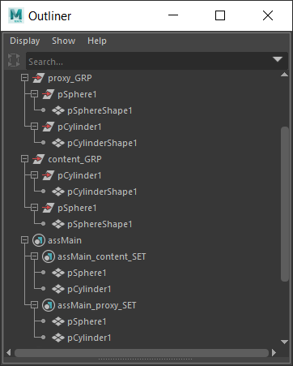
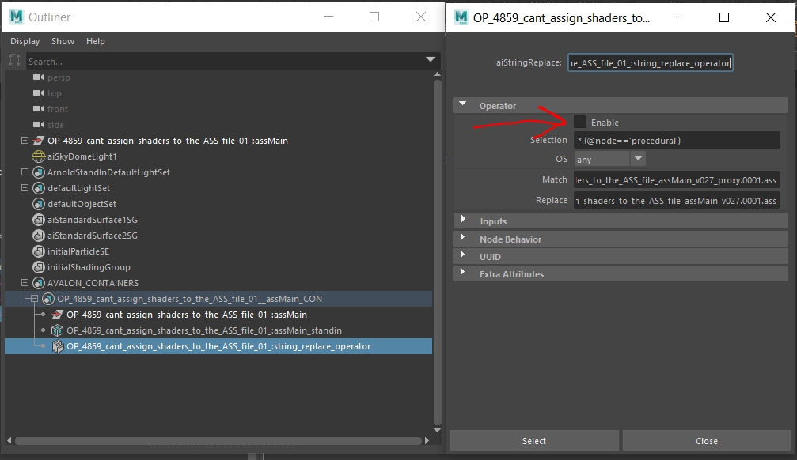

## Arnold Scene Source (.ass)
Arnold Scene Source can be published as a single file or a sequence of files, determined by the frame range.

When creating the instance, two objectsets are created; `content` and `proxy`. Meshes in the `proxy` objectset will be the viewport representation when loading as `standin`.

### Arnold Scene Source Proxy Workflow
In order to utilize operators and proxies, the content and proxy nodes need to share the same names (including the shape names). This is done by parenting the content and proxy nodes into separate groups. For example:

## Standin
Arnold Scene Source `ass` and Alembic `abc` are supported to load as standins.

### Standin Proxy Workflow
If a subset has a proxy representation, this will be used as display in the viewport. At render time the standin path will be replaced using the recommended string replacement workflow;

https://help.autodesk.com/view/ARNOL/ENU/?guid=arnold_for_maya_operators_am_Updating_procedural_file_paths_with_string_replace_html

Since the content and proxy nodes share the same names and hierarchy, any manually shader assignments will be shared.

:::note for advanced users
You can stop the proxy swapping by disabling the string replacement operator found in the container.

:::
