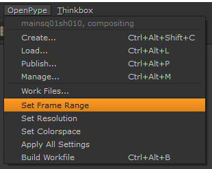
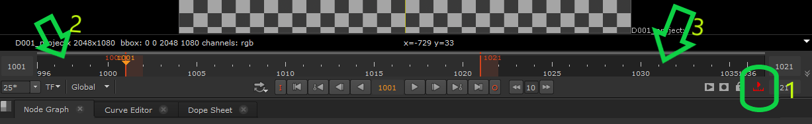
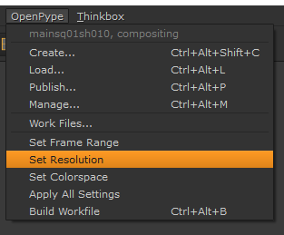
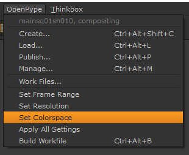
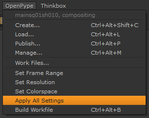
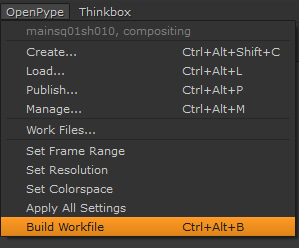
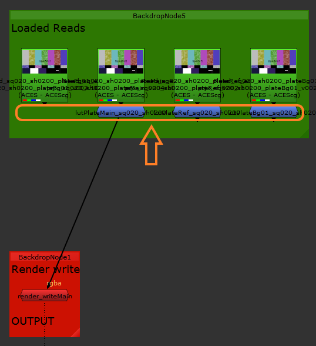

:::important
After Nuke starts it will automatically **Apply All Settings** for you. If you are sure the settings are wrong just contact your supervisor and he will set them correctly for you in project database.
:::

## Pype global tools

-   [Set Context](artist_tools.md#set-context)
-   [Work Files](artist_tools.md#workfiles)
-   [Create](artist_tools.md#creator)
-   [Load](artist_tools.md#loader)
-   [Manage (Inventory)](artist_tools.md#inventory)
-   [Publish](artist_tools.md#publisher)
-   [Library Loader](artist_tools.md#library-loader)

## Nuke specific tools

### Set Frame Ranges

Use this feature in case you are not sure the frame range is correct.

##### Result

-   setting Frame Range in script settings
-   setting Frame Range in viewers (timeline)

<figure>

<figcaption>

1.  limiting to Frame Range without handles
2.  **Input** handle on start
3.  **Output** handle on end

</figcaption>
</figure>

### Set Resolution

This menu item will set correct resolution format for you defined by your production.

##### Result

-   creates new item in formats with project name
-   sets the new format as used

### Set Colorspace

This menu item will set correct Colorspace definitions for you. All has to be configured by your production (Project coordinator).

##### Result

-   set Colorspace in your script settings
-   set preview LUT to your viewers

### Apply All Settings

It is usually enough if you once per while use this option just to make yourself sure the workfile is having set correct properties.

##### Result

-   set Frame Ranges
-   set Colorspace
-   set Resolution

### Build First Work File

This tool will create your first version of workfile and save it to correct folder with correct file name convention. It will look into database and get all last [versions](artist_concepts.md#version) of available [subsets](artist_concepts.md#subset).

##### Result

-   adds all last versions of subsets (rendered image sequences) as read nodes
-   adds available color transformations under Read nodes
-   adds publishable write node as `renderMain` subset

<figure>

<figcaption>

Orange arrow is pointing at `Lut` groups.

</figcaption>
</figure>

