This QuickStart is just a small introduction to what OpenPype can do for you. It attempts to make an overview for compositing artists, and simplifies processes that are better described in specific parts of the documentation.

## Launch Nuke - Shot and Task Context
OpenPype has to know what shot and task you are working on. You need to run Nuke in context of the task, using Ftrack Action or OpenPype Launcher to select the task and run Nuke.

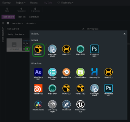
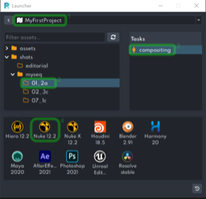

:::tip Admin Tip - Nuke version
You can [configure](admin_settings_project_anatomy.md#Attributes) which DCC version(s) will be available for current project in **Studio Settings → Project → Anatomy → Attributes → Applications**
:::

## Nuke OpenPype menu shows the current context

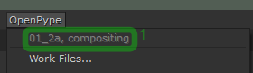

Launching Nuke with context stops your timer, and starts the clock on the shot and task you picked.

## Nuke Initial setup
Openpype makes initial setup for your Nuke script. It is the same as running [Apply All Settings](artist_hosts_nuke.md#apply-all-settings) from the OpenPype menu.

Reads frame range and resolution from Avalon database, sets it in Nuke Project Settings,
Creates Viewer node, sets it’s range and indicates handles by In and Out points.

Reads Color settings from the project configuration, and sets it in Nuke Project Settings and Viewer.

Sets project directory in the Nuke Project Settings to the Nuke Script Directory

## Save Nuke script – the Work File
Use OpenPype - Work files menu to create a new Nuke script. Openpype offers you the preconfigured naming. 
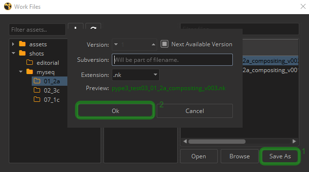

The Next Available Version checks the work folder for already used versions and offers the lowest unused version number automatically.

Subversion can be used to distinguish or name versions. For example used to add shortened artist name.

More about [workfiles](artist_tools#workfiles).

:::tip Admin Tips
- **Workfile Naming**

  - The [workfile naming](admin_settings_project_anatomy#templates) is configured in anatomy, see **Studio Settings → Project → Anatomy → Templates → Work**

- **Open Workfile**

  - You can [configure](project_settings/settings_project_nuke#create-first-workfile) Nuke to automatically open the last version, or create a file on startup. See **Studio Settings → Project → Global → Tools → Workfiles**

- **Nuke Color Settings**

  - [Color setting](project_settings/settings_project_nuke) for Nuke can be found in **Studio Settings → Project → Anatomy → Color Management and Output Formats → Nuke**
:::

## Load plate – Asset Loader
Use Load from OpenPype menu to load any plates or renders available.

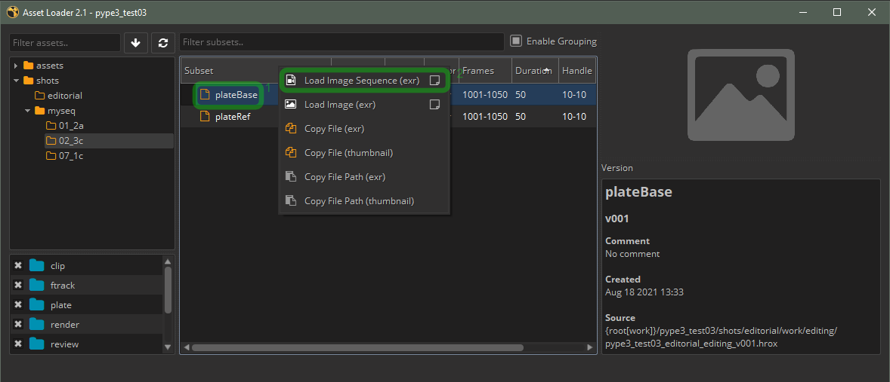

Pick the plate asset, right click and choose Load Image Sequence to create a Read node in Nuke.

Note that the Read node created by OpenPype is green. Green color indicates the highest version of asset is loaded. Asset versions could be easily changed by [Manage](#managing-versions). Lower versions will be highlighted by orange color on the read node.

More about [Asset loader](artist_tools#loader).

## Create Write Node – Instance Creator
To create OpenPype managed Write node, select the Read node you just created, from OpenPype menu, pick Create.
In the Instance Creator, pick Create Write Render, and Create.

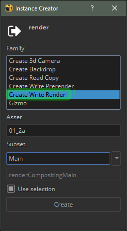

This will create a Group with a Write node inside.

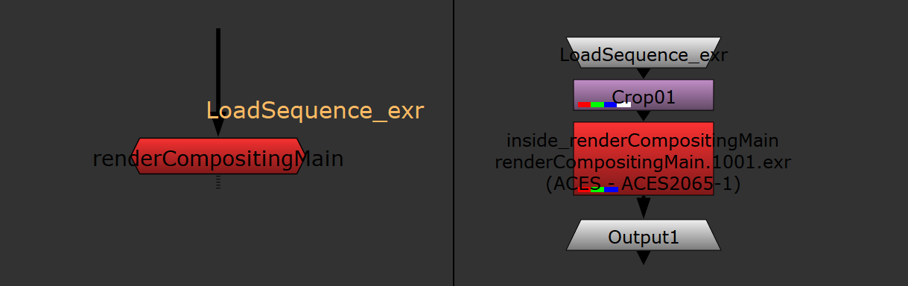

:::tip Admin Tip - Configuring write node
You can configure write node parameters in **Studio Settings → Project → Anatomy → Color Management and Output Formats → Nuke → Nodes**
:::

## What Nuke Publish Does
From Artist perspective, Nuke publish gathers all the stuff found in the Nuke script with Publish checkbox set to on, exports stuff and raises the Nuke script (workfile) version.

The Pyblish dialog shows the progress of the process.

The left column of the dialog shows what will be published. Typically it is one or more renders or prerenders, plus work file.

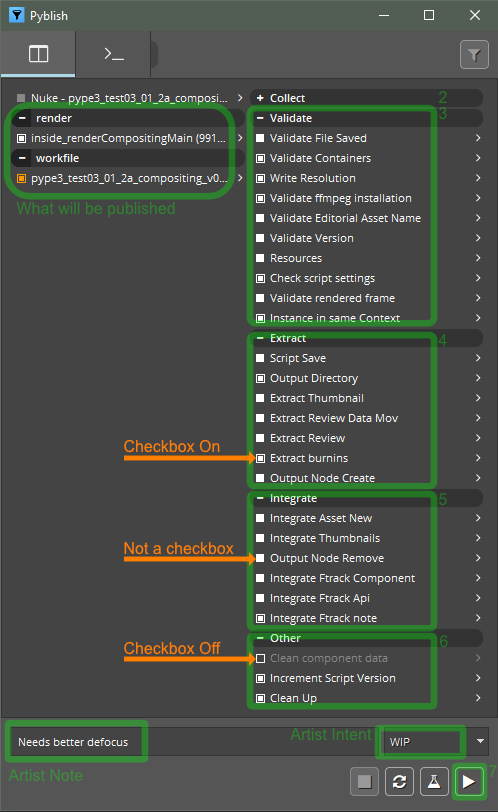

The right column shows the publish steps

#### Publish steps
1. Gathers all the stuff found in the Nuke script with Publish checkbox set to on
2. Collects all the info (from the script, database…)
3. Validates components to be published (checks render range and resolution...)
4. Extracts data from the script
   -  generates thumbnail
   -  creates review(s) like h264
   -  adds burnins to review(s)
   -  Copies and renames components like render(s), review(s), Nuke script... to publish folder
5. Integrates components (writes to database, sends preview of the render to Ftrack ...
6. Increments Nuke script version, cleans up the render directory

Gathering all the info and validating usually takes just a few seconds. Creating reviews for long, high resolution shots can however take significant amount of time when publishing locally.

#### Pyblish Note and Intent
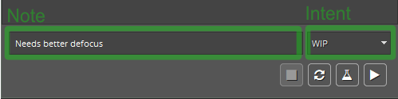

Artist can add Note and Intent before firing the publish button. The Note and Intent is ment for easy communication between artist and supervisor. After publish, Note and Intent can be seen in Ftrack notes.

#### Pyblish Checkbox

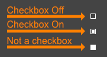

Pyblish Dialog tries to pack a lot of info in a small area. One of the more tricky parts is that it uses non-standard checkboxes. Some squares can be turned on and off by the artist, some are mandatory.

If you run the publish and decide to not publish the Nuke script, you can turn it off right in the Pyblish dialog by clicking on the checkbox. If you decide to render and  publish the shot in lower resolution to speed up the turnaround, you have to turn off the Write Resolution validator. If you want to use an older version of the asset (older version of the plate...), you have to turn off the Validate containers, and so on.

More info about [Using Pyblish](artist_tools#publisher)

:::tip Admin Tip - Configuring validators
You can configure Nuke validators like Output Resolution in **Studio Settings → Project → Nuke → Publish plugins**
:::

## Review
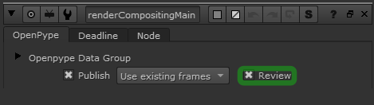

When you turn the review checkbox on in your OpenPype write node, here is what happens:
- OpenPype uses the current Nuke script to 
  - Load the render
  - Optionally apply LUT
  - Render Prores 4444 with the same resolution as your render
- Use Ffmpeg to convert the Prores to whatever review(s) you defined
- Use Ffmpeg to add (optional) burnin to the review(s) from previous step

Creating reviews is a part of the publishing process. If you choose to do a local publish or to use existing frames, review will be processed also on the artist's machine.
If you choose to publish on the farm, you will render and do reviews on the farm.

So far there is no option for using existing frames (from your local / check render) and just do the review on the farm.

More info about [configuring reviews](pype2/admin_presets_plugins#extractreview).

:::tip Admin Tip - Configuring Reviews
You can configure reviewsin **Studio Settings → Project → Global → Publish plugins → ExtractReview / ExtractBurnin**
Reviews can be configured separately for each host, task, or family. For example Maya can produce different review to Nuke, animation task can have different burnin then modelling, and plate can have different review then model.
:::

## Render and Publish

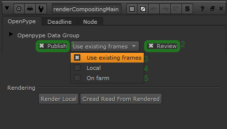

Let’s say you want to render and publish the shot right now, with only a Read and Write node. You need to decide if you want to render, check the render and then publish it, or you want to execute the render and publish in one go.

If you wish to check your render before publishing, you can use your local machine or your farm to render the write node as you would do without OpenPype, load and check your render (OpenPype Write has a convenience button for that), and if happy, use publish with Use existing frames option selected in the write node to generate the review on your local machine.

If you want to render and publish on the farm in one go, run publish with On farm option selected in the write node to render and make the review on farm.

## Version-less Render

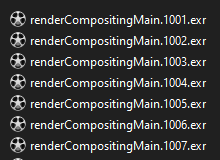

OpenPype is configured so your render file names have no version number. The main advantage is that you can keep the render from the previous version and re-render only part of the shot. With care, this is handy.

Main disadvantage of this approach is that you can render only one version of your shot at one time. Otherwise you risk to partially overwrite your shot render before publishing copies and renames the rendered files to the properly versioned publish folder.

When making quick farm publishes, like making two versions with different color correction, care must be taken to let the first job (first version) completely finish before the second version starts rendering.

## Managing Versions

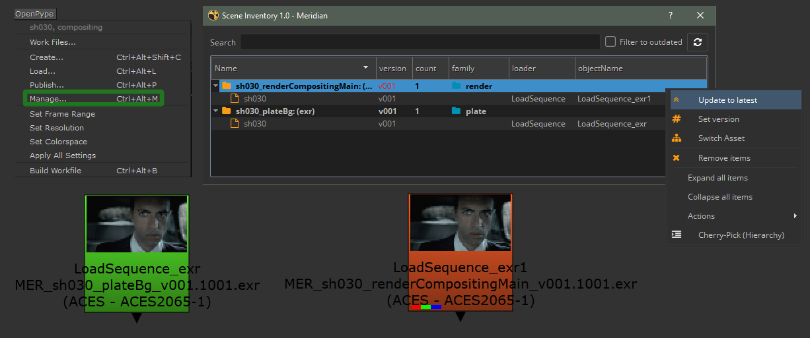

OpenPype checks all the assets loaded to Nuke on script open. All out of date assets are colored orange, up to date assets are colored green.

Use Manage to switch versions for loaded assets.

## Fixing Validate Containers

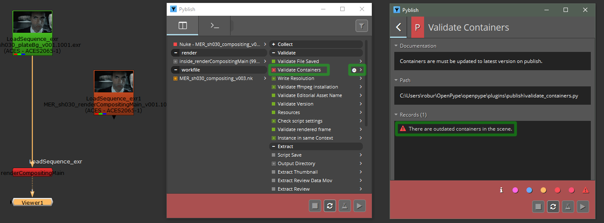

If your Pyblish dialog fails on Validate Containers, you might have an old asset loaded. Use OpenPype - Manage... to switch the asset(s) to the latest version.

## Fixing Validate Version
If your Pyblish dialog fails on Validate Version, you might be trying to publish already published version. Rise your version in the OpenPype WorkFiles SaveAs.

Or maybe you accidentaly copied write node from different shot to your current one. Check the write publishes on the left side of the Pyblish dialog. Typically you publish only one write. Locate and delete the stray write from other shot.