## Available Tools

-   [Work Files](artist_tools.md#workfiles)
-   [Create](artist_tools.md#creator)
-   [Load](artist_tools.md#loader)
-   [Publish](artist_tools.md#publisher)
-   [Manage](artist_tools.md#inventory)

## Setup

To install the extension, download, install [Anastasyi's Extension Manager](https://install.anastasiy.com/). Open Anastasyi's Extension Manager and select Photoshop in menu. Then go to `{path to pype}hosts/photoshop/api/extension.zxp`. Drag extension.zxp and drop it to Anastasyi's Extension Manager. The extension will install itself. 

## Usage

When you launch Photoshop you will be met with the Workfiles app. If dont have any previous workfiles, you can just close this window.

In Photoshop you can find the tools in the `OpenPype` extension:

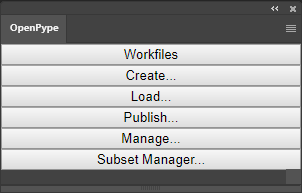 <!-- picture needs to be changed -->

You can show the extension panel by going to `Window` > `Extensions` > `OpenPype`.

### Create

When you have created an image you want to publish, you will need to create special groups or tag existing groups. To do this open the `Creator` through the extensions `Create` button.

With the `Creator` you have a variety of options to create:

- Check `Use selection` (A dialog will ask whether you want to create one image per selected layer).
    - Yes.
        - No selection.
            - This will create a single group named after the `Subset` in the `Creator`.
        - Single selected layer.
            - The selected layer will be grouped under a single group named after the selected layer.
        - Single selected group.
            - The selected group will be tagged for publishing.
        - Multiple selected items.
            - Each selected group will be tagged for publishing and each layer will be grouped individually.
    - No.
        - All selected layers will be grouped under a single group named after the `Subset` in the `Creator`.
- Uncheck `Use selection`.
    - This will create a single group named after the `Subset` in the `Creator`.

#### Simplified publish

There is a simplified workflow for simple use case where only single image should be created containing all visible layers.
No image instances must be present in a workfile and `project_settings/photoshop/publish/CollectInstances/flatten_subset_template` must be filled in Settings.
Then artists just need to hit 'Publish' button in menu.

### Publish

When you are ready to share some work, you will need to publish. This is done by opening the `Pyblish` through the extensions `Publish` button.

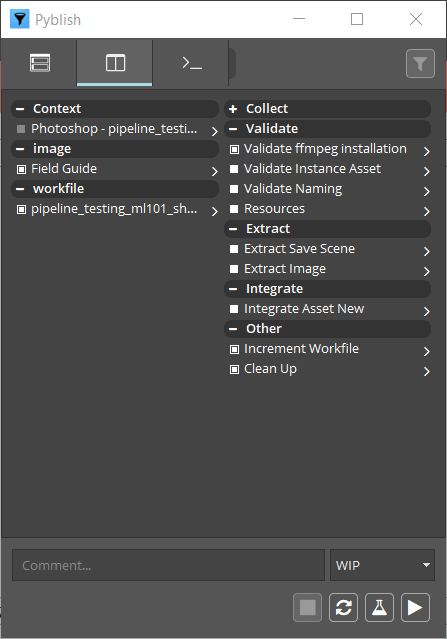 <!-- picture needs to be changed -->

This tool will run through checks to make sure the contents you are publishing is correct. Hit the "Play" button to start publishing.

You may encounter issues with publishing which will be indicated with red squares. If these issues are within the validation section, then you can fix the issue. If there are issues outside of validation section, please let the OpenPype team know.

#### Repair Validation Issues

All validators will give some description about what the issue is. You can inspect this by going into the validator through the arrow:

 <!-- picture needs to be changed -->

You can expand the errors by clicking on them for more details:

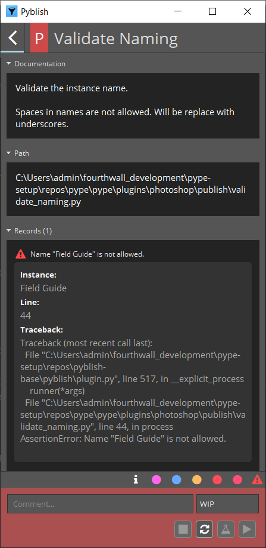 <!-- picture needs to be changed -->

Some validator have repair actions, which will fix the issue. If you can identify validators with actions by the circle icon with an "A":

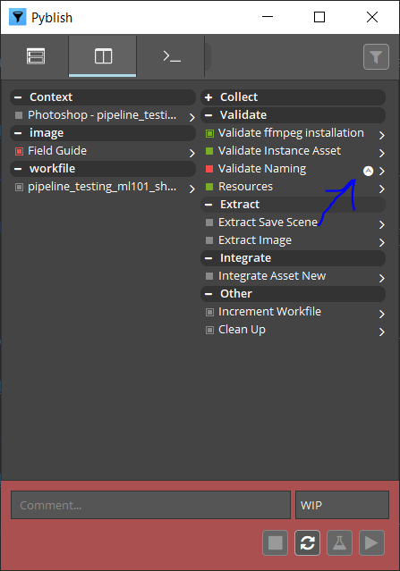 <!-- picture needs to be changed -->

To access the actions, you right click on the validator. If an action runs successfully, the actions icon will turn green. Once all issues are fixed, you can just hit the "Refresh" button and try to publish again.

 <!-- picture needs to be changed -->

### Load

When you want to load existing published work, you can load in smart layers through the `Loader`. You can reach the `Loader` through the extension's `Load` button.

 <!-- picture needs to be changed -->

The supported families for Photoshop are:

- `image`

To load an image, right-click on the subset you want and choose a representation:

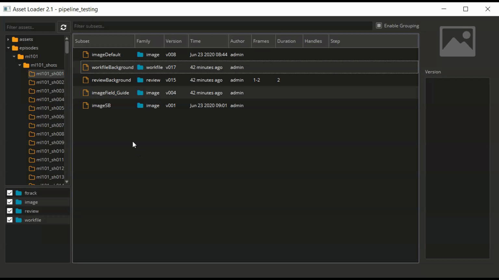

### Manage

Now that we have some images loaded, we can manage which version is loaded. This is done through the `Scene Inventory`. You can reach it through the extension's `Manage` button.

:::note
Loaded images has to stay as smart layers in order to be updated. If you rasterize the layer, you cannot update it to a different version.
:::

You can switch to a previous version of the image or update to the latest.

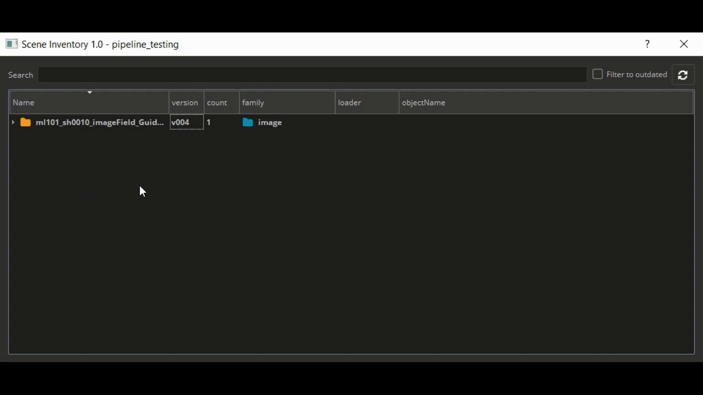
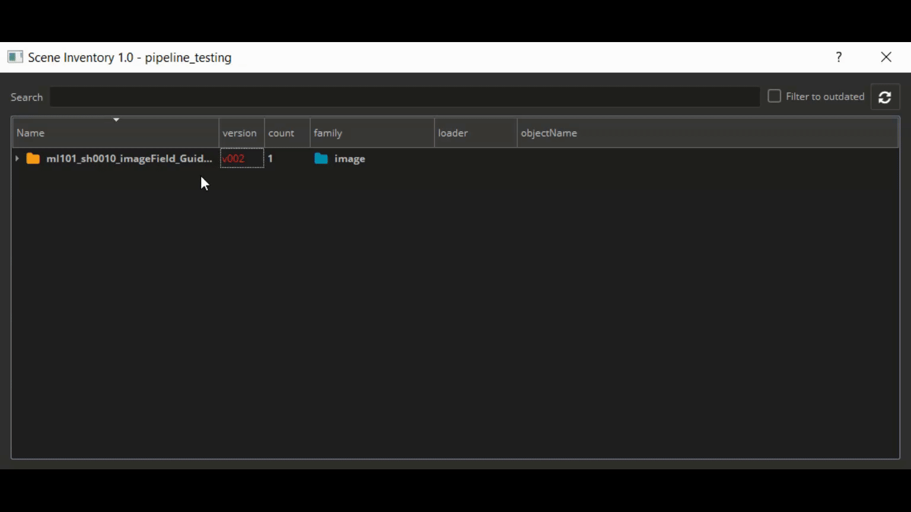

### New Publisher

All previous screenshot came from regular [pyblish](https://pyblish.com/) process, there is also a different UI available. This process extends existing implementation and adds new functionalities.

To test this in Photoshop, the artist needs first to enable experimental `New publisher` in Settings. (Tray > Settings > Experimental tools)
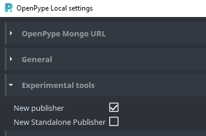

New dialog opens after clicking on `Experimental tools` button in Openpype extension menu.
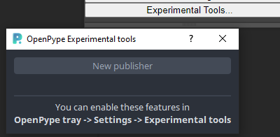

After you click on this button, this dialog will show up.

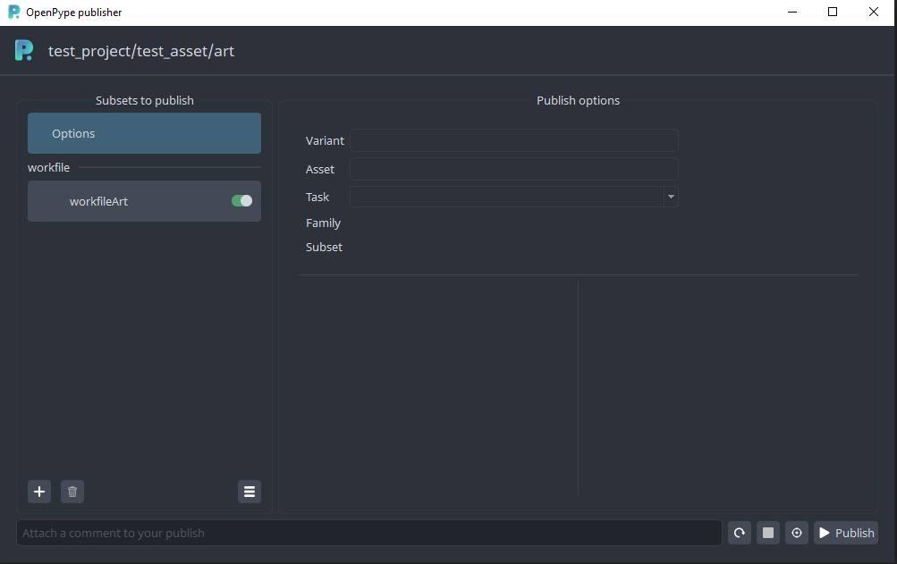

You can see the first instance, called `workfileYourTaskName`. (Name depends on studio naming convention for Photoshop's workfiles.). This instance is so called "automatic", 
it was created without instigation by the artist. You shouldn't delete this instance as it might hold necessary values for future publishing, but you can choose to skip it
from publishing (by toggling the pill button inside of the rectangular object denoting instance).

New publisher allows publishing into different context, just click on a workfile instance, update `Variant`, `Asset` or `Task` in the form in the middle and don't forget to click on the 'Confirm' button.

Similarly to the old publishing approach, you need to create instances for everything you want to publish. You will initiate by clicking on the '+' sign in the bottom left corner.

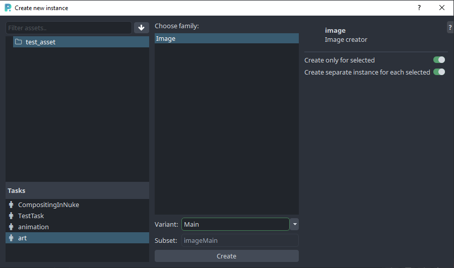

In this dialog you can select the family for the published layer or group. Currently only 'image' is implemented.

On right hand side you can see creator attributes:
- `Create only for selected` - mimics `Use selected` option of regular publish
- `Create separate instance for each selected` - if separate instance should be created for each layer if multiple selected

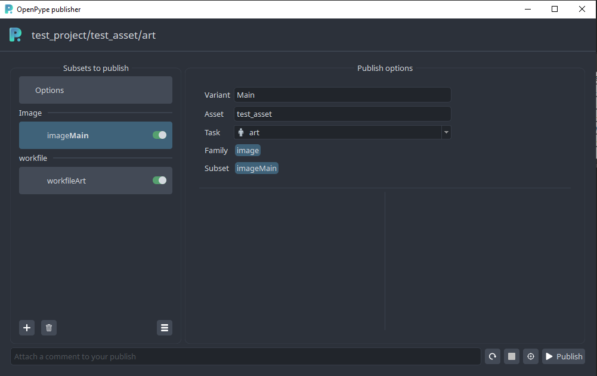

Here you can see a newly created instance of image family. (Name depends on studio naming convention for image family.) You can disable instance from publishing in the same fashion as a workfile instance.
You could also decide delete instance by selecting it and clicking on a trashcan icon (next to plus button on left button)

Buttons on the bottom right are for:
- `Refresh publishing` - set publishing process to starting position - useful if previous publish failed, or you changed configuration of a publish
- `Stop/pause publishing` - if you would like to pause publishing process at any time
- `Validate` - if you would like to run only collecting and validating phases (nothing will be published yet)
- `Publish` - standard way how to kick off full publishing process

In the unfortunate case of some error during publishing, you would receive this kind of error dialog.

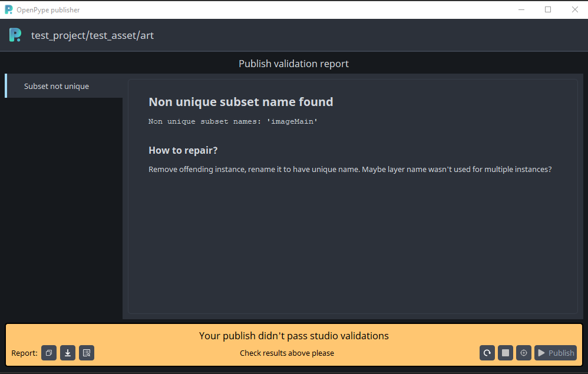

In this case there is an issue that you are publishing two or more instances with the same subset name ('imageMaing'). If the error is recoverable by the artist, you should
see helpful information in a `How to repair?` section or fix it automatically by clicking on a 'Wrench' button on the right if present.

If you would like to ask for help admin or support, you could use any of the three buttons on bottom left:
- `Copy report` - stash full publishing log to a clipboard
- `Export and save report` - save log into a file for sending it via mail or any communication tool
- `Show details` - switches into a more detailed list of published instances and plugins. Similar to the old pyblish list.

If you are able to fix the workfile yourself, use the first button on the right to set the UI to initial state before publish. (Click the `Publish` button to start again.)

New publishing process should be backward compatible, eg. if you have a workfile with instances created in the previous publishing approach, they will be translated automatically and
could be used right away.

If you would create instances in a new publisher, you cannot use them in the old approach though!

If you would hit on unexpected behaviour with old instances, contact support first, then you could try some steps to recover your publish. Delete instances in New publisher UI, or try `Subset manager` in the extension menu.
Nuclear option is to purge workfile metadata in `File > File Info > Origin > Headline`. This is only for most determined daredevils though!
