import Tabs from '@theme/Tabs';
import TabItem from '@theme/TabItem';

:::warning
Before you are able to start with OpenPype tools in DaVinci Resolve, installation of its own Python 3.6 interpreter and PySide 2 has to be done. Go to [Installation of python and pyside](admin_hosts_resolve.md#installation-of-python-and-pyside) link for more information
:::

## OpenPype global tools

-   [Work Files](artist_tools.md#workfiles)
-   [Create](artist_tools.md#creator)
-   [Load](artist_tools.md#loader)
-   [Manage (Inventory)](artist_tools.md#inventory)
-   [Publish](artist_tools.md#publisher)

## Creating Shots from timeline items

Before a clip can be published with [Publisher](artist_tools.md#publisher) timeline item has to be marked with OpenPype metadata markers. This way it is converted to a publishable subset.

Lets do it step by step.

### Color clips before opening Create menu

Timeline video clips should be colored to `Chocolate` color for OpenPype to se it as selected for subset creation.

### Rename timeline track names

To be able to work with dynamic subset name, which is based on track names it is recommended to rename those tracks to what type of plates their clips represent. Commonly used ones are `main`, `review`, `fg01`, `fg02`, `bg`, `bg01`, etc. It is completely up to you but we recommend to always have at least `main` plate. For example if a clip is on track **element** and subset family is set to **plate** then the resulting subset name will be **plateElement**

  

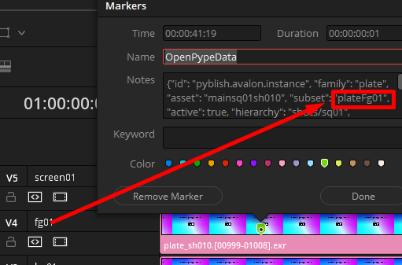
The name of the resulting *subset* can be seen in the **OpenPypeData** marker.
    

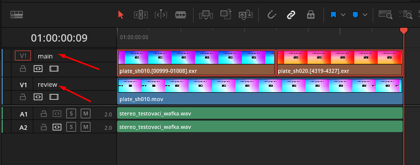
Simple track setup where we are only using `main` and  `review` track names.

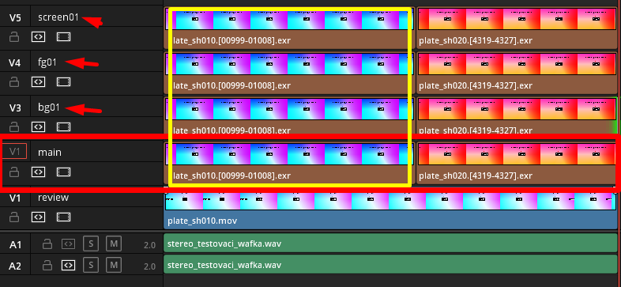
An example of used track names. The yellow frame is highlighting vertically aligned clips - which are going to be renamed and grouped together under one asset (shot) name. The concept of vertical renaming will be explained later in [Vertical Synchronization of Subset Attributes](#vertical-synchronization-of-subset-attributes).

### Create menu...

After all clips which are intended to be converted to publishable instances are colored to `Chocolate` color, you can open OpenPype menu.

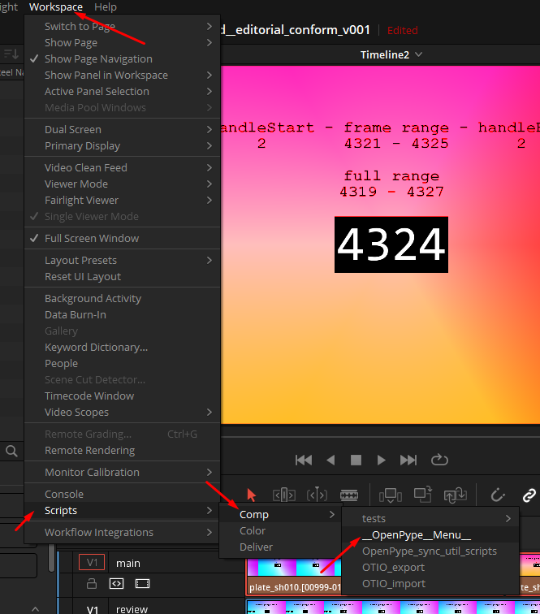

After the menu widget is opened (it can take while so be patient please :).

Hit `Create ...` and then set **Use selection** to active and select the family to **Create Publishable Clips**. 

The Subset name can stay as it is, it is not going to be used because each clip will generate it's own name.

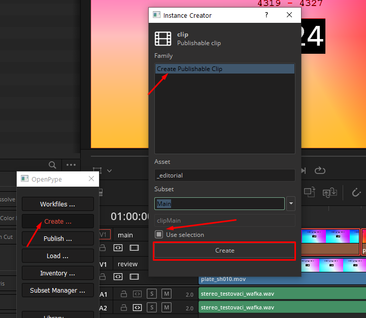

The new windows that opens, let's you define various attributes for your future subsets and shots.

Set Rename clips to active if you wish to use different names of shots in pipeline then the original clip names conformed from EDL/XML.

**Count sequence from** - Start of the shot numbering if `#` is used in one of the keywords

**Stepping number** - Sequential gaps in the numbering

As you can see the in `{shot}` key within *Shot Template Keywords* section, you can use `#` symbol do define padding of the number in sequence and where it's going to be used.

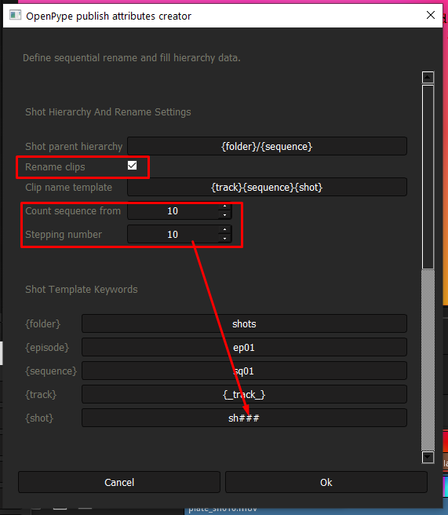

Notice the relationship of following sections. Keys from **Shot Template Keywords** sections will be used for formatting of templates in **Shot Hierarchy And Rename Settings** section.

**Shot parent hierarchy** will be forming parents of the asset (shot) *the hidden root for this is project folder*. So for example of this template we will get resulging string `shots/sq01`

**Clip name template** in context of clip sitting on track name `main` in second position `mainsq01sh020`. This is due track key is hosting `{_track_}` which is inheriting name form timeline track name. Other allowed namespases are:
- `{_sequence_}`: timeline name
- `{_clip_}`: clip name
- `{_trackIndex_}`: position of track on timeline from bottom
- `{_clipIndex_}`: clip position on timeline from left

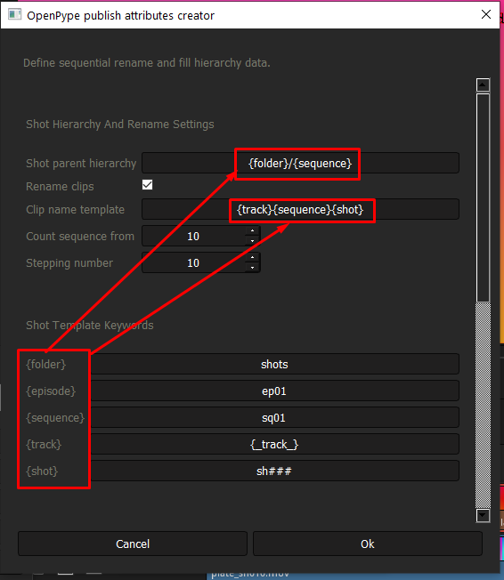

### Vertical synchronization of subset attributes

In case you are only working with two tracks on timeline where `main` track is going to be used as plates for compositors and `review` track holds mp4 clips for offlines and web preview. **Enable vertical sync** can be deactivated.

In multiple tracks scenario - as mentioned [here](#rename-timeline-track-names) - it is recommended to activate **Enable vertical sync** and define the hero (driving) track to *main*. This will ensure that all of the clips on corresponding to the same shots will have the same publishing parameters.

  

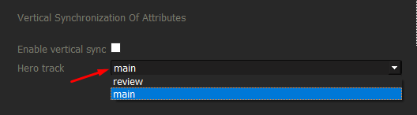

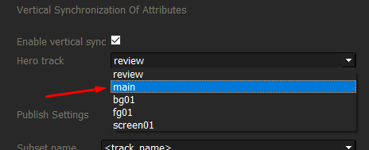

## Publishing Shots

Once all `Chocolate` colored clips have gone through the [creator](#rcreate-menu), have been colored to `Pink` color and a marker has been created for each of them, it means they have been successfully converted to publishable clips. Now we can run **Publisher** - it's button can be found in the OpenPype menu.

  

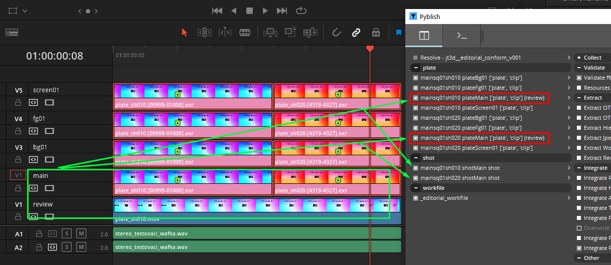
Notice that the main track clips and review had been merged into one instance. And since it is main `hero` clip it is also holding all new shot metadata. For that reason it also create secon instance for each with `shot` family. This instance will create all shot hierarchy and pass frame range attributes to shot (asset).

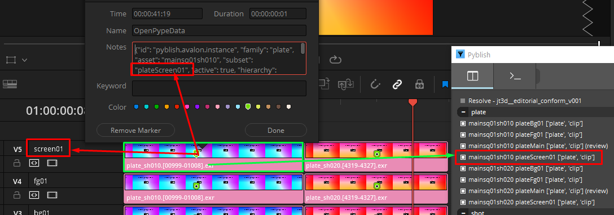
Also notice how the subset name is formed form a *track* name and *subset family* from previous steps.

Also important is to notice the asset name in *OpenPypeData* at marker - the name is the same for all **Vertically renamed** shots as they have been grouped together. Unfortunately Resolve is not allowing to rename the clips so the only way to know is to see it in marker's metadata.

