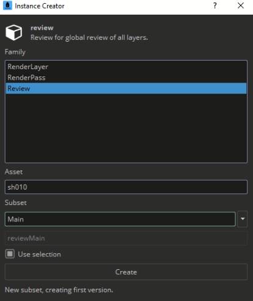
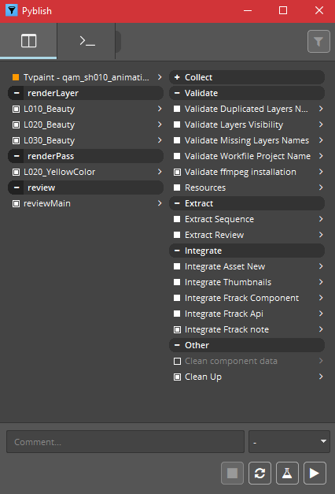
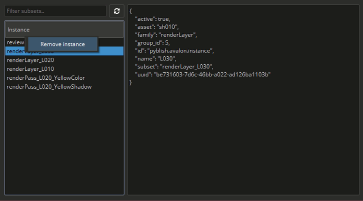

-   [Work Files](artist_tools.md#workfiles)
-   [Load](artist_tools.md#loader)
-   [Create](artist_tools.md#creator)
-   [Subset Manager](artist_tools.md#subset-manager)
-   [Scene Inventory](artist_tools.md#scene-inventory)
-   [Publish](artist_tools.md#publisher)
-   [Library](artist_tools.md#library)

## Setup
When you launch TVPaint with OpenPype for the very first time it is necessary to do some additional steps. Right after the TVPaint launching a few system windows will pop up. 

Choose `Replace the file in the destination`. Then another window shows up. 

Click on `Continue`.

After opening TVPaint go to the menu bar: `Windows → Plugins → OpenPype`. 

Another TVPaint window pop up. Please press `Yes`. This window will be presented in every single TVPaint launching. Unfortunately, there is no other way how to workaround it. 

Now OpenPype Tools menu is in your TVPaint work area. 

You can start your work. 

---

## Usage
In TVPaint you can find the Tools in OpenPype menu extension. The OpenPype Tools menu should be available in your work area. However, sometimes it is happening that the Tools menu is hidden. You can display the extension panel by going to `Windows -> Plugins -> OpenPype`.

## Create 
In TVPaint you can create and publish [Reviews](#review), [Render Passes](#render-pass), and [Render Layers](#render-layer). 

You have the possibility to organize your layers by using `Color group`.  

On the bottom left corner of your timeline, you will note a `Color group` button.

It allows you to choose a group by checking one of the colors of the color list. 

The timeline's animation layer can be marked by the color you pick from your Color group. Layers in the timeline with the same color are gathered into a group represents one render layer. 

:::important
OpenPype specifically never tries to guess what you want to publish from the scene. Therefore, you have to tell OpenPype what you want to publish. There are three ways how to publish render from the scene. 
:::

When you want to publish `review` or `render layer` or `render pass`, open the `Creator` through the Tools menu `Create` button.

### Review 
Review renders the whole file as is and sends its QuickTime to Ftrack. For the animation review select `Review` in the `Creator` and press `Create`. 

### Render Layer
Render Layer bakes all layers of one particular color group. Choose any amount of animation layers that need to be grouped together and assign them a color. Select any layer of a particular color, go to `Creator` and choose `RenderLayer`. In the `Subset`, you type what is gonna be its name *(L10, L20, etc.)* according to the naming convention in your studio. After publishing all layers within one color group will be rendered as one. 

### Render Pass
Render Passes are specific because they have to belong to a particular layer. If you try to create a render pass and did not do any render layer before, it will pop up an error message. 

When you need to create `RenderPass` choose one or several layers within one color group that you want to publish (*L020_colour_fx*, *L020_colour_mouth*, and *L020_colour_eye* from a yellow group of animation layers). In Creator pick `RenderPass` and the `Subset` fill out with e.g. `YellowColor`. You can check your render instances in [Subset Manager](#subset-manager) or you can start to publish. The publishing process will show you a collection of all instances.

It will render selected layers within the color group. E.i. the layers *L020_colour_fx*, *L020_colour_mouth*, and *L020_colour_eye* will be rendered as one pass.  

---

## Publish 
Now you have created the required instances and you can publish them via `Publish` tool. Just click on `Publish` in OpenPype Tools menu, wait until all instances are collected correctly. You can check on the left side whether all your instances have been created and ready for publishing. Then press the `Play` button. 

Once the `Publish` window gets green your renders have been published. 

---

## Subset Manager
All created instances (render layers, passes, and reviews) will be shown as a simple list. If you don't want to publish them, right click on the item in the list and select `Remove instance`.

---

## Load 
When you want to load existing published work you can reach the `Loader` through the OpenPype Tools `Load` button.

The supported families for TVPaint are:

- `render`
- `image`
- `background`
- `plate`

To load a family item, right-click on the subset you want and import their representations, switch among the versions, delete older versions, copy files, etc.

---

## Scene Inventory
Scene Inventory shows you everything that you have loaded into your scene using OpenPype. You can reach it through the extension's `Scene Inventory` button.

You can switch to a previous version of the file or update it to the latest or delete items. 
