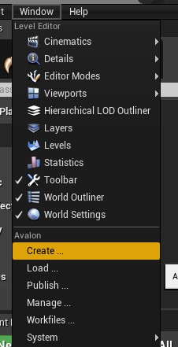
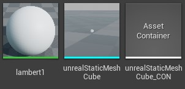

## Introduction

OpenPype supports Unreal in similar ways as in other DCCs Yet there are few specific you need to be aware of.

### Project naming

Unreal doesn't support project names starting with non-alphabetic character. So names like `123_myProject` are
invalid. If OpenPype detects such name it automatically prepends letter **P** to make it valid name, so `123_myProject` will become `P123_myProject`. There is also soft-limit on project name length to be shorter then 20 characters. Longer names will issue warning in Unreal Editor that there might be possible side effects.

## OpenPype global tools

OpenPype global tools can be found in *Window* main menu:

-   [Create](artist_tools.md#creator)
-   [Load](artist_tools.md#loader)
-   [Manage (Inventory)](artist_tools.md#inventory)
-   [Publish](artist_tools.md#publisher)
-   [Library Loader](artist_tools.md#library-loader)

## Static Mesh

### Loading

To import Static Mesh model, just choose **OpenPype → Load ...** and select your mesh. Static meshes are transferred as FBX files as specified in [Unreal Engine 4 Static Mesh Pipeline](https://docs.unrealengine.com/en-US/Engine/Content/Importing/FBX/StaticMeshes/index.html). This action will create new folder with subset name (`unrealStaticMeshMain_CON` for example) and put all data into it. Inside, you can find:

In this case there is **lambert1**, material pulled from Maya when this static mesh was published, **unrealStaticMeshCube** is the geometry itself, **unrealStaticMeshCube_CON** is a *AssetContainer* type and is there to mark this directory as Avalon Container (to track changes) and to hold OpenPype metadata.

### Publishing

Publishing of Static Mesh works in similar ways. Select your mesh in *Content Browser* and **OpenPype → Create ...**. This will create folder named by subset you've chosen - for example **unrealStaticMeshDefault_INS**. It this folder is that mesh and *Avalon Publish Instance* asset marking this folder as publishable instance and holding important metadata on it. If you want to publish this instance, go **OpenPype → Publish ...**