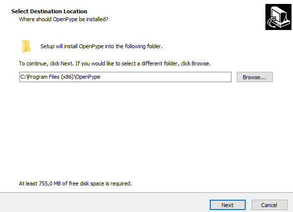
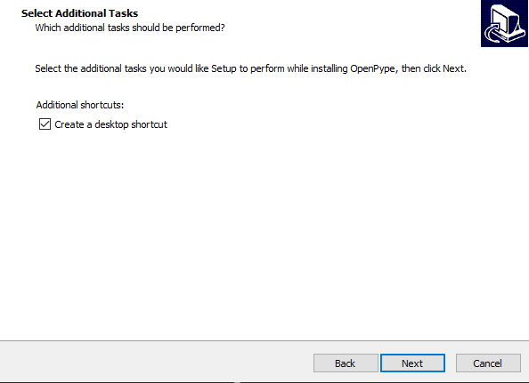
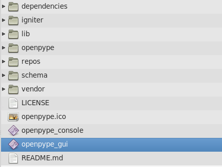
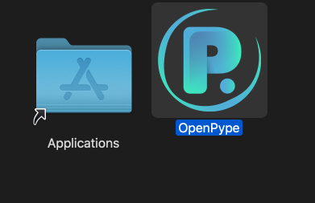
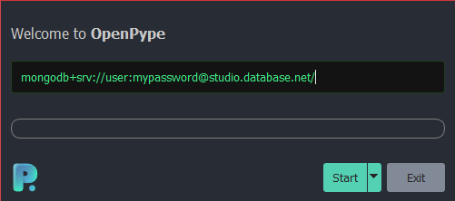
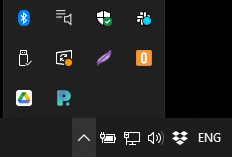

import Tabs from '@theme/Tabs';
import TabItem from '@theme/TabItem';

## Installation

OpenPype comes in packages for Windows (10 or Server), Mac OS X (Mojave or higher), and Linux distribution (Centos, Ubuntu), and you can install them on your machine the same way as you are used to. 

:::important
To install OpenPype you will need administrator permissions.
:::

:::note pick your platform
<Tabs 
    defaultValue='win'
    values={[
        {label: 'Windows', value: 'win'},
        {label: 'Linux', value: 'linux'},
        {label: 'Mac OS X', value: 'mac'},
    ]}>

<TabItem value='win'>

For installation on Windows, download and run the executable file `OpenPype-3.0.0.exe`.
During the installation process, you can change the destination location path of the application, 

and create an icon on the desktop.

</TabItem>

<TabItem value='linux'>

For installation on your Linux distribution, download and unzip `OpenPype-3.0.0.zip`. A new folder `OpenPype-3.0.0` will be created.
Inside this folder find and run `openpype_gui`,

</TabItem>

<TabItem value='mac'>

For installation on Mac OS X, download and run dmg image file `OpenPype-3.0.0.dmg`. 

Drag the OpenPype icon into the Application folder.

After the installation, you can find OpenPype among the other Applications. 

</TabItem>
</Tabs>
:::

## Run OpenPype

To run OpenPype click on the icon or find executable file (e.g. `C:\Program Files (x86)\OpenPype\openpype_gui.exe`) in the application location. 
On the very first run of OpenPype the user will be asked for OpenPype Mongo URL. 
This piece of information will be provided by the administrator or project manager who set up the studio.

Once the Mongo URL address is entered, press `Start`, and OpenPype will be initiated. 
OpenPype will also remember the connection for the next launch, so it is a one-time process. 

:::note
If the launch was successful, the artist should see a turquoise OpenPype logo in their
tray menu. Keep in mind that on Windows this icon might be hidden by default, in which case, the artist can simply drag the icon down to the tray.

:::