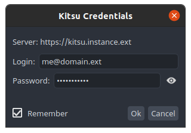

# How to use Kitsu in OpenPype

## Login to Kitsu module in OpenPype
1. Launch OpenPype, the `Kitsu Credentials` window will open automatically, if not, or if you want to log-in with another account, go to systray OpenPype icon and click on `Kitsu Connect`.
2. Enter your credentials and press *Ok*:

    

:::tip
In Kitsu, All the publish actions executed by `pyblish` will be attributed to the currently logged-in user.
:::