## Set Context

Any time your host app is open in defined context it can be changed to different hierarchy, asset or task within a project. This will allow you to change your opened session to any other asset, shot and tasks within the same project. This is useful particularly in cases where your host takes long time to start.

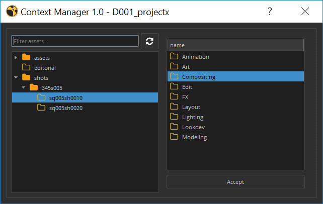

:::note

Notice that the window doesn't close after hitting `Accept` and confirming the change of context. This behaviour let's you keep the window open and change the context multiple times in a row.
:::

## Creator

### Details

Despite the name, Creator isn't for making new content in your scene, but rather taking what's already in it and creating all the metadata your content needs to be published.

In Maya this means creating a set with everything you want to publish and assigning custom attributes to it so it gets picked up during publishing stage.

In Nuke it's either converting an existing write node to a publishable one, or simply creating a write node with all the correct settings and outputs already set.

### Usage

1.  select what you want to publish from your scenes
2.  Open *Creator* from OpenPype menu
3.  Choose what family (data type) you need to export
4.  Type the name for you export. This name is how others are going to be able to refer to this particular subset when loading it into their scenes. Every assets should have a Main subset, but can have any number of other variants.
5.  Click on *Create*

  * * *

## Loader
Loader loads published subsets into your current scene or script.

### Usage
1. open *Loader* from OpenPype menu
2. select the asset where the subset you want to load is published
3. from subset list select the subset you want
4. right-click the subset
5. from action menu select what you want to do *(load, reference, ...)*

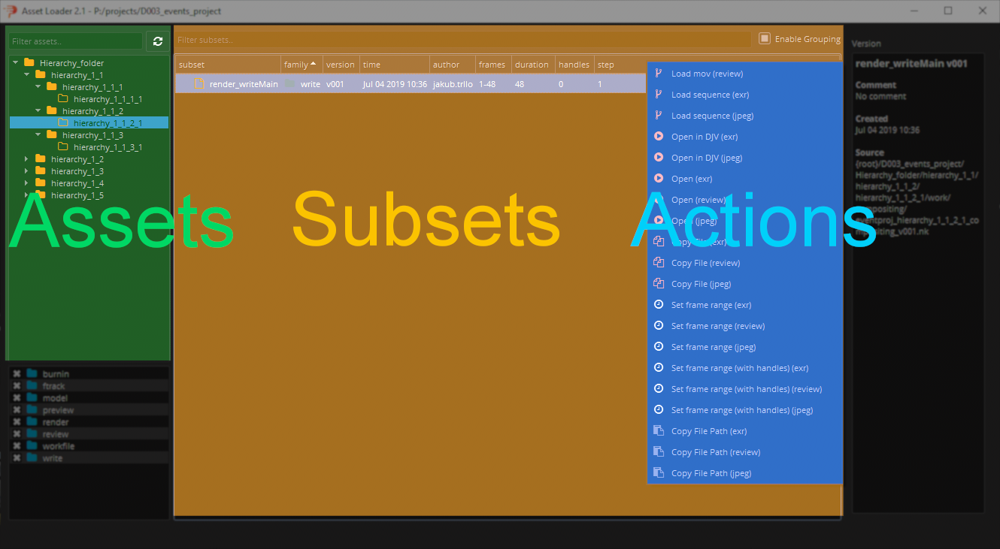 <!-- picture needs to be changed -->

### Refresh data
Data are not auto-refreshed to avoid database issues. To refresh assets or subsets press refresh button.

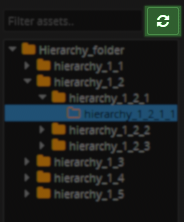

### Load another version
Loader by default load last version, but you can of course load another versions. Double-click on the subset in the version column to expose the drop down, choose version you want to load and continue from point 4 of the [Usage](#usage-1).

  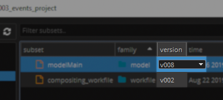

  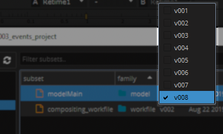

### Filtering

#### Filter Assets and Subsets by name
To filter assets/subsets by name just type name or part of name to filter text input. Only assets/subsets containing the entered string remain.

- **Assets filtering example** *(it works the same for subsets)*:

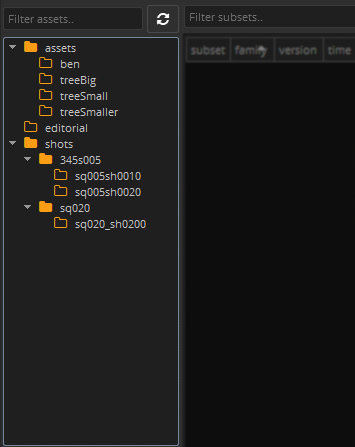

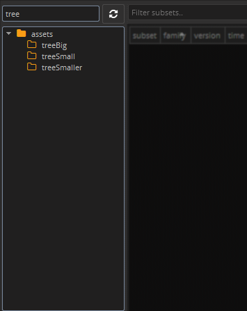

#### Filter Subsets by Family

To filter [subsets](artist_concepts.md#subset) by their [families](artist_publish.md#families) you can use families list where you can check families you want to see or uncheck families you are not interested in.

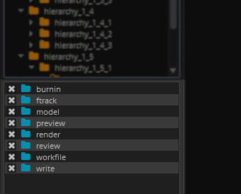

### Subset groups
Subsets may be grouped which can help to make the subset list more transparent. You can toggle visibility of groups with `Enable Grouping` checkbox.

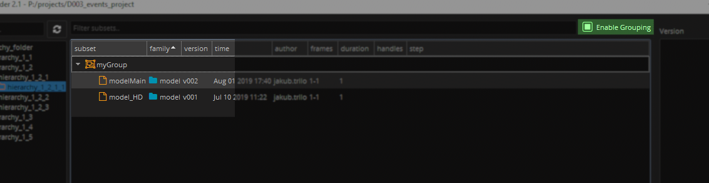

#### Add to group or change current group
You can set group of selected subsets with shortcut `Ctrl + G`.

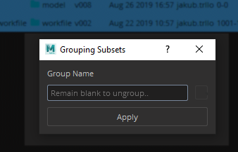

:::warning
You'll set the group in Avalon database so your changes will take effect for all users.
:::

### Site Sync support

If **Site Sync** is enabled additional widget is shown in right bottom corner.
It contains list of all representations of selected version(s). It also shows availability of representation files
on particular site (*active* - mine, *remote* - theirs). 

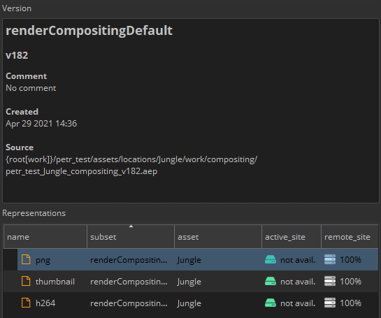

On this picture you see that representation files are available only on remote site (could be GDrive or other). 
If artist wants to work with the file(s) they need to be downloaded first. That could be done by right mouse click on
particular representation (or multiselect all) and select *Download*.

This will mark representation to be download which will happen in the background if OpenPype Tray is running.

For more details of progress, state or possible error details artist should open **[Sync Queue](#Sync-Queue)** item in Tray app.

Work in progress...

## Library Loader

Library loader is extended [loader](#loader) which allows to load published subsets from Library projects. Controls are same but library loader has extra Combo Box which allows you to choose project you want to load from.

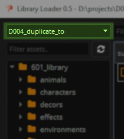 <!-- picture needs to be changed -->

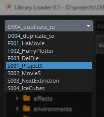 <!-- picture needs to be changed -->

### Delivery Action ###

Library Loader contains functionality to export any selected asset, subsets and their version to configurable folder.
Delivery follows structure based on defined template, this template must be configured first by Admin in the Settings.

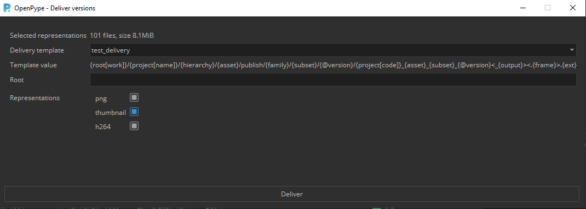 

* Usage
- Select all required subsets for export (you can change theirs versions by double clicking on 'Version' value)
- Right click and select **Deliver Versions** from context menu
- Select predefined Delivery template (must be configured by Admin system or project wide)
- Fill value for root folder (folder will be created if it doesn't exist)
- Filter out type of representation you are not interested in
- Push **Deliver** button
- Dialog must be kept open until export is finished
- In a case of problems with any of the representation, that one will be skipped, description of error will be provided in the dialog
* * *

## Publisher

> Use publish to share your work with others. It collects, validates and exports the data in standardized way.

### Details

When you run pyblish, the UI is made of 2 main parts. On the left, you see all the items pyblish will be working with (called instances), and on the right a list of actions that are going to process these items.
Even though every task type has some pre-defined settings of what should be collected from the scene and what items will be published by default. You can technically publish any output type from any task type.
Each item is passed through multiple plugins, each doing a small piece of work. These are organized into 4 areas and run in sequence.

### Using Pyblish

In the best case scenario, you open pyblish from the Avalon menu, press play, wait for it to finish, and you’re done.
These are the steps in detail, for cases, where the default settings don’t work for you or you know that the task you’re working on, requires a different treatment.

#### Collect

Finds all the important data in the scene and makes it ready for publishing

#### Validate

Each validator makes sure your output complies to one particular condition. This could be anything from naming conventions, scene setting, to plugin usage. An item can only be published if all validators pass.

#### Extract

Extractor takes the item and saves it to the disk. Usually to temporary location. Each extractor represents one file format and there can be multiple file formats exported for each item.

#### Integrate

Integrator takes the extracted files, categorizes and moves them to a correct location on the disk or on the server.

* * *

## Inventory

With Scene Inventory, you can browse, update and change subsets loaded with [Loader](#loader) into your scene or script.

:::note
You should first understand [Key concepts](artist_concepts) to understand how you can use this tool.
:::

### Details
<!-- This part may be in Maya description? -->

Once a subset is loaded, it turns into a container within a scene. This containerization allows us to have a good overview of everything in the scene, but also makes it possible to change versions, notify user if something is outdated, replace one asset for another, etc.
<!-- END HERE -->

The scene manager has a simple GUI focused on efficiency. You can see everything that has been previously loaded into the scene, how many time it's been loaded, what version and a lot of other information. Loaded assets are grouped by their asset name, subset name and representation. This grouping gives ability to apply changes for all instances of the loaded asset *(e.g. when __tree__ is loaded 20 times you can easily update version for all of them)*.

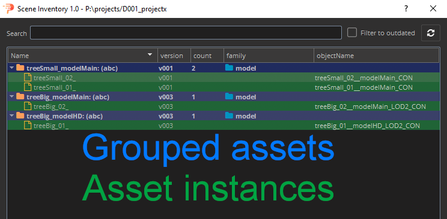 <!-- picture needs to be changed -->

To interact with any container, you need to right click it and you'll see a drop down with possible actions. The key actions for production are already implemented, but more will be added over time.

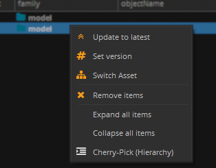

### Usage

#### Change version
You can change versions of loaded subsets with scene inventory tool. Version of loaded assets is colored to red when newer version is available.

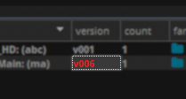

##### Update to the latest version
Select containers or subsets you want to update, right-click selection and press `Update to latest`.

##### Change to specific version
Select containers or subsets you want to change, right-click selection, press `Set version`, select from dropdown version you want change to and press `OK` button to confirm.

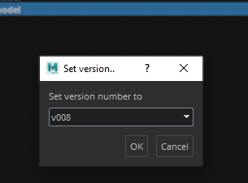

#### Switch Asset
It's tool in Scene inventory tool that gives ability to switch asset, subset and representation of loaded assets.

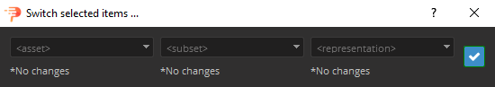 <!-- picture needs to be changed -->

Because loaded asset is in fact representation of version published in asset's subset it is possible to switch each of this part *(representation, version, subset and asset)*, but with limitations. Limitations are obvious as you can imagine when you have loaded `.ma` representation of `modelMain` subset from `car` asset it is not possible to switch subset to `modelHD` and keep same representation if `modelHD` does not have published `.ma` representation. It is possible to switch multiple loaded assets at once that makes this tool very powerful helper if all published assets contain same subsets and representations.

Switch tool won't let you cross the border of limitations and inform you when you have to specify more if impossible combination occurs *(It is also possible that there will be no possible combination for selected assets)*. Border is colored to red and confirm button is not enabled when specification is required.

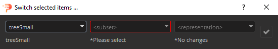 <!-- picture needs to be changed -->

Possible switches:
- switch **representation** (`.ma` to `.abc`, `.exr` to `.dpx`, etc.)
- switch **subset** (`modelMain` to `modelHD`, etc.)
    - `AND` keep same **representation** *(with limitations)*
    - `AND` switch **representation** *(with limitations)*
- switch **asset** (`oak` to `elm`, etc.)
    - `AND` keep same **subset** and **representation** *(with limitations)*
    - `AND` keep same **subset** and switch **representation** *(with limitations)*
    - `AND` switch **subset** and keep same **representation** *(with limitations)*
    - `AND` switch **subset** and **representation** *(with limitations)*

We added one more switch layer above subset for LOD (Level Of Depth). That requires to have published subsets with name ending with **"_LOD{number}"** where number represents level (e.g. modelMain_LOD1). Has the same limitations as mentioned above. This is handy when you want to change only subset but keep same LOD or keep same subset but change LOD for multiple assets. This option is hidden if you didn't select subset that have published subset with LODs.

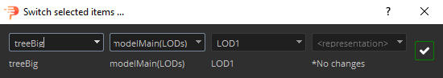 <!-- picture needs to be changed -->
### Filtering

#### Filter by name

There is a search bar on the top for cases when you have a complex scene with many assets and need to find a specific one.

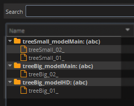

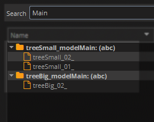

#### Filter with Cherry-pick selection

To keep only selected subsets right-click selection and press `Cherry-Pick (Hierarchy)` *(Border of subset list change to **orange** color when Cherry-pick filtering is set so you know filter is applied).*

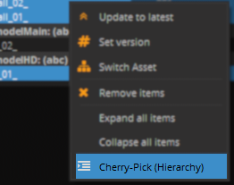

To return to original state right-click anywhere in subsets list and press `Back to Full-View`.

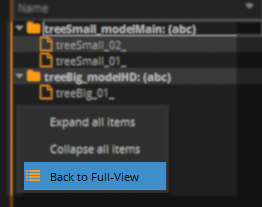

:::tip
You can Cherry-pick from Cherry-picked subsets.
:::

* * *

## Workfiles

Save new working scenes or scripts, or open the ones you previously worked on.

### Details

Instead of digging through your software native file browser, you can simply open the workfiles app and see all the files for the asset or shot you're currently working with. The app takes care of all the naming and the location of your work files.

When saving a scene you can also add a comment. It is completely up to you how you use this, however we recommend using it for subversion within your current working version.

Let's say that the last version of the comp you published was v003 and now you're working on the file prj_sh010_compositing_v004.nk if you want to keep snapshots of your work, but not iterate on the main version because the supervisor is expecting next publish to be v004, you can use the comment to do this, so you can save the file under the name prj_sh010_compositing_v004_001 , prj_sh010_compositing_v004_002. the main version is automatically iterated every time you publish something.

### Usage

#### To open existing file:

1. Open Workfiles tool from OpenPype menu
2. Select file from list - the latest version is the highest *(descendent ordering)*
3. Press `Open` button

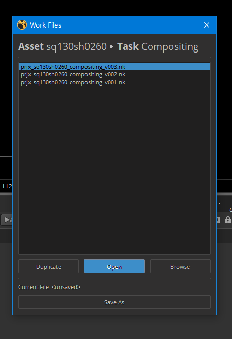

#### To save new workfile
1. Open Workfiles tool from OpenPype menu
2. Press `Save As` button
3. You can add optional comment to the filename, that will be appended at the end
4. Press `OK`

:::note
You can manually override the workfile version by unticking next available version and using the version menu to choose your own.
:::

## Look Assigner

> The Look Manager takes care of assigning published looks to the correct model in the scene.

### Details

When a look is published it also stores the information about what shading networks need to be assigned to which models, but it also stores all the render attributes on the mesh necessary for a successful render.

### Usage

Look Assigner has GUI is made of two parts. On the left you will see the list of all the available models in the scene and on the right side, all the looks that can be associate with them. To assign a look to a model you just need to:

1.  Click on "load all subsets"
2.  Choose a subset from the menu on the left
3.  Right click on a look from the list on the right
4.  Choose "Assign"

At this point you should have a model with all it's shaders applied correctly. The tool automatically loads the latest look available.

## Subset Manager

> Subset Manager lists all items which are meant for publishig and will be published if Publish is triggered

### Details

One or more items (instances) could be published any time Publish process is started. Each this publishable
item must be created by Creator tool previously. Subset Manager provides easy way how to check which items, 
and how many, will be published. 

It also provides clean and preferable way how to remove unwanted item from publishing.

### Usage

Subset Manager has GUI is made of two parts. On the left you will see the list of all the available publishable items in the scene and on the right side, details about these items.

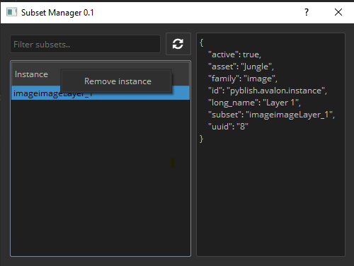

Any time new item is Created, it will show up here.

Currently there is only single action, 'Remove instance' which cleans workfile file from publishable item metadata.
This might not remove underlying host item, it depends on host and implementation!

It might also happen that user deletes underlying host item(for example layer in Photoshop) directly in the host, but metadata will stay.
This could result in phantom issues during publishing. Use Subset Manager to purge workfile from abandoned items.

Please check behaviour in host of your choice.

## Sync Queue

### Details

If **Site Sync** is configured for a project, each asset is marked to be synchronized to a remote site during publishing.
Each artist's OpenPype Tray application handles synchronization in background, it looks for all representation which 
are marked with the site of the user (unique site name per artist) and remote site.

Artists then can see progress of synchronization via **Sync Queue** link in the Tray application.

Artists can see all synced representation in this dialog with helpful information such as when representation was created, when it was synched,
status of synchronization (OK or Fail) etc.

### Usage

With this app artists can modify synchronized representation, for example mark failed representation for re-sync etc.

Actions accessible by context menu on single (or multiple representations):
- *Open in Explorer* - if site is locally accessible, open folder with it with OS based explorer
- *Re-sync Active Site* - mark artist own side for re-download (repre must be accessible on remote side)
- *Re-sync Remote Site* - mark representation for re-upload
- *Completely remove from local* - removes tag of synchronization to artist's local site, removes files from disk (available only for personal sites)
- *Change priority* - mark representations with higher priority for faster synchronization run

Double click on any of the representation open Detail dialog with information about all files for particular representation.
In this dialog error details could be accessed in the context menu.

#### Context menu on project name
Artists can also Pause whole server or specific project for synchronization. In that state no download/upload is being run.
This might be helpful if the artist is not interested in a particular project for a while or wants to save bandwidth data limit for a bit.

Another option is `Validate files on active site`. This option triggers process where all representation of the selected project are looped through, file paths are resolved for active site and
if paths point to local system, paths are physically checked if files are existing. If file exists and representation is not marked to be present on 'active_site' in DB, DB is updated 
to follow that. 

This might be useful if artist has representation files that Site Sync doesn't know about (newly attached external drive with representations from studio).
This project might take a while!