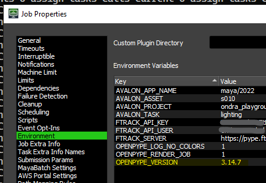

Deadline is not host as usual, it is missing most of the host features, but it does have
its own set of publishing plugins.

## How to test OpenPype on Deadline

### Versions

Since 3.14 job submitted from OpenPype is bound to OpenPype version used to submit it. So
if you submit job with 3.14.8, Deadline will try to find that particular version and use it
for rendering. This is handled by `OPENPYPE_VERSION` variable on job - you can delete it from
there and then the version set in studio Settings will be used.

Deadline needs to bootstrap this version so it will try to look the closest compatible
build. So to use version 3.14.8 on Deadline it is enough to have build 3.14.0 or similar - important
are the first two version numbers - major and minor. If they match, the version
is considered compatible.

### Testing

So to test various changes you don't need to build again an again OpenPype and putting
it to directory where Deadline is looking for versions - this needs to be done only on
minor version change. That build will then be used to bootstrap whatever is set on the
job or in the studio Settings.

So you can either use zip version if it suits you, or better set your sources directory
so it will be find as a version - for example with symlink.

That way you can only modify `OPENPYPE_VERSION` variable on job to point it to version
you would like to test.