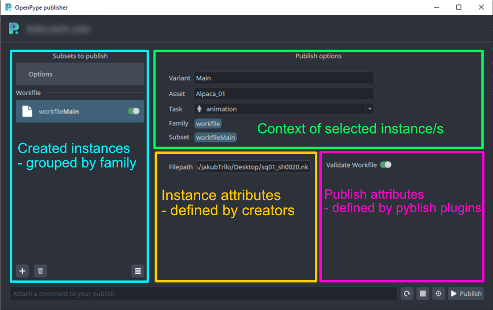
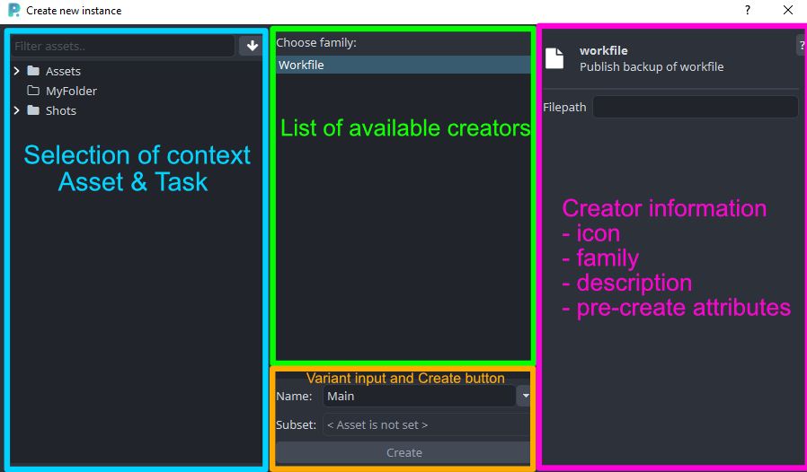

Publishing workflow consists of 2 parts:
- Creating - Mark what will be published and how.
- Publishing - Use data from Creating to go through the pyblish process.

OpenPype is using [pyblish](https://pyblish.com/) for the publishing process. OpenPype extends and modifies its few functions a bit, mainly for reports and UI purposes. The main differences are that OpenPype's publish UI allows to enable/disable instances or plugins during Creating part instead of in the publishing part and has limited plugin actions only for failed validation plugins.

## **Creating**

Concept of Creating does not have to "create" anything yet, but prepare and store metadata about an "instance" (becomes a subset after the publish process). Created instance always has `family` which defines what kind of data will be published, the best example is `workfile` family. Storing of metadata is host specific and may be even a Creator plugin specific. Most hosts are storing metadata into a workfile (Maya scene, Nuke script, etc.) to an item or a node the same way as regular Pyblish instances, so consistency of host implementation is kept, but some features may require a different approach that is the reason why it is creator plugin responsibility. Storing the metadata to the workfile persists values, so the artist does not have to create and set what should be published and how over and over.

### Created instance

Objected representation of created instance metadata defined by class **CreatedInstance**. Has access to **CreateContext** and **BaseCreator** that initialized the object. Is a dictionary-like object with few immutable keys (marked with start `*` in table). The immutable keys are set by the creator plugin or create context on initialization and their values can't change. Instance can have more arbitrary data, for example ids of nodes in scene but keep in mind that some keys are reserved.

| Key | Type | Description |
|---|---|---|
| *id | str | Identifier of metadata type. ATM constant **"pyblish.avalon.instance"** |
| *instance_id | str | Unique ID of instance. Set automatically on instance creation using `str(uuid.uuid4())` |
| *family | str | Instance's family representing type defined by creator plugin. |
| *creator_identifier | str | Identifier of creator that collected/created the instance. |
| *creator_attributes | dict | Dictionary of attributes that are defined by the creator plugin (`get_instance_attr_defs`). |
| *publish_attributes | dict | Dictionary of attributes that are defined by publish plugins. |
| variant | str | Variant is entered by the artist on creation and may affect **subset**. |
| subset | str | Name of instance. This name will be used as a subset name during publishing. Can be changed on context change or variant change. |
| active | bool | Is the instance active and will be published or not. |
| asset | str | Name of asset in which context was created. |
| task | str | Name of task in which context was created. Can be set to `None`. |

:::note
Task should not be required until the subset name template expects it.
:::

object of **CreatedInstance** has method **data_to_store** which returns a dictionary that can be parsed to a json string. This method will return all data related to the instance so it can be re-created using `CreatedInstance.from_existing(data)`.

#### *Create context* {#category-doc-link}

Controller and wrapper around Creating is `CreateContext` which cares about loading of plugins needed for Creating. And validates required functions in host implementation.

Context discovers creator and publish plugins. Trigger collections of existing instances on creators and trigger Creating itself. Also it keeps in mind instance objects by their ids.

Creator plugins can call **creator_adds_instance** or **creator_removed_instance** to add/remove instances but these methods are not meant to be called directly out of the creator. The reason is that it is the creator's responsibility to remove metadata or decide if it should remove the instance.

#### Required functions in host implementation
Host implementation **must** implement **get_context_data** and **update_context_data**. These two functions are needed to store metadata that are not related to any instance but are needed for Creating and publishing process. Right now only data about enabled/disabled optional publish plugins is stored there. When data is not stored and loaded properly, reset of publishing will cause that they will be set to default value. Context data also parsed to json string similarly as instance data.

There are also few optional functions. For UI purposes it is possible to implement **get_context_title** which can return a string shown in UI as a title. Output string may contain html tags. It is recommended to return context path (it will be created function this purposes) in this order `"{project name}/{asset hierarchy}/<b>{asset name}</b>/{task name}"`.

Another optional function is **get_current_context**. This function is handy in hosts where it is possible to open multiple workfiles in one process so using global context variables is not relevant because artists can switch between opened workfiles without being acknowledged. When a function is not implemented or won't return the right keys the global context is used.
```json
# Expected keys in output
{
    "project_name": "MyProject",
    "asset_name": "sq01_sh0010",
    "task_name": "Modeling"
}
```

### Create plugin
Main responsibility of create plugin is to create, update, collect and remove instance metadata and propagate changes to create context. Has access to **CreateContext** (`self.create_context`) that discovered the plugin so has also access to other creators and instances. Create plugins have a lot of responsibility so it is recommended to implement common code per host.

#### *BaseCreator*
Base implementation of creator plugin. It is not recommended to use this class as base for production plugins but rather use one of **AutoCreator** and **Creator** variants.

**Abstractions**
- **`family`** (class attr) - Tells what kind of instance will be created.
```python
class WorkfileCreator(Creator):
    family = "workfile"
```

- **`collect_instances`** (method) - Collect already existing instances from the workfile and add them to create context. This method is called on initialization or reset of **CreateContext**. Each creator is responsible to find its instance metadata, convert them to **CreatedInstance** object and add them to create context (`self._add_instance_to_context(instnace_obj)`).
```python
def collect_instances(self):
    # Using 'pipeline.list_instances' is just example how to get existing instances from scene
    # - getting existing instances is different per host implementation
    for instance_data in pipeline.list_instances():
        # Process only instances that were created by this creator
        creator_id = instance_data.get("creator_identifier")
        if creator_id == self.identifier:
            # Create instance object from existing data
            instance = CreatedInstance.from_existing(
                instance_data, self
            )
            # Add instance to create context
            self._add_instance_to_context(instance)
```

- **`create`** (method) - Create a new object of **CreatedInstance** store its metadata to the workfile and add the instance into the created context. Failed Creating should raise **CreatorError** if an error happens that artists can fix or give them some useful information. Triggers and implementation differs for **Creator** and **AutoCreator**.

- **`update_instances`** (method) - Update data of instances. Receives tuple with **instance** and **changes**.
```python
def update_instances(self, update_list):
    # Loop over changed instances
    for instance, changes in update_list:
        # Example possible usage of 'changes' to use different node on change
        #   of node id in instance data (MADE UP)
        node = None
        if "node_id" in changes:
            old_value, new_value = changes["node_id"]
            if new_value is not None:
                node = pipeline.get_node_by_id(new_value)

        if node is None:
            node = pipeline.get_node_by_instance_id(instance.id)
        # Get node in scene that represents the instance
        # Imprind data to a node
        pipeline.imprint(node, instance.data_to_store())


# Most implementations will probably ignore 'changes' completely
def update_instances(self, update_list):
    for instance, _ in update_list:
        # Get node from scene
        node = pipeline.get_node_by_instance_id(instance.id)
        # Imprint data to node
        pipeline.imprint(node, instance.data_to_store())
```

- **`remove_instances`** (method) - Remove instance metadata from workfile and from create context.
```python
# Possible way how to remove instance
def remove_instances(self, instances):
    for instance in instances:
        # Remove instance metadata from workflle
        pipeline.remove_instance(instance.id)
        # Remove instance from create context
        self._remove_instance_from_context(instance)


# Default implementation of `AutoCreator`
def remove_instances(self, instances):
    pass
```

:::note
When host implementation use universal way how to store and load instances you should implement host specific creator plugin base class with implemented **collect_instances**, **update_instances** and **remove_instances**.
:::

**Optional implementations**

- **`enabled`** (attr) - Boolean if the creator plugin is enabled and used.
- **`identifier`** (class attr) - Consistent unique string identifier of the creator plugin. Is used to identify source plugin of existing instances. There can't be 2 creator plugins with the same identifier. Default implementation returns `family` attribute.
```python
class RenderLayerCreator(Creator):
    family = "render"
    identifier = "render_layer"


class RenderPassCreator(Creator):
    family = "render"
    identifier = "render_pass"
```

- **`label`** (attr) - String label of creator plugin which will show up in UI, `identifier` is used when not set. It should be possible to use html tags.
```python
class RenderLayerCreator(Creator):
    label = "Render Layer"
```

- **`get_icon`** (attr) - Icon of creator and its instances. Value can be a path to an image file, full name of qtawesome icon, `QPixmap` or `QIcon`. For complex cases or cases when `Qt` objects are returned it is recommended to override `get_icon` method and handle the logic or import `Qt` inside the method to not break headless usage of creator plugin. For list of qtawesome icons check qtawesome github repository (look for the used version in pyproject.toml). Default implementation return **icon** attribute.
- **`icon`** (method) - Attribute for default implementation of **get_icon**.
```python
class RenderLayerCreator(Creator):
    # Use font awesome 5 icon
    icon = "fa5.building"
```

- **`get_instance_attr_defs`** (method) - Attribute definitions of instance. Creator can define attribute values with default values for each instance. These attributes may affect how instances will be instance processed during publishing. Attribute defiitions can be used from `openpype.pipeline.lib.attribute_definitions` (NOTE: Will be moved to `openpype.lib.attribute_definitions` soon). Attribute definitions define basic types of values for different cases e.g. boolean, number, string, enumerator, etc. Default implementation returns **instance_attr_defs**.
- **`instance_attr_defs`** (attr) - Attribute for default implementation of **get_instance_attr_defs**.

```python
from openpype.pipeline import attribute_definitions


class RenderLayerCreator(Creator):
    def get_instance_attr_defs(self):
        # Return empty list if '_allow_farm_render' is not enabled (can be set during initialization)
        if not self._allow_farm_render:
            return []
        # Give artist option to change if should be rendered on farm or locally
        return [
            attribute_definitions.BoolDef(
                "render_farm",
                default=False,
                label="Render on Farm"
            )
        ]
```

- **`get_subset_name`** (method) - Calculate subset name based on passed data. Data can be extended using the `get_dynamic_data` method. Default implementation is using `get_subset_name` from `openpype.lib` which is recommended.

- **`get_dynamic_data`** (method) - Can be used to extend data for subset templates which may be required in some cases.


#### *AutoCreator*
Creator that is triggered on reset of create context. Can be used for families that are expected to be created automatically without artist interaction (e.g. **workfile**). Method `create` is triggered after collecting all creators.

:::important
**AutoCreator** has implemented **remove_instances** to do nothing as removing of auto created instances would lead to creating new instance immediately or on refresh.
:::

```python
def __init__(
    self, create_context, system_settings, project_settings, *args, **kwargs
):
    super(MyCreator, self).__init__(
        create_context, system_settings, project_settings, *args, **kwargs
    )
    # Get variant value from settings
    variant_name = (
        project_settings["my_host"][self.identifier]["variant"]
    ).strip()
    if not variant_name:
        variant_name = "Main"
    self._variant_name = variant_name

# Create does not expect any arguments
def create(self):
    # Look for existing instance in create  context
    existing_instance = None
    for instance in self.create_context.instances:
        if instance.creator_identifier == self.identifier:
            existing_instance = instance
            break

    # Collect current context information
    # - variant can be filled from settings
    variant = self._variant_name
    # Only place where we can look for current context
    project_name = io.Session["AVALON_PROJECT"]
    asset_name = io.Session["AVALON_ASSET"]
    task_name = io.Session["AVALON_TASK"]
    host_name = io.Session["AVALON_APP"]

    # Create new instance if does not exist yet
    if existing_instance is None:
        asset_doc = io.find_one({"type": "asset", "name": asset_name})
        subset_name = self.get_subset_name(
            variant, task_name, asset_doc, project_name, host_name
        )
        data = {
            "asset": asset_name,
            "task": task_name,
            "variant": variant
        }
        data.update(self.get_dynamic_data(
            variant, task_name, asset_doc, project_name, host_name
        ))

        new_instance = CreatedInstance(
            self.family, subset_name, data, self
        )
        self._add_instance_to_context(new_instance)

    # Update instance context if is not the same
    elif (
        existing_instance["asset"] != asset_name
        or existing_instance["task"] != task_name
    ):
        asset_doc = io.find_one({"type": "asset", "name": asset_name})
        subset_name = self.get_subset_name(
            variant, task_name, asset_doc, project_name, host_name
        )
        existing_instance["asset"] = asset_name
        existing_instance["task"] = task_name
```

#### *Creator*
Implementation of creator plugin that is triggered manually by the artist in UI (or by code). Has extended options for UI purposes than **AutoCreator** and **create** method expect more arguments.

**Optional implementations**
- **`create_allow_context_change`** (class attr) - Allow to set context in UI before Creating. Some creators may not allow it or their logic would not use the context selection (e.g. bulk creators). Is set to `True` but default.
```python
class BulkRenderCreator(Creator):
    create_allow_context_change = False
```
- **`get_default_variants`** (method) - Returns list of default variants that are listed in create dialog for user. Returns **default_variants** attribute by default.
- **`default_variants`** (attr) - Attribute for default implementation of **get_default_variants**.

- **`get_default_variant`** (method) - Returns default variant that is prefilled in UI (value does not have to be in default variants). By default returns **default_variant** attribute. If returns `None` then UI logic will take first item from **get_default_variants** if there is any otherwise **"Main"** is used.
- **`default_variant`** (attr) - Attribute for default implementation of **get_default_variant**.

- **`get_description`** (method) - Returns a short string description of the creator. Returns **description** attribute by default.
- **`description`** (attr) - Attribute for default implementation of **get_description**.

- **`get_detailed_description`** (method) - Returns detailed string description of creator. Can contain markdown. Returns **detailed_description** attribute by default.
- **`detailed_description`** (attr) - Attribute for default implementation of **get_detailed_description**.

- **`get_pre_create_attr_defs`** (method) - Similar to **get_instance_attr_defs** returns attribute definitions but they are filled before creation. When creation is called from UI the values are passed to **create** method. Returns **pre_create_attr_defs** attribute by default.
- **`pre_create_attr_defs`** (attr) - Attribute for default implementation of **get_pre_create_attr_defs**.

```python
from openpype.pipeline import Creator, attribute_definitions


class CreateRender(Creator):
    family = "render"
    label = "Render"
    icon = "fa.eye"
    description = "Render scene viewport"

    def __init__(
        self, context, system_settings, project_settings, *args, **kwargs
    ):
        super(CreateRender, self).__init__(
            context, system_settings, project_settings, *args, **kwargs
        )
        plugin_settings = (
            project_settings["my_host"]["create"][self.__class__.__name__]
        )
        # Get information if studio has enabled farm publishing
        self._allow_farm_render = plugin_settings["allow_farm_render"]
        # Get default variants from settings
        self.default_variants = plugin_settings["variants"]

    def get_instance_attr_defs(self):
        # Return empty list if '_allow_farm_render' is not enabled (can be set during initialization)
        if not self._allow_farm_render:
            return []
        # Give artist option to change if should be rendered on farm or locally
        return [
            attribute_definitions.BoolDef(
                "render_farm",
                default=False,
                label="Render on Farm"
            )
        ]

    def get_pre_create_attr_defs(self):
        # Give user option to use selection or not
        attrs = [
            attribute_definitions.BoolDef(
                "use_selection",
                default=False,
                label="Use selection"
            )
        ]
        if self._allow_farm_render:
            # Set to render on farm in creator dialog
            # - this value is not automatically passed to instance attributes
            #   creator must do that during creation
            attrs.append(
                attribute_definitions.BoolDef(
                    "render_farm",
                    default=False,
                    label="Render on Farm"
                )
            )
        return attrs

    def create(self, subset_name, instance_data, pre_create_data):
        # ARGS:
        # - 'subset_name' - precalculated subset name
        # - 'instance_data' - context data
        #    - 'asset' - asset name
        #    - 'task' - task name
        #    - 'variant' - variant
        #    - 'family' - instnace family

        # Check if should use selection or not
        if pre_create_data.get("use_selection"):
            items = pipeline.get_selection()
        else:
            items = [pipeline.create_write()]

        # Validations related to selection
        if len(items) > 1:
            raise CreatorError("Please select only single item at time.")

        elif not items:
            raise CreatorError("Nothing to create. Select at least one item.")

        # Create instence object
        new_instance = CreatedInstance(self.family, subset_name, data, self)
        # Pass value from pre create attribute to instance
        # - use them only when pre create date contain the data
        if "render_farm" in pre_create_data:
            use_farm = pre_create_data["render_farm"]
            new_instance.creator_attributes["render_farm"] = use_farm

        # Store metadata to workfile
        pipeline.imprint(new_instance.id, new_instance.data_to_store())

        # Add instance to context
        self._add_instance_to_context(new_instance)
```

## **Publish**
### Exceptions
OpenPype define few specific exceptions that should be used in publish plugins.

#### *Validation exception*
Validation plugins should raise `PublishValidationError` to show to an artist what's wrong and give him actions to fix it. The exception says that errors in the plugin can be fixed by the artist himself (with or without action on plugin). Any other errors will stop publishing immediately. The exception `PublishValidationError` raised after validation order has the same effect as any other exception.

Exception `PublishValidationError` expects 4 arguments:
- **message** Which is not used in UI but for headless publishing.
- **title** Short description of error (2-5 words). Title is used for grouping of exceptions per plugin.
- **description** Detailed description of the issue where markdown and html can be used.
- **detail** Is optional to give even more detailed information for advanced users. At this moment the detail is shown directly under description but it is in plan to have detail in a collapsible widget.

Extended version is `PublishXmlValidationError` which uses xml files with stored descriptions. This helps to avoid having huge markdown texts inside code. The exception has 4 arguments:
- **plugin** The plugin object which raises the exception to find its related xml file.
- **message** Exception message for publishing without UI or different pyblish UI.
- **key** Optional argument says which error from xml is used as a validation plugin may raise error with different messages based on the current errors. Default is **"main"**.
- **formatting_data** Optional dictionary to format data in the error. This is used to fill detailed description with data from the publishing so artist can get more precise information.

**Where and how to create xml file**

Xml files for `PublishXmlValidationError` must be located in **./help** subfolder next to the plugin and the filename must match the filename of the plugin.
```
# File location related to plugin file
└ publish
 ├ help
 │ ├ validate_scene.xml
 │ └ ...
 ├ validate_scene.py
 └ ...
```

Xml file content has **&ltroot&gt** node which may contain any amount of **&lterror&gt** nodes, but each of them must have **id** attribute with unique value. That is then used for **key**. Each error must have **&lttitle&gt** and **&ltdescription&gt** and **&ltdetail&gt**. Text content may contain python formatting keys that can be filled when an exception is raised.
```xml
<?xml version="1.0" encoding="UTF-8"?>
<root>
    <error id="main">
        <title>Subset context</title>
        <description>## Invalid subset context

Context of the given subset doesn't match your current scene.

### How to repair?

You can fix this with the "Repair" button on the right. This will use '{expected_asset}' asset name and overwrite '{found_asset}' asset name in scene metadata.

After that restart publishing with Reload button.
        </description>
        <detail>
### How could this happen?

The subset was created in different scene with different context
or the scene file was copy pasted from different context.
        </detail>
    </error>
</root>
```

#### *Known errors*
When there is a known error that can't be fixed by the user (e.g. can't connect to deadline service, etc.) `KnownPublishError` should be raised. The only difference is that its message is shown in UI to the artist otherwise a neutral message without context is shown.

### Plugin extension
Publish plugins can be extended by additional logic when inheriting from `OpenPypePyblishPluginMixin` which can be used as mixin (additional inheritance of class). Publish plugins that inherit from this mixin can define attributes that will be shown in **CreatedInstance**. One of the most important usages is to be able turn on/off optional plugins.

Attributes are defined by the return value of `get_attribute_defs` method. Attribute definitions are for families defined in plugin's `families` attribute if it's instance plugin or for whole context if it's context plugin. To convert existing values (or to remove legacy values) can be re-implemented `convert_attribute_values`. Default implementation just converts the values to right types.

:::Important
Values of publish attributes from created instance are never removed automatically so implementing this method is the best way to remove legacy data or convert them to new data structure.
:::

Possible attribute definitions can be found in `openpype/pipeline/lib/attribute_definitions.py`.

<details>
<summary>Example plugin</summary>
<p>

```python
import pyblish.api
from openpype.pipeline import (
    OpenPypePyblishPluginMixin,
    attribute_definitions,
)


# Example context plugin
class MyExtendedPlugin(
    pyblish.api.ContextPlugin, OpenPypePyblishPluginMixin
):
    optional = True
    active = True

    @classmethod
    def get_attribute_defs(cls):
        return [
            attribute_definitions.BoolDef(
                # Key under which it will be stored
                "process",
                # Use 'active' as default value
                default=cls.active,
                # Use plugin label as label for attribute
                label=cls.label
            )
        ]

    def process_plugin(self, context):
        # First check if plugin is optional
        if not self.optional:
            return True

        # Attribute values are stored by class names
        # - for those purposes was implemented 'get_attr_values_from_data'
        #   to help with accessing it
        attribute_values = self.get_attr_values_from_data(context.data)
        # Get 'process' key
        process_value = attribute_values.get("process")
        if process_value is None or process_value:
            return True
        return False

    def process(self, context):
        if not self.process_plugin(context):
            return
        # Do plugin logic
        ...
```
</p>
</details>

## **UI examples**
### Main publish window
Main window of publisher shows instances and their values, collected by creators.

**Card view**

**List view**


#### *Instances views*
List of instances always contains an `Options` item which is used to show attributes of context plugins. Values from the item are saved and loaded using [host implementation](#required-functions-in-host-implementation) **get_context_data** and **update_context_data**. Instances are grouped by family and can be shown in card view (single selection) or list view (multi selection).

Instance view has at the bottom 3 buttons. Plus sign opens [create dialog](#create-dialog), bin removes selected instances and stripes swap card and list view.

#### *Context options*
It is possible to change variant or asset and task context of instances at the top part but all changes there must be confirmed. Confirmation will trigger recalculation of subset names and all new data are stored to instances.

#### *Create attributes*
Instance attributes display all created attributes of all selected instances. All attributes that have the same definition are grouped into one input and are visually indicated if values are not the same for selected instances. In most cases have **< Multiselection >** placeholder.

#### *Publish attributes*
Publish attributes work the same way as create attributes but the source of attribute definitions are pyblish plugins. Attributes are filtered based on families of selected instances and families defined in the pyblish plugin.

### Create dialog

Create dialog is used by artist to create new instances in a context. The context selection can be enabled/disabled by changing `create_allow_context_change` on [creator plugin](#creator). In the middle part the artist selects what will be created and what variant it is. On the right side is information about the selected creator and its pre-create attributes. There is also a question mark button which extends the window and displays more detailed information about the creator.