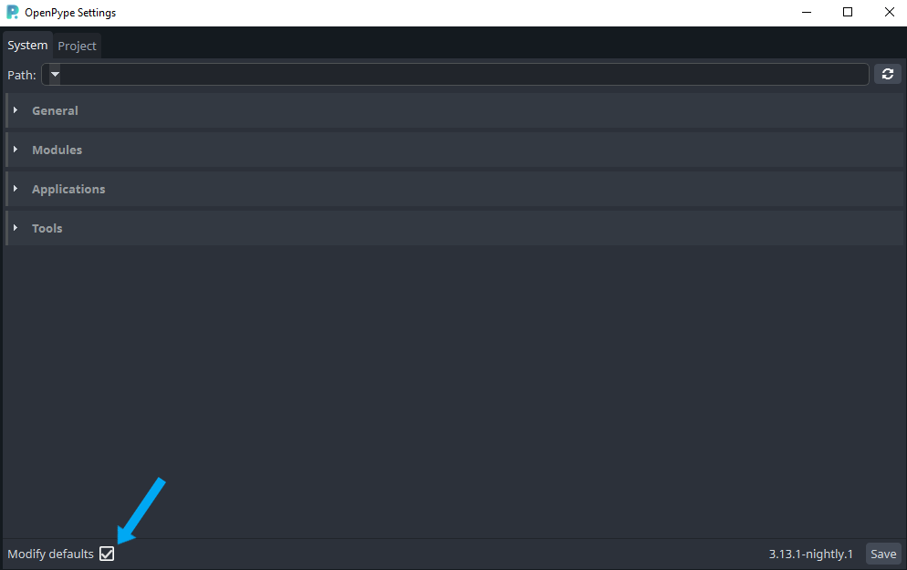

Settings give the ability to change how OpenPype behaves in certain situations. Settings are split into 3 categories **system settings**, **project anatomy** and **project settings**. Project anatomy and project settings are grouped into a single category but there is a technical difference (explained later). Only difference in system and project settings is that system settings can't be technically handled on a project level or their values must be available no matter in which project the values are received. Settings have headless entities or settings UI.

There is one more category **local settings** but they don't have ability to be changed or defined easily. Local settings can change how settings work per machine, can affect both system and project settings but they're hardcoded for predefined values at this moment.

## Settings schemas
System and project settings are defined by settings schemas. Schema defines the structure of output value, what value types output will contain, how settings are stored and how its UI input will look.

## Settings values
Output of settings is a json serializable value. There are 3 possible types of value **default values**, **studio overrides** and **project overrides**. Default values must be always available for all settings schemas, their values are stored to code. Default values are what everyone who just installed OpenPype will use as default values. It is good practice to set example values but they should be actually relevant.

Setting overrides is what makes settings a powerful tool. Overrides contain only a part of settings with additional metadata that describe which parts of settings values should be replaced from overrides values. Using overrides gives the ability to save only specific values and use default values for rest. It is super useful in project settings which have up to 2 levels of overrides. In project settings are used **default values** as base on which are applied **studio overrides** and then **project overrides**. In practice it is possible to save only studio overrides which affect all projects. Changes in studio overrides are then propagated to all projects without project overrides. But values can be locked on project level so studio overrides are not used.

## Settings storage
As was mentioned default values are stored into repository files. Overrides are stored in the Mongo database. The value in mongo contain only overrides with metadata so their content on it's own is useless and must be used with combination of default values. System settings and project settings are stored into special collection. Single document represents one set of overrides with OpenPype version for which is stored. Settings are versioned and are loaded in specific order - current OpenPype version overrides or first lower available. If there are any overrides with the same or lower version then the first higher version is used. If there are any overrides then no overrides are applied.

Project anatomy is stored into a project document thus is not versioned and its values are always overridden. Any changes in anatomy schema may have a drastic effect on production and OpenPype updates.

## Settings schema items
As was mentioned schema items define output type of values, how they are stored and how they look in UI.
- schemas are (by default) defined by json files
- OpenPype core system settings schemas are stored in `~/openpype/settings/entities/schemas/system_schema/` and project settings in `~/openpype/settings/entities/schemas/projects_schema/`
    - both contain `schema_main.json` which are entry points
- OpenPype modules/addons can define their settings schemas using `BaseModuleSettingsDef` in that case some functionality may be slightly modified
- single schema item is represented by dictionary (object) in json which has `"type"` key.
    - **type** is only common key which is required for all schema items
- each item may have "input modifiers" (other keys in dictionary) and they may be required or optional based on the type
- there are special keys across all items
	- `"is_file"` - this key is used when defaults values are stored in the file. Its value matches the filename where values are stored
	  - key is validated, must be unique in hierarchy otherwise it won't be possible to store default values
		- make sense to fill it only if it's value if `true`

	- `"is_group"` - define that all values under a key in settings hierarchy will be overridden if any value is modified
		  - this key is not allowed for all inputs as they may not have technical ability to handle it
		  - key is validated, must be unique in hierarchy and is automatically filled on last possible item if is not defined in schemas
		  - make sense to fill it only if it's value if `true`
- all entities can have set `"tooltip"` key with description which will be shown in UI on hover

### Inner schema
Settings schemas are big json files which would become unmanageable if they were in a single file. To be able to split them into multiple files to help organize them special types `schema` and `template` were added. Both types are related to a different file by filename. If a json file contains a dictionary it is considered as `schema` if it contains a list it is considered as a `template`.

#### schema
Schema item is replaced by content of entered schema name. It is recommended that the schema file is used only once in settings hierarchy. Templates are meant for reusing.
- schema must have `"name"` key which is name of schema that should be used

```javascript
{
    "type": "schema",
    "name": "my_schema_name"
}
```

#### template
Templates are almost the same as schema items but can contain one or more items which can be formatted with additional data or some keys can be skipped if needed. Templates are meant for reusing the same schemas with ability to modify content.

- legacy name is `schema_template` (still usable)
- template must have `"name"` key which is name of template file that should be used
- to fill formatting keys use `"template_data"`
- all items in template, except `__default_values__`, will replace `template` item in original schema
- template may contain other templates

```javascript
// Example template json file content
[
    {
        // Define default values for formatting values
        // - gives ability to set the value but have default value
        "__default_values__": {
            "multipath_executables": true
        }
    }, {
        "type": "raw-json",
        "label": "{host_label} Environments",
        "key": "{host_name}_environments"
    }, {
        "type": "path",
        "key": "{host_name}_executables",
        "label": "{host_label} - Full paths to executables",
        "multiplatform": "{multipath_executables}",
        "multipath": true
    }
]
```
```javascript
// Example usage of the template in schema
{
    "type": "dict",
    "key": "template_examples",
    "label": "Schema template examples",
    "children": [
        {
            "type": "template",
            "name": "example_template",
            "template_data": [
                {
                    "host_label": "Maya 2019",
                    "host_name": "maya_2019",
                    "multipath_executables": false
                },
                {
                    "host_label": "Maya 2020",
                    "host_name": "maya_2020"
                },
                {
                    "host_label": "Maya 2021",
                    "host_name": "maya_2021"
                }
            ]
        }
    ]
}
```
```javascript
// The same schema defined without templates
{
    "type": "dict",
    "key": "template_examples",
    "label": "Schema template examples",
    "children": [
        {
            "type": "raw-json",
            "label": "Maya 2019 Environments",
            "key": "maya_2019_environments"
        }, {
            "type": "path",
            "key": "maya_2019_executables",
            "label": "Maya 2019 - Full paths to executables",
            "multiplatform": false,
            "multipath": true
        }, {
            "type": "raw-json",
            "label": "Maya 2020 Environments",
            "key": "maya_2020_environments"
        }, {
            "type": "path",
            "key": "maya_2020_executables",
            "label": "Maya 2020 - Full paths to executables",
            "multiplatform": true,
            "multipath": true
        }, {
            "type": "raw-json",
            "label": "Maya 2021 Environments",
            "key": "maya_2021_environments"
        }, {
            "type": "path",
            "key": "maya_2021_executables",
            "label": "Maya 2021 - Full paths to executables",
            "multiplatform": true,
            "multipath": true
        }
    ]
}
```

Template data can be used only to fill templates in values but not in keys. It is also possible to define default values for unfilled fields to do so one of the items in the list must be a dictionary with key "__default_values__"` and value as dictionary with default key: values (as in example above).
```javascript
{
    ...
    // Allowed
    "key": "{to_fill}"
    ...
    // Not allowed
    "{to_fill}": "value"
    ...
}
```

Because formatting values can be only string it is possible to use formatting values which are replaced with different types.
```javascript
// Template data
{
    "template_data": {
        "executable_multiplatform": {
            "type": "schema",
            "name": "my_multiplatform_schema"
        }
    }
}
// Template content
{
    ...
    // Allowed - value is replaced with dictionary
    "multiplatform": "{executable_multiplatform}"
    ...
    // Not allowed - there is no way how it could be replaced
    "multiplatform": "{executable_multiplatform}_enhanced_string"
    ...
}
```

#### dynamic_schema
Dynamic schema item marks a place in settings schema where schemas defined by `BaseModuleSettingsDef` can be placed.
- example:
```javascript
{
    "type": "dynamic_schema",
    "name": "project_settings/global"
}
```
- `BaseModuleSettingsDef` with implemented `get_settings_schemas` can return a dictionary where key defines a dynamic schema name and value schemas that will be put there
- dynamic schemas work almost the same way as templates
    - one item can be replaced by multiple items (or by 0 items)
- goal is to dynamically load settings of OpenPype modules without having their schemas or default values in core repository
    - values of these schemas are saved using the `BaseModuleSettingsDef` methods
- we recommend to use `JsonFilesSettingsDef` which has full implementation of storing default values to json files
    - requires only to implement method `get_settings_root_path` which should return path to root directory where settings schema can be found and default values will be saved

### Basic Dictionary inputs
These inputs wraps another inputs into {key: value} relation

#### dict
- this is dictionary type wrapping more inputs with keys defined in schema
- may be used as dynamic children (e.g. in [list](#list) or [dict-modifiable](#dict-modifiable))
	- in that case the only key modifier is `children` which is a list of its keys
	- USAGE: e.g. List of dictionaries where each dictionary has the same structure.
- if is not used as dynamic children then must have defined `"key"` under which are it's values stored
- may be with or without `"label"` (only for GUI)
	- `"label"` must be set to be able to mark item as group with `"is_group"` key set to True
- item with label can visually wrap its children
    - this option is enabled by default to turn off set `"use_label_wrap"` to `False`
    - label wrap is by default collapsible
        - that can be set with key `"collapsible"` to `True`/`False`
        - with key `"collapsed"` as `True`/`False` can be set that is collapsed when GUI is opened (Default: `False`)
    - it is possible to add lighter background with `"highlight_content"` (Default: `False`)
        - lighter background has limits of maximum applies after 3-4 nested highlighted items there is not much difference in the color
    - output is dictionary `{the "key": children values}`
```javascript
// Example
{
    "key": "applications",
    "type": "dict",
    "label": "Applications",
    "collapsible": true,
    "highlight_content": true,
    "is_group": true,
    "is_file": true,
    "children": [
        ...ITEMS...
    ]
}

// Without label
{
    "type": "dict",
    "key": "global",
    "children": [
        ...ITEMS...
    ]
}

// When used as widget
{
    "type": "list",
    "key": "profiles",
    "label": "Profiles",
    "object_type": {
        "type": "dict",
        "children": [
            {
                "key": "families",
                "label": "Families",
                "type": "list",
                "object_type": "text"
            }, {
                "key": "hosts",
                "label": "Hosts",
                "type": "list",
                "object_type": "text"
            }
            ...
        ]
    }
}
```

#### dict-roots
- entity can be used only in Project settings
- keys of dictionary are based on current project roots
- they are not updated "live" it is required to save root changes and then
    modify values on this entity
    # TODO do live updates
```javascript
{
    "type": "dict-roots",
    "key": "roots",
    "label": "Roots",
    "object_type": {
        "type": "path",
        "multiplatform": true,
        "multipath": false
    }
}
```

#### dict-conditional
- is similar to `dict` but has always available one enum entity
    - the enum entity has single selection and it's value define other children entities
- each value of enumerator have defined children that will be used
    - there is no way how to have shared entities across multiple enum items
- value from enumerator is also stored next to other values
    - to define the key under which will be enum value stored use `enum_key`
    - `enum_key` must match key regex and any enum item can't have children with same key
    - `enum_label` is label of the entity for UI purposes
- enum items are define with `enum_children`
    - it's a list where each item represents single item for the enum
    - all items in `enum_children` must have at least `key` key which represents value stored under `enum_key`
    - enum items can define `label` for UI purposes
    - most important part is that item can define `children` key where are definitions of it's children (`children` value works the same way as in `dict`)
- to set default value for `enum_key` set it with `enum_default`
- entity must have defined `"label"` if is not used as widget
- is set as group if any parent is not group (can't have children as group)
- may be with or without `"label"` (only for GUI)
	- `"label"` must be set to be able to mark item as group with `"is_group"` key set to True
- item with label can visually wrap its children
	- this option is enabled by default to turn off set `"use_label_wrap"` to `False`
	- label wrap is by default collapsible
		- that can be set with key `"collapsible"` to `True`/`False`
		- with key `"collapsed"` as `True`/`False` can be set that is collapsed when GUI is opened (Default: `False`)
	- it is possible to add lighter background with `"highlight_content"` (Default: `False`)
		- lighter background has limits of maximum applies after 3-4 nested highlighted items there is not much difference in the color
- for UI purposes was added `enum_is_horizontal` which will make combobox appear next to children inputs instead of on top of them (Default: `False`)
	- this has extended ability of `enum_on_right` which will move combobox to right side next to children widgets (Default: `False`)
- output is dictionary `{the "key": children values}`
- using this type as template item for list type can be used to create infinite hierarchies

```javascript
// Example
{
    "type": "dict-conditional",
    "key": "my_key",
    "label": "My Key",
    "enum_key": "type",
    "enum_label": "label",
    "enum_children": [
        // Each item must be a dictionary with 'key'
        {
            "key": "action",
            "label": "Action",
            "children": [
                {
                    "type": "text",
                    "key": "key",
                    "label": "Key"
                },
                {
                    "type": "text",
                    "key": "label",
                    "label": "Label"
                },
                {
                    "type": "text",
                    "key": "command",
                    "label": "Command"
                }
            ]
        },
        {
            "key": "menu",
            "label": "Menu",
            "children": [
                {
                    "key": "children",
                    "label": "Children",
                    "type": "list",
                    "object_type": "text"
                }
            ]
        },
        {
            // Separator does not have children as "separator" value is enough
            "key": "separator",
            "label": "Separator"
        }
    ]
}
```

How output of the schema could look like on save:
```javascript
{
    "type": "separator"
}

{
    "type": "action",
    "key": "action_1",
    "label": "Action 1",
    "command": "run command -arg"
}

{
    "type": "menu",
    "children": [
        "child_1",
        "child_2"
    ]
}
```

### Inputs for setting any kind of value (`Pure` inputs)
- all inputs must have defined `"key"` if are not used as dynamic item
    - they can also have defined `"label"`

#### boolean
- simple checkbox, nothing more to set
```javascript
{
    "type": "boolean",
    "key": "my_boolean_key",
    "label": "Do you want to use Pype?"
}
```

#### number
- number input, can be used for both integer and float
    - key `"decimal"` defines how many decimal places will be used, 0 is for integer input (Default: `0`)
    - key `"minimum"` as minimum allowed number to enter (Default: `-99999`)
    - key `"maximum"` as maximum allowed number to enter (Default: `99999`)
- key `"steps"` will change single step value of UI inputs (using arrows and wheel scroll)
- for UI it is possible to show slider to enable this option set `show_slider` to `true`
```javascript
{
    "type": "number",
    "key": "fps",
    "label": "Frame rate (FPS)"
    "decimal": 2,
    "minimum": 1,
    "maximum": 300000
}
```

```javascript
{
    "type": "number",
    "key": "ratio",
    "label": "Ratio"
    "decimal": 3,
    "minimum": 0,
    "maximum": 1,
    "show_slider": true
}
```

#### text
- simple text input
    - key `"multiline"` allows to enter multiple lines of text (Default: `False`)
    - key `"placeholder"` allows to show text inside input when is empty (Default: `None`)

```javascript
{
    "type": "text",
    "key": "deadline_pool",
    "label": "Deadline pool"
}
```

#### path-input
- Do not use this input in schema please (use `path` instead)
- this input is implemented to add additional features to text input
- this is meant to be used in proxy input `path`

#### raw-json
- a little bit enhanced text input for raw json
- can store dictionary (`{}`) or list (`[]`) but not both
    - by default stores dictionary to change it to list set `is_list` to `True`
- has validations of json format
- output can be stored as string
    - this is to allow any keys in dictionary
    - set key `store_as_string` to `true`
    - code using that setting must expected that value is string and use json module to convert it to python types

```javascript
{
    "type": "raw-json",
    "key": "profiles",
    "label": "Extract Review profiles",
    "is_list": true
}
```

#### enum
- enumeration of values that are predefined in schema
- multiselection can be allowed with setting key `"multiselection"` to `True` (Default: `False`)
- values are defined under value of key `"enum_items"` as list
    - each item in list is simple dictionary where value is label and key is value which will be stored
    - should be possible to enter single dictionary if order of items doesn't matter
- it is possible to set default selected value/s with `default` attribute
    - it is recommended to use this option only in single selection mode
    - at the end this option is used only when defying default settings value or in dynamic items

```javascript
{
    "key": "tags",
    "label": "Tags",
    "type": "enum",
    "multiselection": true,
    "enum_items": [
        {"burnin": "Add burnins"},
        {"ftrackreview": "Add to Ftrack"},
        {"delete": "Delete output"},
        {"slate-frame": "Add slate frame"},
        {"no-handles": "Skip handle frames"}
    ]
}
```

#### anatomy-templates-enum
- enumeration of all available anatomy template keys
- have only single selection mode
- it is possible to define default value `default`
    - `"work"` is used if default value is not specified
- enum values are not updated on the fly it is required to save templates and
    reset settings to recache values
```javascript
{
    "key": "host",
    "label": "Host name",
    "type": "anatomy-templates-enum",
    "default": "publish"
}
```

#### hosts-enum
- enumeration of available hosts
- multiselection can be allowed with setting key `"multiselection"` to `True` (Default: `False`)
- it is possible to add empty value (represented with empty string) with setting `"use_empty_value"` to `True` (Default: `False`)
- it is possible to set `"custom_labels"` for host names where key `""` is empty value (Default: `{}`)
- to filter host names it is required to define `"hosts_filter"` which is list of host names that will be available
    - do not pass empty string if `use_empty_value` is enabled
    - ignoring host names would be more dangerous in some cases
```javascript
{
    "key": "host",
    "label": "Host name",
    "type": "hosts-enum",
    "multiselection": false,
    "use_empty_value": true,
    "custom_labels": {
        "": "N/A",
        "nuke": "Nuke"
    },
    "hosts_filter": [
        "nuke"
    ]
}
```

#### apps-enum
- enumeration of available application and their variants from system settings
    - applications without host name are excluded
- can be used only in project settings
- has only `multiselection`
- used only in project anatomy
```javascript
{
    "type": "apps-enum",
    "key": "applications",
    "label": "Applications"
}
```

#### tools-enum
- enumeration of available tools and their variants from system settings
- can be used only in project settings
- has only `multiselection`
- used only in project anatomy
```javascript
{
    "type": "tools-enum",
    "key": "tools_env",
    "label": "Tools"
}
```

#### task-types-enum
- enumeration of task types from current project
- enum values are not updated on the fly and modifications of task types on project require save and reset to be propagated to this enum
- has set `multiselection` to `True` but can be changed to `False` in schema

#### deadline_url-enum
- deadline module specific enumerator using deadline system settings to fill it's values
- TODO: move this type to deadline module

### Inputs for setting value using Pure inputs
- these inputs also have required `"key"`
- attribute `"label"` is required in few conditions
    - when item is marked `as_group` or when `use_label_wrap`
- they use Pure inputs "as widgets"

#### list
- output is list
- items can be added and removed
- items in list must be the same type
- to wrap item in collapsible widget with label on top set `use_label_wrap` to `True`
    - when this is used `collapsible` and `collapsed` can be set (same as `dict` item does)
- type of items is defined with key `"object_type"`
- there are 2 possible ways how to set the type:
    1.) dictionary with item modifiers (`number` input has `minimum`, `maximum` and `decimals`) in that case item type must be set as value of `"type"` (example below)
    2.) item type name as string without modifiers (e.g. [text](#text))
    3.) enhancement of 1.) there is also support of `template` type but be careful about endless loop of templates
        - goal of using `template` is to easily change same item definitions in multiple lists

1.) with item modifiers
```javascript
{
    "type": "list",
    "key": "exclude_ports",
    "label": "Exclude ports",
    "object_type": {
        "type": "number", # number item type
        "minimum": 1, # minimum modifier
        "maximum": 65535 # maximum modifier
    }
}
```

2.) without modifiers
```javascript
{
    "type": "list",
    "key": "exclude_ports",
    "label": "Exclude ports",
    "object_type": "text"
}
```

3.) with template definition
```javascript
// Schema of list item where template is used
{
    "type": "list",
    "key": "menu_items",
    "label": "Menu Items",
    "object_type": {
        "type": "template",
        "name": "template_object_example"
    }
}

// WARNING:
//  In this example the template use itself inside which will work in `list`
//  but may cause an issue in other entity types (e.g. `dict`).

'template_object_example.json' :
[
    {
        "type": "dict-conditional",
        "use_label_wrap": true,
        "collapsible": true,
        "key": "menu_items",
        "label": "Menu items",
        "enum_key": "type",
        "enum_label": "Type",
        "enum_children": [
            {
                "key": "action",
                "label": "Action",
                "children": [
                    {
                        "type": "text",
                        "key": "key",
                        "label": "Key"
                    }
                ]
            }, {
                "key": "menu",
                "label": "Menu",
                "children": [
                    {
                        "key": "children",
                        "label": "Children",
                        "type": "list",
                        "object_type": {
                            "type": "template",
                            "name": "template_object_example"
                        }
                    }
                ]
            }
        ]
    }
]
```

#### dict-modifiable
- one of dictionary inputs, this is only used as value input
- items in this input can be removed and added same way as in `list` input
- value items in dictionary must be the same type
- required keys may be defined under `"required_keys"`
    - required keys must be defined as a list (e.g. `["key_1"]`) and are moved to the top
    - these keys can't be removed or edited (it is possible to edit label if item is collapsible)
- type of items is defined with key `"object_type"`
    - there are 2 possible ways how to set the object type (Examples below):
    1. just a type name as string without modifiers (e.g. `"text"`)
    2. full types with modifiers as dictionary(`number` input has `minimum`, `maximum` and `decimals`) in that case item type must be set as value of `"type"`
- this input can be collapsible
    - `"use_label_wrap"` must be set to `True` (Default behavior)
    - that can be set with key `"collapsible"` as `True`/`False` (Default: `True`)
        - with key `"collapsed"` as `True`/`False` can be set that is collapsed when GUI is opened (Default: `False`)

1. **Object type** without modifiers
```javascript
{
    "type": "dict-modifiable",
    "object_type": "text",
    "is_group": true,
    "key": "templates_mapping",
    "label": "Deadline - Templates mapping",
    "is_file": true
}
```

2. **Object type** with item modifiers
```javascript
{
    "type": "dict-modifiable",
    "object_type": {
        "type": "number",
        "minimum": 0,
        "maximum": 300
    },
    "is_group": true,
    "key": "templates_mapping",
    "label": "Deadline - Templates mapping",
    "is_file": true
}
```

#### path
- input for paths, use `path-input` internally
- has 2 input modifiers `"multiplatform"` and `"multipath"`
    - `"multiplatform"` - adds `"windows"`, `"linux"` and `"darwin"` path inputs (result is dictionary)
    - `"multipath"` - it is possible to enter multiple paths
    - if both are enabled result is dictionary with lists

```javascript
{
    "type": "path",
    "key": "ffmpeg_path",
    "label": "FFmpeg path",
    "multiplatform": true,
    "multipath": true
}
```

#### list-strict
- input for strict number of items in list
- each child item can be different type with different possible modifiers
- it is possible to display them in horizontal or vertical layout
    - key `"horizontal"` as `True`/`False` (Default: `True`)
- each child may have defined `"label"` which is shown next to input
    - label does not reflect modifications or overrides (TODO)
- children item are defined under key `"object_types"` which is list of dictionaries
    - key `"children"` is not used because is used for hierarchy validations in schema
- USAGE: For colors, transformations, etc. Custom number and different modifiers
  give ability to define if color is HUE or RGB, 0-255, 0-1, 0-100 etc.

```javascript
{
    "type": "list-strict",
    "key": "color",
    "label": "Color",
    "object_types": [
        {
            "label": "Red",
            "type": "number",
            "minimum": 0,
            "maximum": 255,
            "decimal": 0
        }, {
            "label": "Green",
            "type": "number",
            "minimum": 0,
            "maximum": 255,
            "decimal": 0
        }, {
            "label": "Blue",
            "type": "number",
            "minimum": 0,
            "maximum": 255,
            "decimal": 0
        }, {
            "label": "Alpha",
            "type": "number",
            "minimum": 0,
            "maximum": 1,
            "decimal": 6
        }
    ]
}
```

#### color
- pre implemented entity to store and load color values
- entity store and expect list of 4 integers in range 0-255
    - integers represents rgba [Red, Green, Blue, Alpha]
- has modifier `"use_alpha"` which can be `True`/`False`
    - alpha is always `255` if set to `True` and alpha slider is not visible in UI

```javascript
{
    "type": "color",
    "key": "bg_color",
    "label": "Background Color"
}
```

### Anatomy
Anatomy represents data stored on project document. Item cares about **Project Anatomy**.

#### anatomy
- entity is just enhanced [dict](#dict) item
- anatomy has always all keys overridden with overrides

### Noninteractive items
Items used only for UI purposes.

#### label
- add label with note or explanations
- it is possible to use html tags inside the label
- set `work_wrap` to `true`/`false` if you want to enable word wrapping in UI (default: `false`)

```javascript
{
    "type": "label",
    "label": "<span style=\"color:#FF0000\";>RED LABEL:</span> Normal label"
}
```

#### separator
- legacy name is `splitter` (still usable)
- visual separator of items (more divider than separator)

```javascript
{
    "type": "separator"
}
```

### Proxy wrappers
- should wrap multiple inputs only visually
- these do not have `"key"` key and do not allow to have `"is_file"` or `"is_group"` modifiers enabled
- can't be used as a widget (first item in e.g. `list`, `dict-modifiable`, etc.)

#### form
- wraps inputs into form look layout
- should be used only for Pure inputs

```javascript
{
    "type": "dict-form",
    "children": [
        {
            "type": "text",
            "key": "deadline_department",
            "label": "Deadline apartment"
        }, {
            "type": "number",
            "key": "deadline_priority",
            "label": "Deadline priority"
        }, {
           ...
        }
    ]
}
```


#### collapsible-wrap
- wraps inputs into collapsible widget
    - looks like `dict` but does not hold `"key"`
- should be used only for Pure inputs

```javascript
{
    "type": "collapsible-wrap",
    "label": "Collapsible example"
    "children": [
        {
            "type": "text",
            "key": "_example_input_collapsible",
            "label": "Example input in collapsible wrapper"
        }, {
           ...
        }
    ]
}
```


## How to add new settings
Always start with modifying or adding a new schema and don't worry about values. When you think schema is ready to use launch OpenPype settings in development mode using `poetry run python ./start.py settings --dev` or prepared script in `~/openpype/tools/run_settings(.sh|.ps1)`. Settings opened in development mode have the checkbox `Modify defaults` available in the bottom left corner. When checked default values are modified and saved on `Save`. This is a recommended approach on how default settings should be created instead of direct modification of files.


