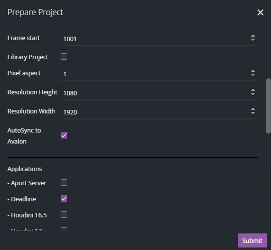
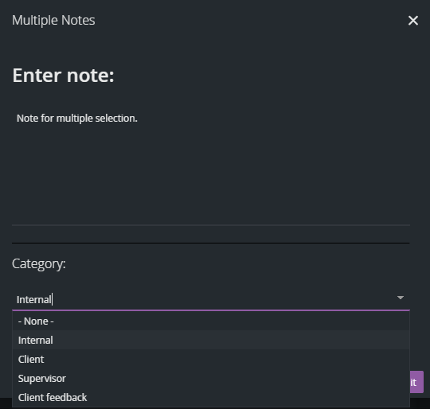
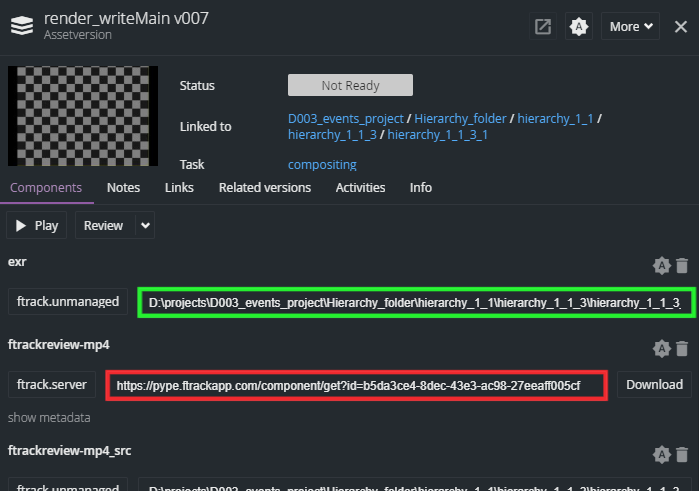

Actions are small useful tools that help artists, managers and administrators.
To avoid overfilled action menu some actions are filtered by entity types and some of them by user roles permissions.

In most cases actions filtered by entity type:
- Project
- Typed Context
    - Folder
    - Episode
    - Sequence
    - Shot
    - Library
    - Asset Build
    - Asset Variant
    - Epic
    - Milestone
- Task
- Asset Version
- Component
- Review Session

*Typed Context* is global Ftrack entity for hierarchical types representing all of them. Hierarchical types can be used for filtering too, but because they are dynamic *(you can add, modify and remove them)*, *Typed Context* is used to be more general.

So if you do not see action you need to use check if action is available for selected *entity type* or ask *administrator* to check if you have permissions to use it.

:::note
Actions can be heavily customised by your studio, so this guide might not fit 100 %.
:::

:::important
Filtering can be more complicated for example a lot of actions can be shown only when one particular entity is selected.
:::

---
## Applications

### Launch applications
* Entity types: Task
* User roles: All

These actions *launch application with OpenPype * and *start timer* for the selected Task. We recommend you to launch application this way.

:::important
Project Manager or Supervisor must set project's applications during project preparation otherwise you won't see them. Applications can be added even if the project is in progress.
:::

---

## OpenPype Admin

#### A group of actions that are used for OpenPype Administration.

### Sync to Avalon
* Entity types: Project, Typed Context
* User roles: Pypeclub, Administrator, Project manager

Synchronization to Avalon is key process to keep OpenPype data updated. Action updates selected entities (Project, Shot, Sequence, etc.) and all nested entities to Avalon database. If action is successfully finished [Sync Hier Attrs](#sync-hier-attrs) action is triggered.

There are 2 versions of **Sync to Avalon**, first labeled as **server** second as **local**.
* **server** version will be processed with [event server](module_ftrack.md#event-server)
* **local** version will be processed with user's OpenPype tray application

It is recommended to use **local** version if possible to avoid unnecessary deceleration of event server.

### Sync Hier Attrs
* Entity types: Project, Typed Context
* User roles: Pypeclub, Administrator, Project manager

Synchronization to Avalon of Ftrack's hierarchical Custom attributes is a bit complicated so we decided to split synchronization process into 2 actions. This action updates hierarchical Custom attributes of selected entities (Project, Shot, Sequence, etc.) and all their nested entities to pipeline database. This action is also triggered automatically after successfully finished [Sync To Avalon](#sync-to-avalon) action.

There are 2 versions of **Sync Hier Attrs** first labeled as **server** second as **local**.
* **server** version will be processed with [event server](module_ftrack.md#event-server)
* **local** version will be processed with user's OpenPype application

It is recommended to use **local** version if possible to avoid unnecessary deceleration of event server.

### Job Killer
* Entity types: All
* User roles: Pypeclub, Administrator

Custom Jobs in Ftrack help to track process and status of triggered actions but sometimes unexpected failure of action may happen *(Please let us know when happens)*. The failure will cause that job's status will remain set to **Running** which may cause issues in future.

This action gives ability to *stop running jobs*. When action is triggered, an interface with all running jobs with checkbox next to each is shown. Status of checked jobs will be set to **Failure** on submit.

### Delete Assets by Name
* Entity types: Typed Context, Task
* User roles: Pypeclub, Administrator

With this action it's possible to delete up to 15 entities at once from active project in pipeline database. Entered names must match exactly the names stored in database. These entities also must not have children entities *(Sequence must not have Shots but Task is not entity)*.

---

## Prepare Project

* Entity types: Project
* User roles: Pypeclub, Administrator, Project manager

Allows project managers and coordinator to *set basic project attributes* needed for OpenPype to operate, *Create project folders* if you want and especially prepare project specific [settings](admin_settings_project).

:::tip
It is possible to use this action during the lifetime of a project but we recommend using it only once at the start of the project.
:::

---

## Multiple Notes

* Entity types: Asset Version
* User roles: All

You can add same note to multiple Asset Versions at once with this action.

---

## Delete Asset/Subset

* Entity types: Typed Context, Task
* User roles: Pypeclub, Administrator

Action deletes Entities and Asset Versions from Ftrack and Avalon database.

You should use this action if you need to delete Entities or Asset Versions otherwise deletion will not take effect in Avalon database. Currently the action allows to only delete one entity at the time. Entity also must not have any children.

---

## Create Project Structure

* Entity types: Project
* User roles: Pypeclub, Administrator

*Create Project Structure* helps to create basic folder structure and may create the main ftrack entities for the project.

Structure is loaded from settings *(OpenPype Settings → Project → Global → Project Folder Structure)*. You should examine these settings to see how it works. Settings may contain dictionaries of nested dictionaries where each key represents a folder name. Key and all it's parents will be also created in Ftrack if the key ends with `[ftrack]`. Default Ftrack entity type is *Folder* but entity type can be specified using `[ftrack.{entity type}]`. To create *Sequence* with name *Seq_001* key should look like `Seq_001[ftrack.Sequence]`.

:::note
Please keep in mind this action is meant to make your project setup faster at the very beginning, but it does not create folders for each shot and asset. For creating asset folder refer to `Create Folders` Action
:::

---

## Delivery

* Entity types: Task
* User roles: Pypeclub, Project manager, Administrator

Collects approved hires files and copy them into a folder. It takes any components of any versions and copies and renames them correctly.

---

## Create Folders

* Entity types: Typed Context, Task
* User roles: All

It is usually not necessary to launch this action because folders are created automatically every time you start working on a task. However it can be handy if you need to create folders before any work begins or you want to use applications that don't have pipeline implementation.

---

## Thumbnail

A group of actions for thumbnail management.

### Thumbnail to Parent
Propagates the thumbnail of the selected entity to its parent.

### Thumbnail to Children
Propagates the thumbnail of the selected entity to its first direct children entities.

---
## RV
* Entity types: All
* User roles: All

You can launch RV player with playable components from selected entities. You can choose which components will be played.

:::important
You must have RV player installed and licensed and have correct RV environments set to be able use this action.
:::

---
## DJV View
* Entity types: Task, Asset Version
* User roles: All

You can launch DJV View with one playable component from selected entities. You can choose which component will be played.

:::important
You must have DJV View installed and configured in studio-config to be able use this action.
:::

---

## Open File

* Entity types: File Component
* User roles: All

This action will open folder of selected *Component* on *Asset Version*.

:::warning
Does not work for components uploaded to Ftrack Web server.
:::

:::warning
Component's path must be accessible by current OS.
:::

---
## Sort Review
* Entity types: Review Session
* User roles: All

Helps you sort *Asset Versions* in *Client Review Session*.

Asset Versions are sorted by *Version number*, *Task name* and *Version name*.
