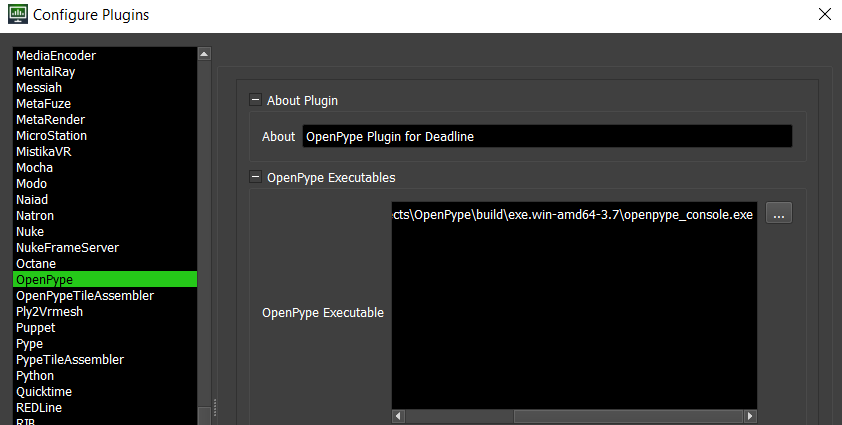
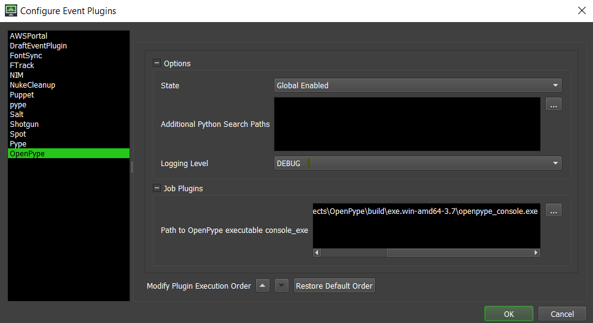
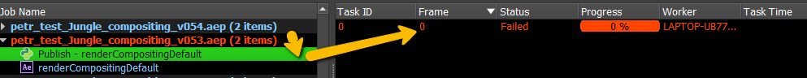
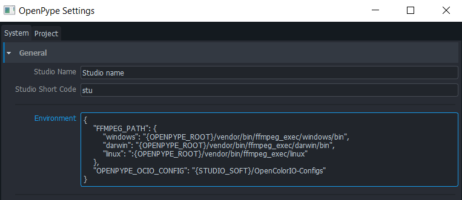

import Tabs from '@theme/Tabs';
import TabItem from '@theme/TabItem';

## Preparation

For [AWS Thinkbox Deadline](https://www.awsthinkbox.com/deadline) support you need to set a few things up in both OpenPype and Deadline itself

1. Deploy OpenPype executable to all nodes of Deadline farm. See [Install & Run](admin_use)

2. Enable Deadline module it in the [settings](admin_settings_system.md#deadline)

3. Set up *Deadline Web API service*. For more details on how to do it, see [here](https://docs.thinkboxsoftware.com/products/deadline/10.0/1_User%20Manual/manual/web-service.html).

4. Point OpenPype to your deadline webservice URL in the [settings](admin_settings_system.md#deadline)

5. Install our custom plugin, event plugin and scripts to your deadline repository. It should be as simple as copying content of `openPype/vendor/deadline/custom` to `path/to/your/deadline/repository/custom`

## Configuration

OpenPype integration with Deadline consists of two parts, event listener which gets triggered for each job and
 handles populating rendering jobs with proper environment variables and
OpenPype plugin which handles publishing itself.

Both need to be configured by pointing DL to OpenPype executables. These executables need to be installed to 
destinations accessible by DL process. Check permissions (must be executable and accessible by Deadline process)

- Enable `Tools > Super User Mode` in Deadline Monitor

- Go to `Tools > Configure plugins`, find `OpenPype` in the list on the left side, find location of OpenPype 
executable. It is recommended to use the `openpype_console` executable as it provides a bit more logging.

- In case of multi OS farms, provide multiple locations, each node goes through a list and tries to find accessible
 locations for itself.

- Go to `Tools > Configure events`, find `OpenPype` in the list on the left side, find location of OpenPype 
executable. It is recommended to use the `openpype_console` executable as it provides a bit more logging.

- State is expected to be set to `Global Enabled`

Path to executables needs to be configured on both, plugin and event level!

## Troubleshooting

#### Publishing jobs fail directly in DCCs

- Double check that all previously described steps were finished
- Check that `deadlinewebservice` is running on DL server 
- Check that user's machine has access to deadline server on configured port

#### Jobs are failing on DL side

Each publishing from OpenPype consists of 2 jobs, first one is rendering, second one is the publishing job (triggered after successful finish of the rendering job).

- Jobs are failing with `OpenPype executable was not found` error

    Check if OpenPype is installed on a node handling this job, plugin and events are properly [configured](#configuration) 

- Publishing job is failing with `ffmpeg not installed` error
 
    OpenPype executable has to have access to `ffmpeg` executable, check OpenPype `Setting > General`

