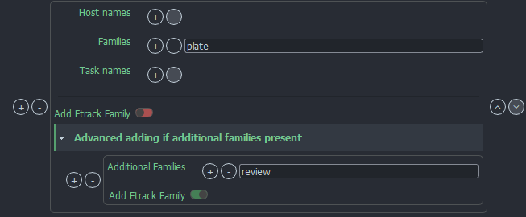

import Tabs from '@theme/Tabs';
import TabItem from '@theme/TabItem';


Ftrack is currently the main project management option for OpenPype. This documentation assumes that you are familiar with Ftrack and it's basic principles. If you're new to Ftrack, we recommend having a thorough look at [Ftrack Official Documentation](http://ftrack.rtd.ftrack.com/en/stable/).

## Prepare Ftrack for OpenPype

### Server URL
If you want to connect Ftrack to OpenPype you might need to make few changes in Ftrack settings. These changes would take a long time to do manually, so we prepared a few Ftrack actions to help you out. First, you'll need to launch OpenPype settings, enable [Ftrack module](admin_settings_system.md#Ftrack), and enter the address to your Ftrack server. 

### Login
Once your server is configured, restart OpenPype and you should be prompted to enter your [Ftrack credentials](artist_ftrack.md#How-to-use-Ftrack-in-OpenPype) to be able to run our Ftrack actions. If you are already logged in to Ftrack in your browser, it is enough to press `Ftrack login` and it will connect automatically.

For more details step by step on how to login to Ftrack in OpenPype to go [artist Ftrack login](artist_ftrack.md#How-to-use-Ftrack-in-OpenPype) documentation.

You can only use our Ftrack Actions and publish to Ftrack if each artist is logged in.


### Custom Attributes
After successfully connecting OpenPype with you Ftrack, you can right click on any project in Ftrack and you should see a bunch of actions available. The most important one is called `OpenPype Admin` and contains multiple options inside.

To prepare Ftrack for working with OpenPype you'll need to run [OpenPype Admin - Create/Update Avalon Attributes](manager_ftrack_actions.md#create-update-avalon-attributes), which creates and sets the Custom Attributes necessary for OpenPype to function. 


## Event Server
Ftrack Event Server is the key to automation of many tasks like _status change_, _thumbnail update_, _automatic synchronization to Avalon database_ and many more. Event server should run at all times to perform the required processing as it is not possible to catch some of them retrospectively with enough certainty.

### Running event server
There are specific launch arguments for event server. With `openpype_console eventserver` you can launch event server but without prior preparation it will terminate immediately. The reason is that event server requires 3 pieces of information: _Ftrack server url_, _paths to events_ and _credentials (Username and API key)_. Ftrack server URL and Event path are set from OpenPype's environments by default, but the credentials must be done separatelly for security reasons.


:::note There are 2 ways of passing your credentials to event server.

<Tabs
  defaultValue="args"
  values={[
    {label: 'Additional Arguments', value: 'args'},
    {label: 'Environments Variables', value: 'env'}
  ]}>

<TabItem value="args">

-  **`--ftrack-user "your.username"`** : Ftrack Username
-   **`--ftrack-api-key "00000aaa-11bb-22cc-33dd-444444eeeee"`** : User's API key
-   `--ftrack-url "https://yourdomain.ftrackapp.com/"` : Ftrack server URL _(it is not needed to enter if you have set `FTRACK_SERVER` in OpenPype' environments)_

So if you want to use OpenPype's environments then you can launch event server for first time with these arguments `openpype_console.exe eventserver --ftrack-user "my.username" --ftrack-api-key "00000aaa-11bb-22cc-33dd-444444eeeee" --store-credentials`. Since that time, if everything was entered correctly, you can launch event server with `openpype_console.exe eventserver`.

</TabItem>
<TabItem value="env">

- `FTRACK_API_USER` - Username _("your.username")_
- `FTRACK_API_KEY` - User's API key _("00000aaa-11bb-22cc-33dd-444444eeeee")_
- `FTRACK_SERVER` - Ftrack server url _("<https://yourdomain.ftrackapp.com/">)_

</TabItem>
</Tabs>
:::

:::caution
We do not recommend setting your Ftrack user and api key environments in a persistent way, for security reasons. Option 1. passing them as arguments is substantially safer.
:::

### Where to run event server

We recommend you to run event server on stable server machine with ability to connect to Avalon database and Ftrack web server. Best practice we recommend is to run event server as service. It can be Windows or Linux. 

:::important
Event server should **not** run more than once! It may cause major issues.
:::

### Which user to use

-   must have at least `Administrator` role
-   the same user should not be used by an artist


:::note How to create Eventserver service
<Tabs
  defaultValue="linux"
  values={[
    {label: 'Linux', value: 'linux'},
    {label: 'Windows', value: 'win'},
  ]}>

<TabItem value="linux">

- create file:
    `sudo vi /opt/openpype/run_event_server.sh`
-   add content to the file:
```sh
#!/usr/bin/env bash
export OPENPYPE_DEBUG=1
export OPENPYPE_MONGO=<openpype-mongo-url>

pushd /mnt/path/to/openpype
./openpype_console eventserver --ftrack-user <openpype-admin-user> --ftrack-api-key <api-key>
```
-   change file permission:
    `sudo chmod 0755 /opt/openpype/run_event_server.sh`

-   create service file:
    `sudo vi /etc/systemd/system/openpype-ftrack-event-server.service`
-   add content to the service file

```toml
[Unit]
Description=Run OpenPype Ftrack Event Server Service
After=network.target

[Service]
Type=idle
ExecStart=/opt/openpype/run_event_server.sh
Restart=on-failure
RestartSec=10s

[Install]
WantedBy=multi-user.target
```

-   change file permission:
    `sudo chmod 0755 /etc/systemd/system/openpype-ftrack-event-server.service`

-   enable service:
    `sudo systemctl enable openpype-ftrack-event-server`

-   start service:
    `sudo systemctl start openpype-ftrack-event-server`

</TabItem>
<TabItem value="win">

-   create service file: `openpype-ftrack-eventserver.bat`
-   add content to the service file: 
```sh
@echo off
set OPENPYPE_DEBUG=1
set OPENPYPE_MONGO=<openpype-mongo-url>

pushd \\path\to\openpype
openpype_console.exe eventserver --ftrack-user <openpype-admin-user> --ftrack-api-key <api-key>
```
-   download and install `nssm.cc`
-   create Windows service according to nssm.cc manual
-   you can also run eventserver as a standard Schedule task
-   be aware of using UNC path

</TabItem>
</Tabs>
:::

* * *

## Ftrack events

Events are helpers for automation. They react to Ftrack Web Server events like change entity attribute, create of entity, etc.

### Sync to Avalon

Automatic [synchronization to pipeline database](manager_ftrack.md#synchronization-to-avalon-database).

This event updates entities on their changes Ftrack. When new entity is created or existing entity is modified. Interface with listing information is shown to users when [synchronization rules](manager_ftrack.md#synchronization-rules) are not met. This event may also undo changes when they might break pipeline. Namely _change name of synchronized entity_, _move synchronized entity in hierarchy_.

:::important
Deleting an entity by Ftrack's default is not processed for security reasons _(to delete entity use [Delete Asset/Subset action](manager_ftrack_actions.md#delete-asset-subset))_.
:::

### Synchronize Hierarchical and Entity Attributes 

Auto-synchronization of hierarchical attributes from Ftrack entities.

Related to [Synchronize to Avalon database](manager_ftrack.md#synchronization-to-avalon-database) event _(without it, it makes no sense to use this event)_. Hierarchical attributes must be synchronized with special way so we needed to split synchronization into 2 parts. There are [synchronization rules](manager_ftrack.md#synchronization-rules) for hierarchical attributes that must be met otherwise interface with messages about not meeting conditions is shown to user.

### Update Hierarchy thumbnails

Push thumbnails from version, up through multiple hierarchy levels

### Update status on task action

Change status of next task from `Not started` to `Ready` when previous task is approved.

Multiple detailed rules for next task update can be configured in the settings.

### Delete Avalon ID from new entity 

Is used to remove value from `Avalon/Mongo Id` Custom Attribute when entity is created.

`Avalon/Mongo Id` Custom Attribute stores id of synchronized entities in pipeline database. When user _Copy → Paste_ selection of entities to create similar hierarchy entities, values from Custom Attributes are copied too. That causes issues during synchronization because there are multiple entities with same value of `Avalon/Mongo Id`. To avoid this error we preventively remove these values when entity is created.

### Sync status from Task to Parent

List of parent object types where this is triggered ("Shot", "Asset build", etc. Skipped if it is empty)

### Sync status from Version to Task

Updates Task status based on status changes on its Asset Version.

The issue this solves is when Asset version's status is changed but the artist assigned to Task is looking at the task status, thus not noticing the review.

This event makes sure statuses Asset Version get synced to it's task. After changing a status on version, this event first tries to set identical status to version's parent (usually task). But this behavior can be tweaked in settings.

### Sync status on first created version

This event handler allows setting of different status to a first created Asset Version in Ftrack.

This is useful for example if first version publish doesn't contain any actual reviewable work, but is only used for roundtrip conform check, in which case this version could receive status `pending conform` instead of standard `pending review`

### Update status on next task
Change status on next task by task types order when task status state changed to "Done". All tasks with the same Task mapping of next task status changes From → To. Some status can be ignored. 

## Publish plugins

### Collect Ftrack Family

Reviews uploads to Ftrack could be configured by combination of hosts, families and task names.
(Currently implemented only in Standalone Publisher, Maya.)

#### Profiles

Profiles are used to select when to add Ftrack family to the instance. One or multiple profiles could be configured, Families, Task names (regex available), Host names combination is needed.

Eg. If I want review created and uploaded to Ftrack for render published from Maya , setting is:

Host names: 'Maya'
Families: 'render'
Add Ftrack Family: enabled


#### Advanced adding if additional families present

In special cases adding 'ftrack' based on main family ('Families' set higher) is not enough. 
(For example upload to Ftrack for 'plate' main family should only happen if 'review' is contained in instance 'families', not added in other cases. )

