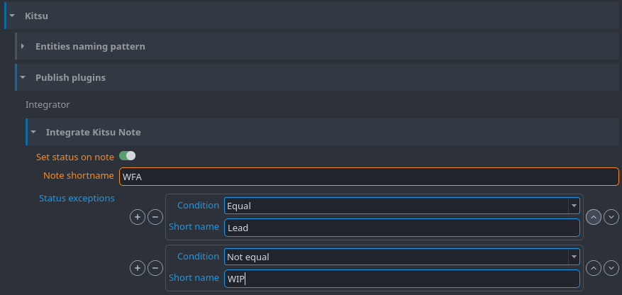

import Tabs from '@theme/Tabs';
import TabItem from '@theme/TabItem';

Kitsu is a great open source production tracker and can be used for project management instead of Ftrack. This documentation assumes that you are familiar with Kitsu and its basic principles. If you're new to Kitsu, we recommend having a thorough look at [Kitsu Official Documentation](https://kitsu.cg-wire.com/).

## Prepare Kitsu for OpenPype

### Server URL
If you want to connect Kitsu to OpenPype you have to set the `Server` url in Kitsu settings. And that's all!
This setting is available for all the users of the OpenPype instance.

## Synchronize
Updating OP with Kitsu data is executed running the `sync-service`, which requires to provide your Kitsu credentials with `-l, --login` and `-p, --password` or by setting the environment variables `KITSU_LOGIN` and `KITSU_PWD`. This process will request data from Kitsu and create/delete/update OP assets.
Once this sync is done, the thread will automatically start a loop to listen to Kitsu events.

```bash
openpype_console module kitsu sync-service -l me@domain.ext -p my_password
```

### Events listening
Listening to Kitsu events is the key to automation of many tasks like _project/episode/sequence/shot/asset/task create/update/delete_ and some more. Events listening should run at all times to perform the required processing as it is not possible to catch some of them retrospectively with strong reliability. If such timeout has been encountered, you must relaunch the `sync-service` command to run the synchronization step again.

Connection token is refreshed every week.

### Push to Kitsu
An utility function is provided to help update Kitsu data (a.k.a Zou database) with OpenPype data if the publishing to the production tracker hasn't been possible for some time. Running `push-to-zou` will create the data on behalf of the user.
:::caution
This functionality cannot deal with all cases and is not error proof, some intervention by a human being might be required.
:::

```bash
openpype_console module kitsu push-to-zou -l me@domain.ext -p my_password
```

## Integrate Kitsu Note
Task status can be automatically set during publish thanks to `Integrate Kitsu Note`. This feature can be configured in:

`Admin -> Studio Settings -> Project Settings -> Kitsu -> Integrate Kitsu Note`.

There are four settings available:
- `Set status on note` -> Turns on and off this integrator.
- `Note shortname` -> Which status shortname should be set automatically (Case sensitive).
- `Status change conditions - Status conditions` -> Conditions that need to be met for kitsu status to be changed. You can add as many conditions as you like. There are two fields to each conditions: `Condition` (Whether current status should be equal or not equal to the condition status) and `Short name` (Kitsu Shortname of the condition status).
- `Status change conditions - Family requirements` -> With this option you can add requirements to which families must be pushed or not in order to have the task status set by this integrator. There are two fields for each requirements: `Condition` (Same as the above) and `Family` (name of the family concerned by this requirement). For instance, adding one item set to `Not equal` and `workfile`, would mean the task status would change if a subset from another family than workfile is published (workfile can still be included), but not if you publish the workfile subset only.



## Q&A
### Is it safe to rename an entity from Kitsu?
Absolutely! Entities are linked by their unique IDs between the two databases.
But renaming from the OP's Project Manager won't apply the change to Kitsu, it'll be overridden during the next synchronization.
