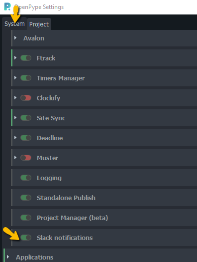
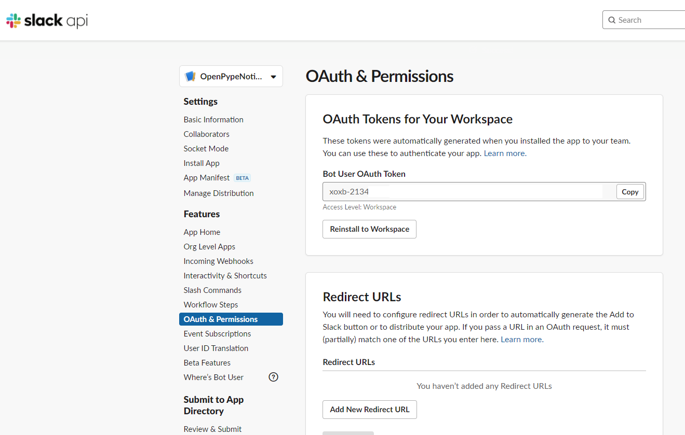
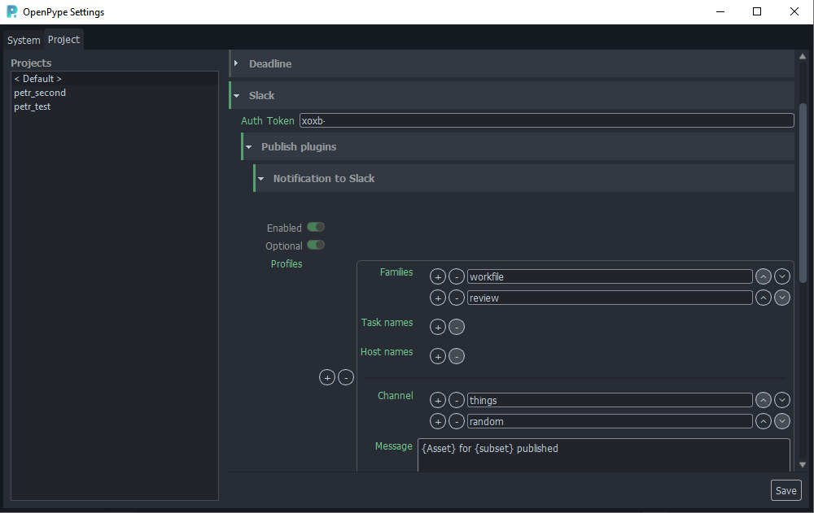

import Tabs from '@theme/Tabs';
import TabItem from '@theme/TabItem';


This module allows configuring profiles(when to trigger, for which combination of task, host and family)
and templates(could contain {} placeholder) to send notification to Slack channel(s)
whenever configured asset type is published.


## App installation

Slack application must be installed to company's Slack first. 

Please locate `openpype/modules/slack/manifest.yml` file in deployed OpenPype installation and follow instruction at
https://api.slack.com/reference/manifests#using and follow "Creating apps with manifests".

### App icon

If you would like to enrich bot with an icon, Slack admin must add the icon after app installation. 

Go to your Slack app home (something like https://api.slack.com/apps/XXXXXXXX/general?) > Basic information > Display Information.
You can upload any image you want, or for your convenience locate prepared OpenPype icon in your installed Openpype installation in `openpype\modules\slac\resources`.

## System Settings

To use notifications, *Slack Notifications* needs to be enabled globally in **OpenPype Settings/System/Modules/Slack Notifications**.




## Project Settings

### Token
Most important for module to work is to fill authentication token 
```Project settings > Slack > Publish plugins > Token```

This token should be available after installation of the app in the Slack dashboard.
It is possible to create multiple tokens and configure different scopes for them.



### Profiles
Profiles are used to select when to trigger notification. One or multiple profiles
could be configured, `Families`, `Task names` (regex available), `Host names`, `Subset names` (regex available) combination is needed.

Eg. If I want to be notified when render is published from Maya, setting is:

- family: 'render'
- host: 'Maya'

### Messages to channels

#### Channels
Multiple messages could be delivered to one or multiple channels, by default app allows Slack bot
to send messages to 'public' channels (eg. bot doesn't need to join the channel first).



#### Upload thumbnail
Integration can upload 'thumbnail' file (if present in an instance), for that bot must be 
manually added to target channel by Slack admin!
(In target channel write: ```/invite @OpenPypeNotifier``)

#### Upload review
Integration can upload 'review' file (if present in an instance), for that bot must be 
manually added to target channel by Slack admin!
(In target channel write: ```/invite @OpenPypeNotifier``)

Burnin version (usually .mp4) is preferred if present.

Please be sure that this configuration is viable for your use case. In case of uploading large reviews to Slack, 
all publishes will be slowed down and you might hit a file limit on Slack pretty soon (it is 5GB for Free version of Slack, any file cannot be bigger than 1GB).
You might try to add `{review_filepath}` to message content. This link might help users to find review easier on their machines.
(It won't show a playable preview though!)

#### Message
Message content can use Templating (see [Available template keys](admin_settings_project_anatomy.md#available-template-keys)).

Few keys also have Capitalized and UPPERCASE format. Values will be modified accordingly ({Asset} >> "Asset", {FAMILY} >> "RENDER").

**Additional implemented keys:**
- review_filepath

##### Message example
```
{Subset} was published for {ASSET} in {task[name]} task.

Here you can find review {review_filepath}
```

#### Message retention
Currently no purging of old messages is implemented in Openpype. Admins of Slack should set their own retention of messages and files per channel.
(see https://slack.com/help/articles/203457187-Customize-message-and-file-retention-policies)
