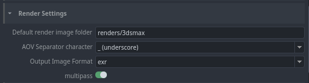

# Color Management (OCIO managed)
//

# Render Settings
Predefine your render settings.

- Set your Default render image folder.
- Define your AOV Seprator character ((-) dash, (_) underscore, (.) dot).
- Select your Output Image Format (bmp, exr, tif, tiff, jpg, png, tga, dds).
- Enable or disable the [multipass](https://help.autodesk.com/view/3DSMAX/2022/ENU/?guid=GUID-4B669CFE-54BB-4C23-A369-49430A9EB9C9).

# Point Cloud
??

# Publish plugins
Find here the publish plugins.

**Publish plugins list:** Validate Frame Range.
