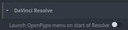

# Launch OpenPype
Enable this option to launch OpenPype menu on start of Resolve.

# Color Management (remapped to OCIO)
//

# Creator plugins
Find here the creator plugins.

**Plugin list:** Create Shot Clip.
