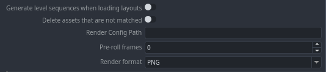

# Color Management (OCIO managed)
//

# Unreal Engine project settings
### Generate level sequences when loading layouts
There are two different layout options in Unreal, depending on the type of project you are working on.
This option will not generate the level sequences hierarchy, but will load the layout in a single level and with a single level sequence. To set this mode, you should turn **off** the setting **Generate level sequences when loading layouts**.

### Delete assets that are not matched
When you have assembled a scene with loaded or imported assets, you can still load a layout to match the existing assets. Enable this option to delete all the unmatched assets in the scene.

### Render Config Path
Enter your render path.

### Pre-roll frames
Enter the number of [warm up frames](https://docs.unrealengine.com/5.2/en-US/API/Editor/MovieSceneTools/UAutomatedLevelSequenceCapture/WarmUpFrameCount/) that will be rendered before the actual render.

### Render format
Select the render format (PNG, EXR, JPG, BMP).

# Project Setup
## Dev mode
Enable the **Dev mode** to make all new projects created on tasks by pype C++ projects. You will need [Visual Studio](https://visualstudio.microsoft.com/) installed.
