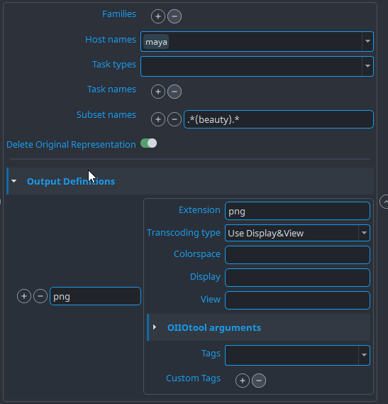
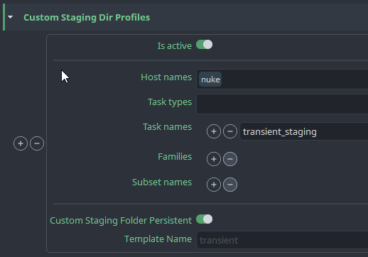

import Tabs from '@theme/Tabs';
import TabItem from '@theme/TabItem';

Project settings can have project specific values. Each new project is using studio values defined in **default** project but these values can be modified or overridden per project.

:::warning Default studio values
Projects always use default project values unless they have [project override](../admin_settings#project-overrides) (orange colour). Any changes in default project may affect all existing projects.
:::

## Color Management (ImageIO)

:::info Default OCIO config
OpenPype distributes its own OCIO configs. Those can be found in `{openpype install dir}/{version}/vendor/bin/ocioconfig/OpenColorIOConfigs`. Windows example: `C:\Program Files (x86)\OpenPype\3.14.0\vendor\bin\ocioconfig\OpenColorIOConfigs`
:::

### Using OCIO config
Global config path is set by default to OpenPype distributed configs. At the moment there are only two - **aces_1.2** and **nuke-default**. Since this path input is not platform specific it is required to use at least an environment variable do platform specific config root directory. Order of paths matter so first path found and existing first served.

Each OCIO config path input supports formatting using environment variables and [anatomy template keys](../admin_settings_project_anatomy#available-template-keys). The default global OCIO config path is `{OPENPYPE_ROOT}/vendor/bin/ocioconfig/OpenColorIOConfigs/aces_1.2/config.ocio`.

If the project settings for a particular host has its own OCIO config **enabled** and set to at least one path and the path exists, it overrides the global OCIO config for that host.

**For example**

Project nuke-specific OCIO config: `project_settings/nuke/imageio/ocio_config`

If config path is defined to particular shot target with following path inputs:
1. `{root[work]}/{project[name]}/{hierarchy}/{asset}/config/aces.ocio`
2. `{root[work]}/{project[name]}/{hierarchy}/config/aces.ocio`

Procedure of resolving path (from above example) will look first into path 1st and if the path is not existing then it will try 2nd and if even that is not existing then it will fall back to global default.

### Using File rules
File rules are inspired by [OCIO v2 configuration]((https://opencolorio.readthedocs.io/en/latest/guides/authoring/rules.html)). Each rule has a unique name which can be overridden by host-specific _File rules_ (example: `project_settings/nuke/imageio/file_rules/rules`).

The _input pattern_ matching uses REGEX expression syntax (try [regexr.com](https://regexr.com/)). Matching rules procedure's intention is to be used during publishing or loading of representation. Since the publishing procedure is run before integrator format publish template path, make sure the pattern is working or any work render path.

:::warning Colorspace name input
The **colorspace name** value is a raw string input and no validation is run after saving project settings. We recommend to open the specified `config.ocio` file and copy pasting the exact colorspace names.
:::

### Extract OIIO Transcode
OIIOTools transcoder plugin with configurable output presets. Any incoming representation with `colorspaceData` is convertible to single or multiple representations with different target colorspaces or display and viewer names found in linked **config.ocio** file.

`oiiotool` is used for transcoding, eg. `oiiotool` must be present in `vendor/bin/oiio` or environment variable `OPENPYPE_OIIO_PATHS` must be provided for custom oiio installation.

Notable parameters:
- **`Delete Original Representation`** - keep or remove original representation. If old representation is kept, but there is new transcoded representation with 'Create review' tag, original representation loses its 'review' tag if present.
- **`Extension`** - target extension. If left empty, original extension is used.
- **`Transcoding type`** - transcoding into colorspace or into display and viewer space could be used. Cannot use both at the same time.
- **`Colorspace`** - target colorspace, which must be available in used color config. (If `Transcoding type` is `Use Colorspace` value in configuration is used OR if empty value collected on instance from DCC).
- **`Display & View`** - display and viewer colorspace. (If `Transcoding type` is `Use Display&View` values in configuration is used OR if empty values collected on instance from DCC).
- **`Arguments`** - special additional command line arguments for `oiiotool`.

Example here describes use case for creation of new color coded review of png image sequence. Original representation's files are kept intact, review is created from transcoded files, but these files are removed in cleanup process.

Another use case is to transcode in Maya only `beauty` render layers and use collected `Display` and `View` colorspaces from DCC.

## Profile filters

Many of the settings are using a concept of **Profile filters**

You can define multiple profiles to choose from for different contexts. Each filter is evaluated and a
profile with filters matching the current context the most, is used.

You can define profile without any filters and use it as **default**.

Only **one or none** profile will be returned per context.

All context filters are lists which may contain strings or Regular expressions (RegEx).
- **`hosts`** - Host from which publishing was triggered. `["maya", "nuke"]`
- **`families`** - Main family of processed subset. `["plate", "model"]`
- **`tasks`** - Currently processed task. `["modeling", "animation"]`

:::important Filtering
Filters are optional. In case when multiple profiles match current context, profile with higher number of matched filters has higher priority than profile without filters.
(The order the profiles in settings doesn't matter, only the precision of matching does.)
:::

## Publish plugins

Publish plugins used across all integrations.

### Extract Review
Plugin responsible for automatic FFmpeg conversion to variety of formats.

Extract review uses [profile filtering](#profile-filters) to render different outputs for different situations.

Applicable context filters:
 **`hosts`** - Host from which publishing was triggered. `["maya", "nuke"]`
- **`families`** - Main family of processed subset. `["plate", "model"]`

**Output Definitions**

A profile may generate multiple outputs from a single input. Each output must define unique name and output extension (use the extension without a dot e.g. **mp4**). All other settings of output definition are optional.

- **`Tags`**
    Define what will happen to output.

- **`FFmpeg arguments`**
    These arguments are appended to ffmpeg arguments auto generated by publish plugin. Some of arguments are handled automatically like rescaling or letterboxes.
    - **Video filters** additional FFmpeg filters that would be defined in `-filter:v` or `-vf` command line arguments.
    - **Audio filters** additional FFmpeg filters that would be defined in `-filter:a` or `-af` command line arguments.
    - **Input arguments** input definition arguments of video or image sequence - this setting has limitations as you have to know what is input.
    - **Output arguments** other FFmpeg output arguments like codec definition.

- **`Output width`** and **`Output height`**
    - It is possible to rescale output to specified resolution and keep aspect ratio.
    - If value is set to 0, source resolution will be used.

- **`Overscan crop`**
    - Crop input resolution before rescaling.

    - Value is text may have a few variants. Each variant define output size for input size.

    - All values that cause output resolution smaller than 1 pixel are invalid.

    - Value without sign (+/-) in is always explicit and value with sign is
    relative. Output size for values "200px" and "+200px" are not the same "+200px" will add 200 pixels to source and "200px" will keep only 200px from source. Value of "0", "0px" or "0%" are automatically converted to "+0px" as 0px is invalid output.

    - Cropped value is related to center. It is better to avoid odd numbers if
    possible.

    **Example outputs for input size: 2200px**

    | String | Output | Description |
    |---|---|---|
    | ` `      | 2200px | Empty string keep resolution unchanged. |
    | `50%`    | 1100px | Crop 25% of input width on left and right side. |
    | `300px`  | 300px | Keep 300px in center of input and crop rest on left and right. |
    | `300`    | 300px | Values without units are used as pixels (`px`). |
    | `+0px`   | 2200px | Keep resolution unchanged. |
    | `0px`   | 2200px | Same as `+0px`. |
    | `+300px` | 2500px | Add black pillars of 150px width on left and right side. |
    | `-300px` | 1900px | Crop 150px on left and right side |
    | `+10%`   | 2420px | Add black pillars of 5% size of input on left and right side. |
    | `-10%`   | 1980px | Crop 5% of input size by on left and right side. |
    | `-10%+`  | 2000px | Input width is 110% of output width. |

    **Value "-10%+" is a special case which says that input's resolution is
    bigger by 10% than expected output.**

    - It is possible to enter single value for both width and height or
    combination of two variants for width and height separated with space.

    **Example for resolution: 2000px 1000px**

    | String        | Output        |
    |---------------|---------------|
    | "100px 120px" | 2100px 1120px |
    | "-10% -200px" | 1800px 800px  |
    | "-10% -0px" | 1800px 1000px  |

- **`Overscan color`**
    - Color of empty area caused by different aspect ratio of input and output.
    - By default is set to black color.

- **`Letter Box`**
    - **Enabled** - Enable letter boxes
    - **Ratio** - Ratio of letter boxes. Ratio type is calculated from output image dimensions. If letterbox ratio > image ratio, _letterbox_ is applied. Otherwise _pillarbox_ will be rendered.
    - **Fill color** - Fill color of boxes (RGBA: 0-255)
    - **Line Thickness** - Line thickness on the edge of box (set to `0` to turn off)
    - **Line color** - Line color on the edge of box (RGBA: 0-255)

    
    

- **`Background color`**
    - Background color can be used for inputs with possible transparency (e.g. png sequence).
    - Input's without possible alpha channel are ignored all the time (e.g. mov).
    - Background color slows down rendering process.
        - set alpha to `0` to not use this option at all (in most of cases background stays black)
        - other than `0` alpha will draw color as background

- **`Additional filtering`**
    - Profile filtering defines which group of output definitions is used but output definitions may require more specific filters on their own.
    - They may filter by subset name (regex can be used) or publish families. Publish families are more complex as are based on knowing code base.
    - Filtering by custom tags -> this is used for targeting to output definitions from other extractors using settings (at this moment only Nuke bake extractor can target using custom tags).
        - Nuke extractor settings path: `project_settings/nuke/publish/ExtractReviewIntermediates/outputs/baking/add_custom_tags`
    - Filtering by input length. Input may be video, sequence or single image. It is possible that `.mp4` should be created only when input is video or sequence and to create review `.png` when input is single frame. In some cases the output should be created even if it's single frame or multi frame input.

### Extract Burnin

Plugin is responsible for adding burnins into review representations.

Burnins are text values painted on top of input and may be surrounded with box in 6 available positions `Top Left`, `Top Center`, `Top Right`, `Bottom Left`, `Bottom Center`, `Bottom Right`.

The Extract Burnin plugin creates new representations based on plugin presets, representations in instance and whether the reviewable matches the profile filter.
A burnin can also be directly linked by name in the output definitions of the [Extract Review plug-in settings](#extract-review) so _can_ be triggered without a matching profile.

#### Burnin formatting options (`options`)

The formatting options define the font style for the burnin texts.
The X and Y offset define the margin around texts and (background) boxes.

#### Burnin profiles (`profiles`)

Plugin process is skipped if `profiles` are not set at all. Profiles contain list of profile items. Each burnin profile may specify filters for **hosts**, **tasks** and **families**. Filters work the same way as described in [Profile Filters](#profile-filters).

#### Profile burnins

A burnin profile may set multiple burnin outputs from one input. The burnin's name represents the unique **filename suffix** to avoid overriding files with same name.

| Key | Description | Type | Example |
| --- | --- | --- | --- |
| **Top Left** | Top left corner content. | str | "{dd}.{mm}.{yyyy}" |
| **Top Centered** | Top center content. | str | "v{version:0>3}" |
| **Top Right** | Top right corner content. | str | "Static text" |
| **Bottom Left** | Bottom left corner content. | str | "{asset}" |
| **Bottom Centered** | Bottom center content. | str | "{username}" |
| **Bottom Right** | Bottom right corner content. | str | "{frame_start}-{current_frame}-{frame_end}" |

Each burnin profile can be configured with additional family filtering and can
add additional tags to the burnin representation, these can be configured under
the profile's **Additional filtering** section.

:::note Filename suffix
The filename suffix is appended to filename of the source representation. For
example, if the source representation has suffix **"h264"** and the burnin
suffix is **"client"** then the final suffix is **"h264_client"**.
:::

**Available keys in burnin content**

- It is possible to use same keys as in [Anatomy](admin_settings_project_anatomy.md#available-template-keys).
- It is allowed to use Anatomy templates themselves in burnins if they can be filled with available data.

- Additional keys in burnins:

  | Burnin key | Description |
  | --- | --- |
  | frame_start | First frame number. |
  | frame_end | Last frame number. |
  | current_frame | Frame number for each frame. |
  | duration | Count number of frames. |
  | resolution_width | Resolution width. |
  | resolution_height | Resolution height. |
  | fps | Fps of an output. |
  | timecode | Timecode by frame start and fps. |
  | focalLength | **Only available in Maya and Houdini**  Camera focal length per frame. Use syntax `{focalLength:.2f}` for decimal truncating. Eg. `35.234985` with `{focalLength:.2f}` would produce `35.23`, whereas `{focalLength:.0f}` would produce `35`. |

:::warning
`timecode` is a specific key that can be **only at the end of content**. (`"BOTTOM_RIGHT": "TC: {timecode}"`)
:::

### IntegrateAssetNew

Saves information for all published subsets into DB, published assets are available for other hosts, tools and tasks after.
#### Template name profiles

Allows to select [anatomy template](admin_settings_project_anatomy.md#templates) based on context of subset being published.

For example for `render` profile you might want to publish and store assets in different location (based on anatomy setting) then for `publish` profile.
[Profile filtering](#profile-filters) is used to select between appropriate template for each context of published subsets.

Applicable context filters:
- **`hosts`** - Host from which publishing was triggered. `["maya", "nuke"]`
- **`tasks`** - Current task. `["modeling", "animation"]`

    

(This image shows use case where `render` anatomy template is used for subsets of families ['review, 'render', 'prerender'], `publish` template is chosen for all other.)

#### Subset grouping profiles

Published subsets might be grouped together for cleaner and easier selection in the **[Subset Manager](artist_tools_subset_manager)**

Group name is chosen with use of [profile filtering](#profile-filters)

Applicable context filters:
- **`families`** - Main family of processed subset. `["plate", "model"]`
- **`hosts`** - Host from which publishing was triggered. `["maya", "nuke"]`
- **`tasks`** - Current task. `["modeling", "animation"]`

    

(This image shows use case where only assets published from 'photoshop', for all families for all tasks should be marked as grouped with a capitalized name of Task where they are published from.)

## Tools
Settings for OpenPype tools.

### Creator
Settings related to [Creator tool](artist_tools_creator).

#### Subset name profiles

Subset name helps to identify published content. More specific name helps with organization and avoid mixing of published content. Subset name is defined using one of templates defined in **Subset name profiles settings**. The template is filled with context information at the time of creation.

Usage of template is defined by profile filtering using creator's family, host and task name. Profile without filters is used as default template and it is recommend to set default template. If default template is not available `"{family}{Task}"` is used.

**Formatting keys**

All templates can contain text and formatting keys **family**, **task** and **variant** e.g. `"MyStudio_{family}_{task}"` (example - not recommended in production).

|Key|Description|
|---|---|
|family|Creators family|
|task|Task under which is creation triggered|
|variant|User input in creator tool|

**Formatting keys have 3 variants with different letter capitalization.**

|Task|Key variant|Description|Result|
|---|---|---|---|
|`bgAnim`|`{task}`|Keep original value as is.|`bgAnim`|
|`bgAnim`|`{Task}`|Capitalize first letter of value.|`BgAnim`|
|`bgAnim`|`{TASK}`|Each letter which be capitalized.|`BGANIM`|

Template may look like `"{family}{Task}{Variant}"`.

Some creators may have other keys as their context may require more information or more specific values. Make sure you've read documentation of host you're using.

### Publish

#### Custom Staging Directory Profiles
With this feature, users can specify a custom data folder path based on presets, which can be used during the creation and publishing stages.

Staging directories are used as a destination for intermediate files (as renders) before they are renamed and copied to proper location during the integration phase. They could be created completely dynamically in the temp folder or for some DCCs in the `work` area.
Example could be Nuke where artist might want to temporarily render pictures into `work` area to check them before they get published with the choice of "Use existing frames" on the write node.

One of the key advantages of this feature is that it allows users to choose the folder for writing such intermediate files to take advantage of faster storage for rendering, which can help improve workflow efficiency. Additionally, this feature allows users to keep their intermediate extracted data persistent, and use their own infrastructure for regular cleaning.

In some cases, these DCCs (Nuke, Houdini, Maya) automatically add a rendering path during the creation stage, which is then used in publishing. Creators and extractors of such DCCs need to use these profiles to fill paths in DCC's nodes to use this functionality.

:::note
Maya's setting `project_settings/maya/RenderSettings/default_render_image_folder` is be overwritten by the custom staging dir.
:::

The custom staging folder uses a path template configured in `project_anatomy/templates/others` with `transient` being a default example path that could be used. The template requires a 'folder' key for it to be usable as custom staging folder.

##### Known issues
- Any DCC that uses prefilled paths and store them inside of workfile nodes needs to implement resolving these paths with a configured profiles.
- If studio uses Site Sync remote artists need to have access to configured custom staging folder!
- Each node on the rendering farm must have access to configured custom staging folder!

### Workfiles
All settings related to Workfile tool.

#### Open last workfile at launch
This feature allows you to define a rule for each task/host or toggle the feature globally to all tasks as they are visible in the picture.

