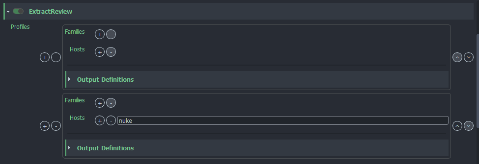
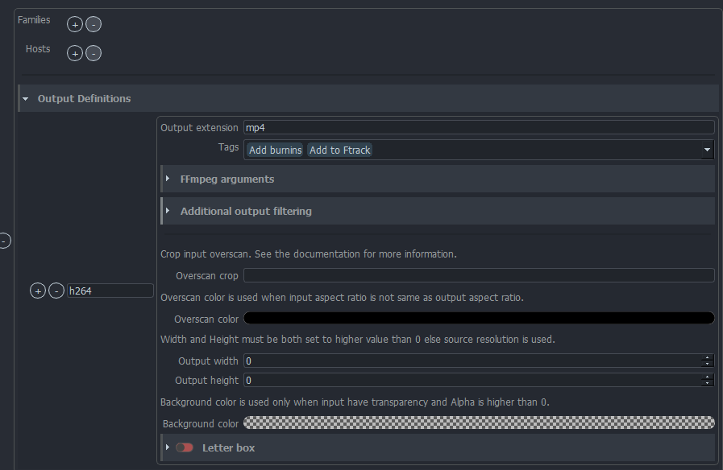
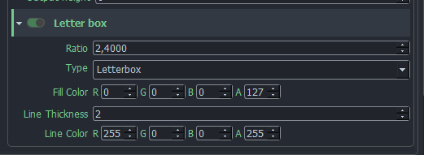
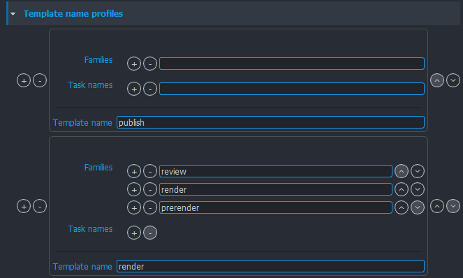
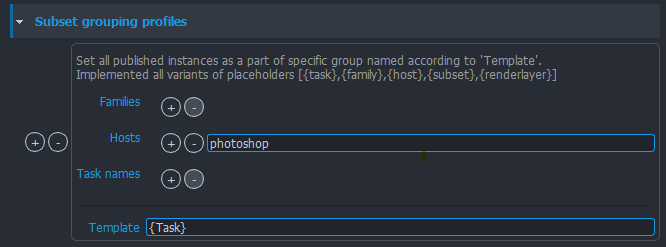
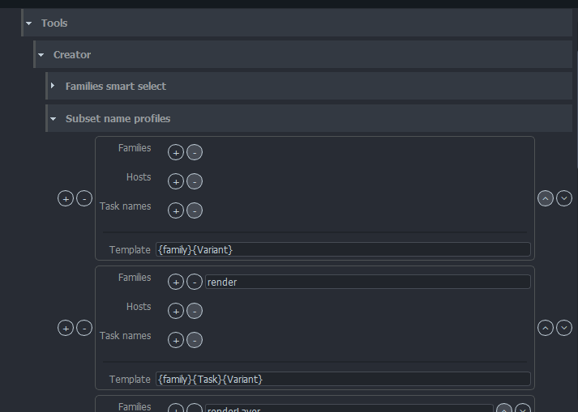
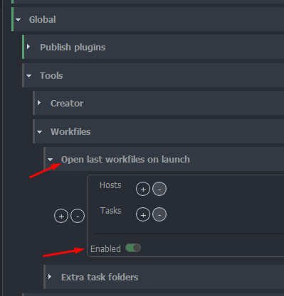

import Tabs from '@theme/Tabs';
import TabItem from '@theme/TabItem';

Project settings can have project specific values. Each new project is using studio values defined in **default** project but these values can be modified or overridden per project.

:::warning Default studio values
Projects always use default project values unless they have [project override](../admin_settings#project-overrides) (orage colour). Any changes in default project may affect all existing projects.
:::

## Profile filters

Many of the settings are using a concept of **Profile filters**

You can define multiple profiles to choose from for different contexts. Each filter is evaluated and a
profile with filters matching the current context the most, is used.

You can define profile without any filters and use it as **default**.

Only **one or none** profile will be returned per context.

All context filters are lists which may contain strings or Regular expressions (RegEx).
- **`hosts`** - Host from which publishing was triggered. `["maya", "nuke"]`
- **`families`** - Main family of processed subset. `["plate", "model"]`
- **`tasks`** - Currently processed task. `["modeling", "animation"]`

:::important Filtering
Filters are optional. In case when multiple profiles match current context, profile with higher number of matched filters has higher priority that profile without filters.
(Eg. order of when filter is added doesn't matter, only the precision of matching does.)
:::

## Publish plugins

Publish plugins used across all integrations.

### Extract Review
Plugin responsible for automatic FFmpeg conversion to variety of formats.

Extract review is using [profile filtering](#profile-filters) to be able render different outputs for different situations.

Applicable context filters:
 **`hosts`** - Host from which publishing was triggered. `["maya", "nuke"]`
- **`families`** - Main family of processed subset. `["plate", "model"]`

**Output Definitions**

Profile may generate multiple outputs from a single input. Each output must define unique name and output extension (use the extension without a dot e.g. **mp4**). All other settings of output definition are optional.

- **`Tags`**
    Define what will happen to output.

- **`FFmpeg arguments`**
    These arguments are appended to ffmpeg arguments auto generated by publish plugin. Some of arguments are handled automatically like rescaling or letterboxes.
    - **Video filters** additional FFmpeg filters that would be defined in `-filter:v` or `-vf` command line arguments.
    - **Audio filters** additional FFmpeg filters that would be defined in `-filter:a` or `-af` command line arguments.
    - **Input arguments** input definition arguments of video or image sequence - this setting has limitations as you have to know what is input.
    - **Output arguments** other FFmpeg output arguments like codec definition.

- **`Output width`** and **`Output height`**
    - it is possible to rescale output to specified resolution and keep aspect ratio.
    - If value is set to 0, source resolution will be used.

- **`Overscan crop`**
    - Crop input resolution before rescaling.

    - Value is text may have a few variants. Each variant define output size for input size.

    - All values that cause output resolution smaller than 1 pixel are invalid.

    - Value without sign (+/-) in is always explicit and value with sign is
    relative. Output size for values "200px" and "+200px" are not the same "+200px" will add 200 pixels to source and "200px" will keep only 200px from source. Value of "0", "0px" or "0%" are automatically converted to "+0px" as 0px is invalid output.

    - Cropped value is related to center. It is better to avoid odd numbers if
    possible.

    **Example outputs for input size: 2200px**

    | String | Output | Description |
    |---|---|---|
    | ` `      | 2200px | Empty string keep resolution unchanged. |
    | `50%`    | 1100px | Crop 25% of input width on left and right side. |
    | `300px`  | 300px | Keep 300px in center of input and crop rest on left and right. |
    | `300`    | 300px | Values without units are used as pixels (`px`). |
    | `+0px`   | 2200px | Keep resolution unchanged. |
    | `0px`   | 2200px | Same as `+0px`. |
    | `+300px` | 2500px | Add black pillars of 150px width on left and right side. |
    | `-300px` | 1900px | Crop 150px on left and right side |
    | `+10%`   | 2420px | Add black pillars of 5% size of input on left and right side. |
    | `-10%`   | 1980px | Crop 5% of input size by on left and right side. |
    | `-10%+`  | 2000px | Input width is 110% of output width. |

    **Value "-10%+" is a special case which says that input's resolution is
    bigger by 10% than expected output.**

    - It is possible to enter single value for both width and height or
    combination of two variants for width and height separated with space.

    **Example for resolution: 2000px 1000px**

    | String        | Output        |
    |---------------|---------------|
    | "100px 120px" | 2100px 1120px |
    | "-10% -200px" | 1800px 800px  |
    | "-10% -0px" | 1800px 1000px  |

- **`Overscan color`**
    - Color of empty area caused by different aspect ratio of input and output.
    - By default is set to black color.

- **`Letter Box`**
    - **Enabled** - Enable letter boxes
    - **Ratio** - Ratio of letter boxes
    - **Type** - **Letterbox** (horizontal bars) or **Pillarbox** (vertical bars)
    - **Fill color** - Fill color of boxes (RGBA: 0-255)
    - **Line Thickness** - Line thickness on the edge of box (set to `0` to turn off)
    - **Fill color** - Line color on the edge of box (RGBA: 0-255)
    - **Example**

    
    

- **`Background color`**
    - Background color can be used for inputs with possible transparency (e.g. png sequence).
    - Input's without possible alpha channel are ignored all the time (e.g. mov).
    - Background color slows down rendering process.
        - set alpha to `0` to not use this option at all (in most of cases background stays black)
        - other than `0` alpha will draw color as background

### IntegrateAssetNew

Saves information for all published subsets into DB, published assets are available for other hosts, tools and tasks after.
#### Template name profiles

Allows to select [anatomy template](admin_settings_project_anatomy.md#templates) based on context of subset being published.

For example for `render` profile you might want to publish and store assets in different location (based on anatomy setting) then for `publish` profile.
[Profile filtering](#profile-filters) is used to select between appropriate template for each context of published subsets.

Applicable context filters:
- **`hosts`** - Host from which publishing was triggered. `["maya", "nuke"]`
- **`tasks`** - Current task. `["modeling", "animation"]`

    

(This image shows use case where `render` anatomy template is used for subsets of families ['review, 'render', 'prerender'], `publish` template is chosen for all other.)

#### Subset grouping profiles

Published subsets might be grouped together for cleaner and easier selection in **[Loader](artist_tools.md#subset-groups)**

Group name is chosen with use of [profile filtering](#profile-filters)

Applicable context filters:
- **`families`** - Main family of processed subset. `["plate", "model"]`
- **`hosts`** - Host from which publishing was triggered. `["maya", "nuke"]`
- **`tasks`** - Current task. `["modeling", "animation"]`

    

(This image shows use case where only assets published from 'photoshop', for all families for all tasks should be marked as grouped with a capitalized name of Task where they are published from.)

## Tools
Settings for OpenPype tools.

## Creator
Settings related to [Creator tool](artist_tools.md#details).

### Subset name profiles

Subset name helps to identify published content. More specific name helps with organization and avoid mixing of published content. Subset name is defined using one of templates defined in **Subset name profiles settings**. The template is filled with context information at the time of creation.

Usage of template is defined by profile filtering using creator's family, host and task name. Profile without filters is used as default template and it is recommend to set default template. If default template is not available `"{family}{Task}"` is used.

**Formatting keys**

All templates can contain text and formatting keys **family**, **task** and **variant** e.g. `"MyStudio_{family}_{task}"` (example - not recommended in production).

|Key|Description|
|---|---|
|family|Creators family|
|task|Task under which is creation triggered|
|variant|User input in creator tool|

**Formatting keys have 3 variants with different letter capitalization.**

|Task|Key variant|Description|Result|
|---|---|---|---|
|`bgAnim`|`{task}`|Keep original value as is.|`bgAnim`|
|`bgAnim`|`{Task}`|Capitalize first letter of value.|`BgAnim`|
|`bgAnim`|`{TASK}`|Each letter which be capitalized.|`BGANIM`|

Template may look like `"{family}{Task}{Variant}"`.

Some creators may have other keys as their context may require more information or more specific values. Make sure you've read documentation of host you're using.

## Workfiles
All settings related to Workfile tool.

### Open last workfile at launch
This feature allows you to define a rule for each task/host or toggle the feature globally to all tasks as they are visible in the picture.

