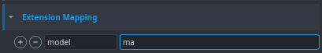
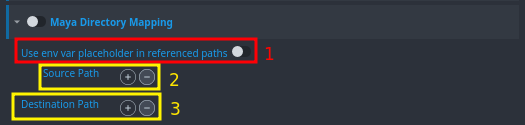
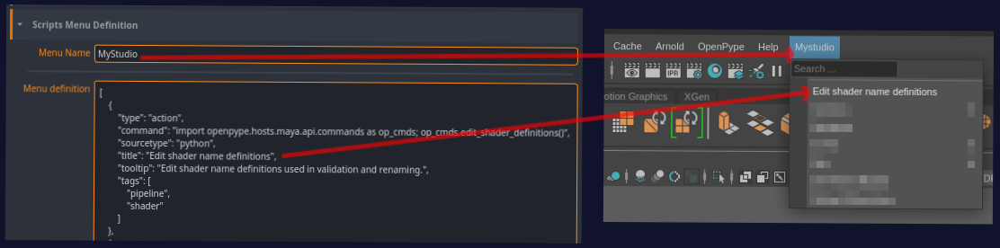
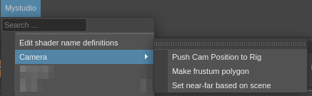
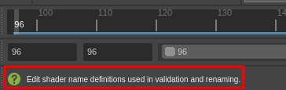
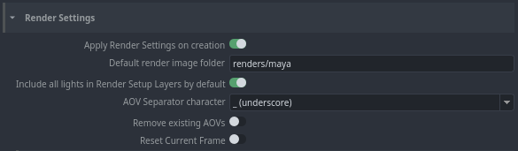
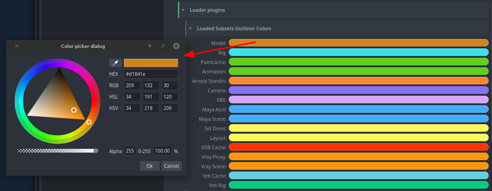
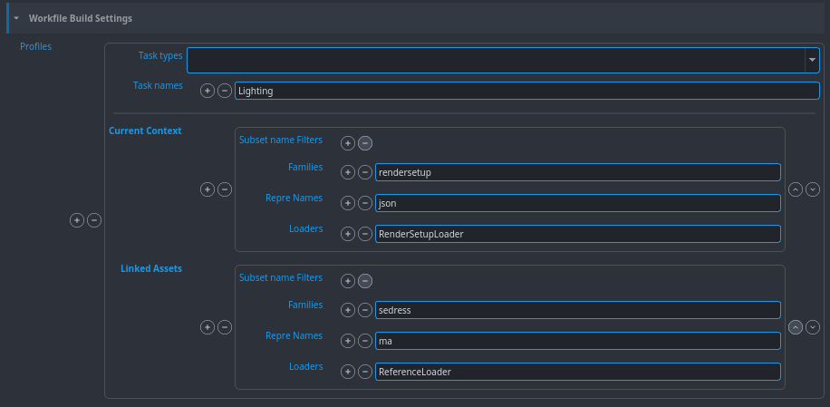
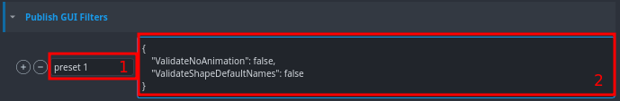
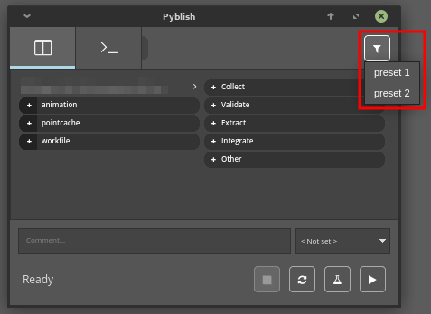

# Open Workfile Post Initialization
Open the Workfile on Maya's launch.

# Explicit Plugins Loading
Determine the plugins to load on Maya's launch.

# Color Management (OCIO managed)
//

# Maya MEL Workspace
Text to set in the MEL Workspace file.

# Extension Mapping
Save a family (on left) as the indicated extension (on right). 

# Maya Directory Mapping
1. Enable it to use the environment variables in the referenced paths.
2. Put here your Path
3. Put here your desination path

The **source path** will be replaced by the **destination path**. 

# Include/Exclude Handles in default playback & render range
1. Enable or disable the inclusion of handles by default.
2. You can also define the inclusion/exclusion of handles by task type.

# Scripts Menu Definition
Build a menu in Maya.

For exemple here : 
- **Menu Name :** Write your menu name
- **Menu Definition :**

→ "type": define the button type. Here, it's an action because when you click on it, it directly loads another window or commit any other action you defined in your script. 
*(if you define the type as a "menu", you can unfold the button to see other buttons and define them as actions).*

→ "command": define the command to implement the script in the button.

→ "sourcetype": define the programmation langage of the script.

→ "title": define the button title (here it's "Edit shader name definitions")

→ "tooltip": pass your cursor on the "Edit shader name definitions" to have a tip written at the bottom of Maya's interface.

→ "tags": keywords to type on the search bar to find an option. Here, type "pipeline" or "shader" to find the "Edit shader name definition".

# Render Settings
Pre-define your render settings.

# Creator plugins
Enable or disable the plugins. Some of them have extra options such as defining the default subsets names.

**Plugins list:** Create Look, Create Render, Create Unreal - Static Mesh, Create Multiverse Look, Create Animation, Create Animation, Create Model, Create Model, Create Point Cache, Create Proxy Alembic, Create Review, Create Ass, Create VRay Proxy, Create Multiverse USD, Create Multiverse USD, Create Multiverse USD Composition, Create Multiverse USD Override, Create Assembly, Create Camera, Create Layout, Create Maya Scene, Create Render Setup, Create Rig, Create Set Dress, Create VRay Scene Create Yeti Rig.

# Publish plugins
Enable or disable the plugins executed at publishing.

**Publish plugins list:** 
- **Collectors:** Collect Render Layers, Collect Camera for FBX export.

- **Validators:** Validate Instance In Context, ValidateContainers, Validate Frame Range, ValidateShaderName, Validate Look Shading Engine Naming, ValidateMayaColorSpace, ValidateAttributes, Validate Loaded Plugin, Validate Maya Units, Validate Maya Units, Validate Unreal Static Mesh Name, Validate Cycle Error, Plug-in Path Attributes, ValidateRenderSettings, Validate Current Render Layer Has Renderable Camera, Validate GLSL Material, Validate GLSL Plugin, Validate Images Files Rule (Workspace), Validate No Default Cameras Renderable, Validate Render Single Camera, Validate Render Passes/AOVs Are Registered, Validate Step Size, Vray Distributed Rendering, Vray Distributed Rendering, Vray Referenced AOVs, Vray Translator Settings, Vray Proxy Settings, VRay Proxy Members, Yeti Render Script Callbacks, Yeti Rig Settings Model, Rig, Validate Camera Attributes, Validate Assembly Name, Validate Assembly Namespaces, Validate Assembly Model Transforms, ValidateAssRelativePaths, Validate Instancer Content, Validate Instancer Cache Frame Ranges, Validate No Default Cameras, Validate Unreal Up-Axis check, Validate Camera Content.

- **Extractor:** Extract Playblast settings, Maya Scene (Raw), Extract camera to Alembic, Extract GLB, Extract Look, Extract GPU Cache.

# Loader plugins
## Loader Subsets Outliner Colors
Set a color to each subset to organize your Maya Outliner.
Click on the subset color to show the color picker window.

## Reference Loader
More informations [here](admin_hosts_maya/#reference-loader).

# Workfile Build Settings
Builder profiles are set of rules allowing artist Load any available versions for the context of the asset, which it is run from. Preset is having following attributes:

- **Filter:** Each profile could be defined with task filter. In case no filter is defined, a profile will be working for all.

- **Context section:** filtres for subset name (regex accepted), families, representation names and available Loader plugin.

- **Linked Assets/Shots:** filters for asset builds to be added

# Template Workfile Build Settings
Same as above (Workfile Build Settings) but it builds the Workfile from a template.

# Publish GUI Filters
Define here presets to find on publishing.
For exemple, if you select the "preset 1", the option "ValidateNoAnimation" and "ValidateShapeDefaultNames" is disabled (*false means inactive*).

Select it here in the Maya's Publish window.

