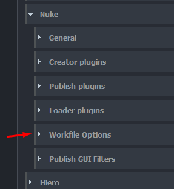
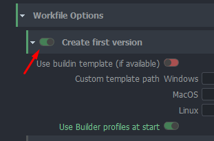
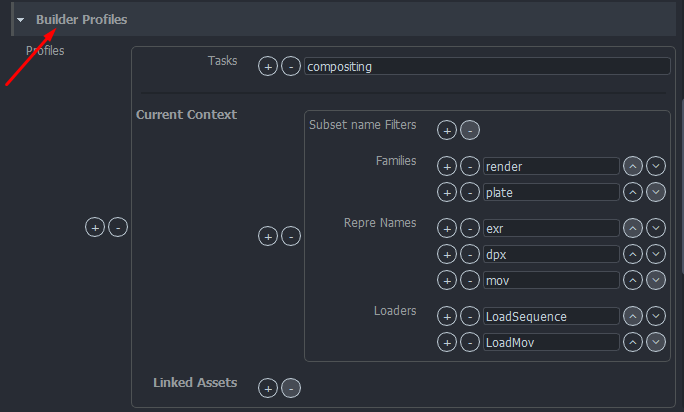

import Tabs from '@theme/Tabs';
import TabItem from '@theme/TabItem';

Project settings can have project specific values. Each new project is using studio values defined in **default** project but these values can be modified or overriden per project.

:::warning Default studio values
Projects always use default project values unless they have [project override](../admin_settings#project-overrides) (orage colour). Any changes in default project may affect all existing projects.
:::

## Workfile Options

All workfile related settings can be found here. This is a list of available features:
- Create First Version
- Add Custom Template Path
- Use Builder Profiles At Start
- Define Builder Profiles With Filters

:::important Auto Load Last Version
In case you want to set the auto load of the latest available version of workfiles, you can do it from [here](settings_project_global#open-last-workfile-at-launch).
:::

### Create First Version

By switchintg this featore on, OpenPype will generate first version. Following attributes are possible to configure:

#### Use buildin template (if available)
Not applycable in Nuke and can be ignored

#### Custom template path
Any path to nukescript. Nodes inside the script will be added into node graph at build time.

#### Use Builder profiles at start
Enabling this feature will look into available Builder Prorfiles (look bellow for more informations about this feature) and load available versions into node graph.

### Builder Profiles
Builder profiles are set of rules allowing artist Load any available versions for the context of the asset, which it is run from. Preset is having following attributes:

- **Filter**: Each profile could be defined with task filter. In case no filter is defined, a profile will be working for all.

- **Context section**: filtres for subset name (regex accepted), families, representation names and available Loader plugin.

- **Linked Assets/Shots**: filters for asset builds to be added

