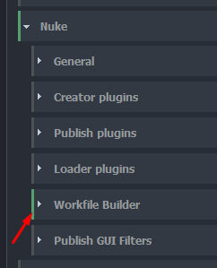
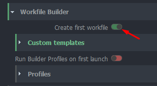
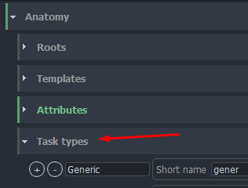
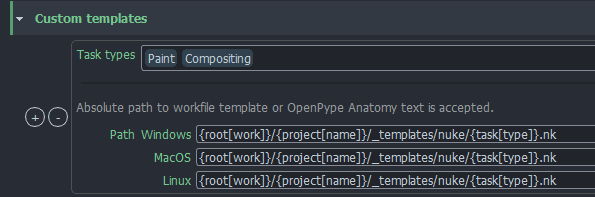
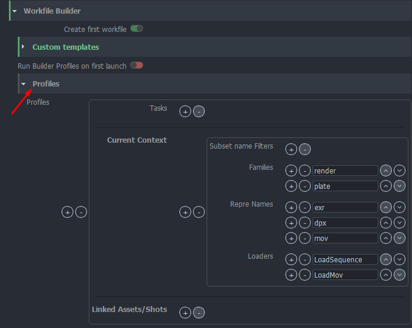

import Tabs from '@theme/Tabs';
import TabItem from '@theme/TabItem';

Project settings can have project specific values. Each new project is using studio values defined in **default** project but these values can be modified or overridden per project.

:::warning Default studio values
Projects always use default project values unless they have [project override](../admin_settings#project-overrides) (orage colour). Any changes in default project may affect all existing projects.
:::

## Workfile Builder

All Workfile Builder related settings can be found here. This is a list of available features:
- Create first workfile
- Custom Template path (task type filtered)
- Run Builder profiles at first run
- Define Builder Profiles With Filters

:::important Auto Load Last Version
In case you want to set the auto load of the latest available version of workfiles, you can do it from [here](settings_project_global#open-last-workfile-at-launch).
:::

### Create first workfile

By switchintg this feature on, OpenPype will generate initial workfile version. Following attributes are possible to configure:

#### Custom templates
Custom templates are added into nuke's node graph as nodes. List of task types can be defined for templates filtering.

- Task types are sourced from project related Anatomy/Task Types

 - multi platform path can be used in a variety of ways. Along the absolute path to a template file also an python formatting could be used. At the moment these keys are supported (image example below):
   - `root[key]`: definitions from anatomy roots
   - `project[name, code]`: project in context
   - `asset`: name of asset/shot in context
   - `task[type, name, short_name]`: as they are defined on asset/shot and in **Anatomy/Task Type** on project context

#### Run Builder profiles on first launch
Enabling this feature will look into available Builder's Prorfiles (look below for more information about this feature) and load available versions into node graph.

### Profiles (Builder)
Builder profiles are set of rules allowing artist Load any available versions for the context of the asset, which it is run from. Preset is having following attributes:

- **Filter**: Each profile could be defined with task filter. In case no filter is defined, a profile will be working for all.

- **Context section**: filtres for subset name (regex accepted), families, representation names and available Loader plugin.

- **Linked Assets/Shots**: filters for asset builds to be added

