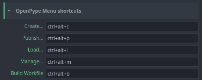
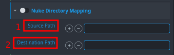
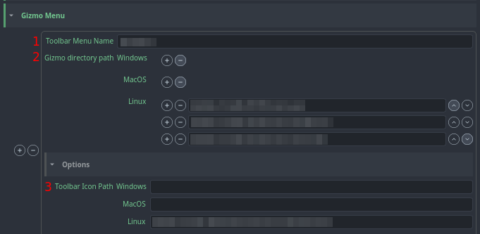
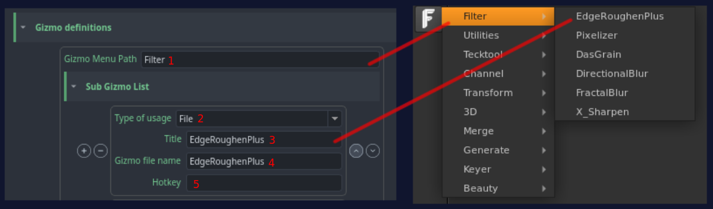

import Tabs from '@theme/Tabs';
import TabItem from '@theme/TabItem';

Project settings can have project specific values. Each new project is using studio values defined in **default** project but these values can be modified or overridden per project.

:::warning Default studio values
Projects always use default project values unless they have [project override](../admin_settings#project-overrides) (orange colour). Any changes in default project may affect all existing projects.
:::

# General
## OpenPype Menu shortcuts
Define OpenPype shortcuts for Create, Publish, Load, Manage, Build Workfile.

# Color Management (OCIO managed)
//

# Nuke Directory Mapping
Enable it to replace the **source path** by the **destination path**. 
1. Put here your Path
2. Put here your desination path

# Scripts Menu Definition
Build a Menu in Nuke.
More informations [here](settings_project_maya/#maya-directory-mapping.md) *(the process is the same on Maya and Nuke)*.
# Gizmo Menu
Create a Gizmo Menu.
1. Enter the Toolbar Menu Name
2. Put the directory paths of the plugins for your operating system (Windows, MacOS or Linux).
3. Enter the path for the toolbar icon.

## Gizmo Definitions
1. **Gizmo Menu Path:** enter the name of the submenu (here it's "Filter").
2. **Type of usage:** select what is going to be retrieved (a file, a python command or a separator). Here it's a File.
3. **Title:** enter the button title. Here it's EdgeRoughenPlus.
4. **Gizmo file name:** enter the file name to be retrieved in the origin file (set in the *Gizmo directory path*).
5. **Hotkey:** enter a hotkey to call this Gizmo.

# Creator plugins
Enable or disable the plugins. Some of them have extra options such as defining the default subsets names.
**Plugins list:** CreateWriteRender, CreateWritePrerender, CreateWriteImage.

# Publish plugins
Enable or disable the plugins executed at publishing.

**Plugins list:** 
- **Collectors:** CollectInstanceData
- **Validators:** Validate Correct Asset Name, Validate Containers, Validate Knobs, Validate Output Resolution, Validate Backdrop, Validate Gizmo (Group), Validate script settings
- **Extractors:** ExtractThumbnail, ExtractReviewData, ExtractReviewDataLut, ExtractSlateFrame
- **Integrators:** IncrementScriptVersion

# Loader Plugins
Enable or disable the plugins executed on loading.

**Plugins list:** Image Loader, Clip Loader

# Workfile Builder

All Workfile Builder related settings can be found here. This is a list of available features:
- Create first workfile
- Custom Template path (task type filtered)
- Run Builder profiles at first run
- Define Builder Profiles With Filters

:::important Auto Load Last Version
In case you want to set the auto load of the latest available version of workfiles, you can do it from [here](settings_project_global#open-last-workfile-at-launch).
:::

## Create first workfile

By switchintg this feature on, OpenPype will generate initial workfile version. Following attributes are possible to configure:

### Custom templates
Custom templates are added into nuke's node graph as nodes. List of task types can be defined for templates filtering.

- Task types are sourced from project related Anatomy/Task Types

 - multi platform path can be used in a variety of ways. Along the absolute path to a template file also an python formatting could be used. At the moment these keys are supported (image example below):
   - `root[key]`: definitions from anatomy roots
   - `project[name, code]`: project in context
   - `asset`: name of asset/shot in context
   - `task[type, name, short_name]`: as they are defined on asset/shot and in **Anatomy/Task Type** on project context

#### Run Builder profiles on first launch
Enabling this feature will look into available Builder's Prorfiles (look below for more information about this feature) and load available versions into node graph.

## Profiles (Builder)
Builder profiles are set of rules allowing artist Load any available versions for the context of the asset, which it is run from. Preset is having following attributes:

- **Filter**: Each profile could be defined with task filter. In case no filter is defined, a profile will be working for all.

- **Context section**: filtres for subset name (regex accepted), families, representation names and available Loader plugin.

- **Linked Assets/Shots**: filters for asset builds to be added

# Templated Workfile Build Settings
Same as above (Workfile Build Settings) but it builds the Workfile from a template.

# Publish GUI Filters
Define here the presets to find on publishing.
(See an example for Maya [here](settings_project_maya/#publish-gui-filters.md), which is the same process as Nuke).