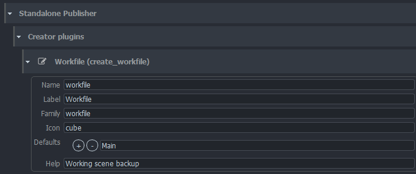

import Tabs from '@theme/Tabs';
import TabItem from '@theme/TabItem';

Project settings can have project specific values. Each new project is using studio values defined in **default** project but these values can be modified or overridden per project.

:::warning Default studio values
Projects always use default project values unless they have [project override](../admin_settings#project-overrides) (orage colour). Any changes in default project may affect all existing projects.
:::

## Creator Plugins

Contains list of implemented families to show in middle menu in Standalone Publisher. Each plugin must contain:
- name
- label
- family
- icon
- default subset(s)
- help (additional short information about family)



## Publish plugins

### Collect Textures

Serves to collect all needed information about workfiles and textures created from those. Allows to publish 
main workfile (for example from Mari), additional worfiles (from Substance Painter) and exported textures.

Available configuration:
- Main workfile extension - only single workfile can be "main" one
- Support workfile extensions - additional workfiles will be published to same folder as "main", just under `resourses` subfolder
- Texture extension - what kind of formats are expected for textures
- Additional families for workfile - should any family ('ftrack', 'review') be added to published workfile
- Additional families for textures - should any family ('ftrack', 'review') be added to published textures

#### Naming conventions

Implementation tries to be flexible and cover multiple naming conventions for workfiles and textures.

##### Workfile naming pattern

Provide regex matching pattern containing regex groups used to parse workfile name to learn needed information. (For example
build name.)

Example:

- pattern: ```^([^.]+)(_[^_.]*)?_v([0-9]{3,}).+``` 
- with groups: ```["asset", "filler", "version"]```
  
parses `corridorMain_v001` into three groups:
- asset build (`corridorMain`)
- filler (in this case empty)
- version (`001`)

Advanced example (for texture files):

- pattern: ```^([^_.]+)_([^_.]+)_v([0-9]{3,})_([^_.]+)_({color_space})_(1[0-9]{3}).+``` 
- with groups: ```["asset", "shader", "version", "channel", "color_space", "udim"]```
  
parses `corridorMain_aluminiumID_v001_baseColor_linsRGB_1001.exr`:
- asset build (`corridorMain`)
- shader (`aluminiumID`)
- version (`001`)
- channel (`baseColor`)
- color_space (`linsRGB`)
- udim (`1001`)


In case of different naming pattern, additional groups could be added or removed. Number of matching groups (`(...)`) must be same as number of items in `Group order for regex patterns`

##### Workfile group positions

For each matching regex group set in previous paragraph, its ordinal position is required (in case of need for addition of new groups etc.)

Number of groups added here must match number of parsing groups from `Workfile naming pattern`.

##### Output names

Output names of published workfiles and textures could be configured separately:
- Subset name template for workfile
- Subset name template for textures (implemented keys: ["color_space", "channel", "subset", "shader"])


### Validate Scene Settings

#### Check Frame Range for Extensions

Configure families, file extension and task to validate that DB setting (frame range) matches currently published values.

### ExtractThumbnailSP

Plugin responsible for generating thumbnails, configure appropriate values for your version o ffmpeg.