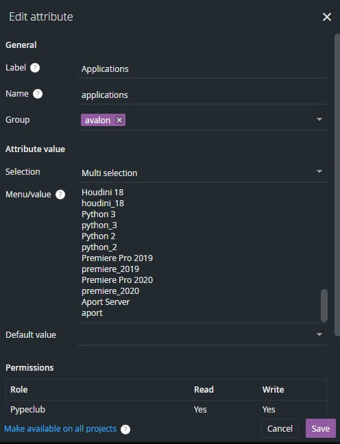

## Host configuration

To add new host application (for example new version of Autodesk Maya, etc.) just follow these steps:

### Launchers

You can find **launchers** in `repos/pype-config`. You can notice there is a bunch of **[TOML](https://en.wikipedia.org/wiki/TOML)** files and Linux and Windows shell scripts in their respective folders. **TOML** file
holds basic metadata information for host application. Their naming convention is important and follow this pattern:

```fix
app_name[_version].toml
```

for example `maya_2020.toml` or `nuke_11.3.toml`. More about it later. For now, lets look on content of one of these files:

```toml
executable = "unreal"
schema = "avalon-core:application-1.0"
application_dir = "unreal"
label = "Unreal Editor 4.24"
ftrack_label = "UnrealEditor"
icon ="ue4_icon"
launch_hook = "pype/hooks/unreal/unreal_prelaunch.py/UnrealPrelaunch"
ftrack_icon = '{}/app_icons/ue4.png'
```

* `executable` - specifies name (without extension) of shell script launching application (in windows/linux/darwin folders)
* `schema` - not important, specifying type of metadata
* `application_dir` - this specifies name of folder used in **app** key in [anatomy templates](admin_config#anatomy)
* `label` - name of application to show in launcher
* `ftrack_label` - name under which this application is show in ftrack actions (grouped by)
* `icon` - application icon used in avalon launcher
* `launch_hook` - path to Python code to execute before application is started (currently only from ftrack action)
* `ftrack_icon` - icon used in ftrack

### Environments

You can modify environment variables for you application in `repos/pype-config/environments`. Those files are
[JSON](https://en.wikipedia.org/wiki/JSON) files. Those file are loaded and processed in somewhat hierarchical way. For example - for Autodesk Maya 2020, first file named `maya.json` is processed and then `maya_2020.json` is. Syntax is following:

```json
{
  "VARIABLE": "123",
  "NEXT_VARIABLE": "{VARIABLE}4",
  "PLATFORMS": {
    "windows": "set_on_windows",
    "linux": "set_on_linux",
    "darwin": "set_on_max"
  },
  "PATHS: [
    "paths/1", "path/2", "path/3"
  ]
}
```

This will result on windows in environment with:

```sh
VARIABLE="123"
NEXT_VARIABLE="1234"
PLATFORMS="set_on_windows"
PATHS="path/1;path/2;path/3"
```

### Ftrack

You need to add your new application to ftrack so it knows about it. This is done in System Preferences of
ftrack in `Advanced:Custom Attributes`. There you can find `applications` attribute. It looks like this:



Menu/value consists of two rows per application - first row is application name and second is basically filename of this **TOML** file mentioned above without `.toml` extension. After you add or modify whatever you need here, you need to add you new application to project in ftrack. Just open project Info in ftrack, find out
**Applications** and add your new application there. If you are running [event server](admin_ftrack#event-server) then this information is synced to avalon automatically. If not, you need to sync it manually by running **Sync to Avalon** action.

Now, restart Pype and your application should be ready.

### Conclusion

To wrap it up:

- create your shell scripts to launch application (don't forget to set correct OS permissions)
- create **TOML** file pointing to shell scripts, set you icons and labels there
- check or create you environment **JSON** file in `environments` even if it is empty (`{}`)
- to make it work with ftrack, modify **applications** in *Custom Attributes*, add it to your project and sync
- restart Pype

## Autodesk Maya

[Autodesk Maya](https://www.autodesk.com/products/maya/overview) is supported out of the box and doesn't require any special setup. Even though everything should be ready to go from the start, here is the checklist to get pype running in Maya

1. Correct executable in launchers as explained in [here](admin_config#launchers)
2. Pype environment variable added to `PYTHONPATH` key in `maya.json` environment preset.
```json
{
  "PYTHONPATH": [
  "{PYPE_ROOT}/repos/avalon-core/setup/maya",
  "{PYPE_ROOT}/repos/maya-look-assigner"
  ]
}
```


## Foundry Nuke

[Foundry Nuke](https://www.foundry.com/products/nuke) is supported out of the box and doesn't require any special setup. Even though everything should be ready to go from the start, here is the checklist to get pype running in Nuke

1. Correct executable in launchers as explained in [here](admin_config#launchers)
2. Following environment variables in `nuke.json` environment file. (PYTHONPATH might need to be changed in different studio setups)

```json
{
  "NUKE_PATH": [
      "{PYPE_ROOT}/repos/avalon-core/setup/nuke/nuke_path",
      "{PYPE_MODULE_ROOT}/setup/nuke/nuke_path",
      "{PYPE_STUDIO_PLUGINS}/nuke"
  ],
  "PYPE_LOG_NO_COLORS": "True",
  "PYTHONPATH": {
      "windows": "{VIRTUAL_ENV}/Lib/site-packages",
      "linux": "{VIRTUAL_ENV}/lib/python3.6/site-packages"
  }
}
```


## AWS Thinkbox Deadline

To support [AWS Thinkbox Deadline](https://www.awsthinkbox.com/deadline) you just need to:

1. enable it in **init_env** key of your `deploy.json` file:

```json
{
  "PYPE_CONFIG": "{PYPE_ROOT}/repos/pype-config",
  "init_env": ["global", "avalon", "ftrack", "deadline"]
}
```

2. Edit `repos/pype-config/environments/deadline.json` and change `DEADLINE_REST_URL` to point to your Deadline Web API service.

3. Set up *Deadline Web API service*. For more details on how to do it, see [here](https://docs.thinkboxsoftware.com/products/deadline/10.0/1_User%20Manual/manual/web-service.html).

### Pype Dealine supplement code

There is some code needed to be installed on Deadline repository. You can find this repository overlay in
`pype-setup/vendor/deadline`. This whole directory can be copied to your existing deadline repository.

Currently there is just **GlobalJobPreLoad.py** script taking care of path remapping in case of multiplatform
machine setup on farm. If there is no mix of windows/linux machines on farm, there is no need to use this.

## Virtual Vertex Muster

:::warning
Support for Muster was removed from OpenPype and AYON.
:::

Pype supports rendering with [Muster](https://www.vvertex.com/). To enable it:
1. Add `muster` to **init_env** to your `deploy.json`
 file:

```json
{
  "PYPE_CONFIG": "{PYPE_ROOT}/repos/pype-config",
  "init_env": ["global", "avalon", "ftrack", "muster"]
}
```

2. Configure URL to Muster Web API - in `repos/pype-config/environments/muster.json`. There you need to set `MUSTER_REST_URL` to correct value.

3. Enabled muster in [tray presets](admin_presets_tools##item_usage-dict)

#### Template mapping

For setting up muster templates have a look at [Muster Template preset](admin_presets_tools#muster-templates)

:::note
User will be asked for it's Muster login credentials during Pype startup or any time later if its authentication token expires.
:::


## Clockify

[Clockify](https://clockify.me/) integration allows pype users to seamlessly log their time into clockify in the background. This in turn allow project managers to have better overview of all logged times with clockify dashboards and analytics.

1. Enable clockify, add `clockify` to **init_env** in your `deploy.json`
 file:

```json
{
  "PYPE_CONFIG": "{PYPE_ROOT}/repos/pype-config",
  "init_env": ["global", "avalon", "ftrack", "clockify"]
}
```

2. Configure your clockify workspace. In `repos/pype-config/environments/clockify.json`, you need to change `CLOCKIFY_WORKSPACE` to the correct value

```json
{
    "CLOCKIFY_WORKSPACE": "test_workspace"
}
```

3. Enabled Clockify in [tray presets](admin_presets_tools##item_usage-dict)


:::note
User will be asked for it's Clockify login credentials during Pype startup.
:::


## Unreal Editor

Pype supports [Unreal](https://www.unrealengine.com/). This support is currently tested only on Windows platform.
You can control Unreal behavior by editing `repos/pype-config/presets/unreal/project_setup.json`:

```json
{
  "dev_mode": false,
  "install_unreal_python_engine": false
}
```

Setting `dev_mode` to **true** will make all new projects created on tasks by pype C++ projects. To work with those,
you need [Visual Studio](https://visualstudio.microsoft.com/) installed.

`install_unreal_python_engine` will install [20tab/UnrealEnginePython](https://github.com/20tab/UnrealEnginePython) as plugin
in new project. This implies `dev_mode`. Note that **UnrealEnginePython** is compatible only with specific versions of Unreal Engine (usually not with the latest one). This plugin is not needed but can be used along *"standard"* python support in Unreal Engine to
extend Pype or Avalon functionality.

### Unreal Engine version detection

Pype is trying to automatically find installed Unreal Engine versions. This relies on [Epic Games Launcher](https://www.epicgames.com/store/en-US/).
If you have custom install location (for example you've built your own version from sources), you can set
`UNREAL_ENGINE_LOCATION` to point there. Pype then tries to find UE version in `UE_x.xx` subfolders.

### Avalon Unreal Integration plugin

Avalon/Pype integration needs [Avalon Unreal Integration Plugin](https://github.com/pypeclub/avalon-unreal-integration). Use `AVALON_UNREAL_PLUGIN` environment variable to point to it. When new
UE project is created, file are copied from this directory to project `Plugins`. If Pype detects that plugin
isn't already built, it will copy its source codes to new project and force `dev_mode`. In that case, you need
**Visual Studio** to compile the plugin along with the project code.

### Dependencies

Pype integration needs:

* *Python Script Plugin enabled* (done automatically)
* *Editor Scripting Utilities* (done automatically)
* *PySide* installed in Unreal Python 2 (or PySide2/PyQt5 if you've build Unreal Editor with Python 3 support) (done automatically)
* *Avalon Unreal Integration plugin* ([sources are on GitHub](https://github.com/pypeclub/avalon-unreal-integration))
* *Visual Studio 2017* is needed to build *Avalon Unreal Integration Plugin* and/or if you need to work in `dev_mode`

### Environment Variables

- `AVALON_UNREAL_EDITOR` points to Avalon Unreal Integration Plugin sources/build
- `UNREAL_ENGINE_LOCATION` to override Pype autodetection and point to custom Unreal intallation
- `PYPE_UNREAL_ENGINE_PYTHON_PLUGIN` path to [20tab/UnrealEnginePython](https://github.com/20tab/UnrealEnginePython) optional plugin
