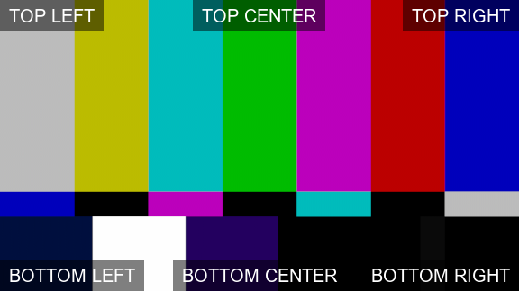

## Global

### publish.json

Each plugin in the json should be added as name of the class. There are some default attributes recommended to use in case you wish a plugin to be switched off for some projects in `project overwrites` like `enabled: false`. So for example if you wish to switch off plugin class name `PluginName(pyblish.api.contextPlugin)` if file `name_of_plugin_file.py`, it could be done only by adding following text into root level of publish.json file:

```json
{
    "PluginName": {
        "enabled": false
    }
}
```


### `ExtractReview`

Plugin responsible for automatic FFmpeg conversion to variety of formats.

Supported extensions for both input and output: `["exr", "jpg", "jpeg", "png", "dpx", "mov", "mp4"]`

**ExtractReview** creates new representations based on presets and representations in instance. Preset should contain only one attribute **"profiles"** which is list of profile items. Each profile item has **outputs**, where definitions of possible outputs are, and may have specified filters for **hosts**, **tasks** and **families**.

#### Profile filters
As mentioned above you can define multiple profiles for different contexts. Profile with filters matching current context the most is used. You can define profile without filters and use it as **default**. Only **one or none** profile is processed per instance.

All context filters are lists which may contain strings or Regular expressions (RegEx).
- **hosts** - Host from which publishing was triggered. `["maya", "nuke"]`
- **tasks** - Currently processed task. `["[Cc]ompositing", "[Aa]nimation"]`
- **families** - Main family of processed instance. `["plate", "model"]`

:::important Filtering
Filters are optional and may not be set. In case when multiple profiles match current context, profile with filters has higher priority that profile without filters.
:::

#### Profile outputs
Profile may have multiple outputs from one input and that's why **outputs** is dictionary where key represents **filename suffix** to avoid overriding files with same name and value represents definition itself. Definition may contain multiple optional keys.

| Key | Description | Type | Example |
| --- | --- | --- | --- |
| **width** | Width of output. | int | 1920 |
| **height** | Height of output. | int | 1080 |
| **letter_box** | Set letterbox ratio. | float | 2.35 |
| **ext** | Extension of output file(s). | str | "mov" |
| **tags** | Tags added to new representation. | list | [here](#new-representation-tags-tags) |
| **ffmpeg_args** | Additional FFmpeg arguments. | dict | [here](#ffmpeg-arguments-ffmpeg_args) |
| **filter** | Filters definition. | dict | [here](#output-filters-filter) |

:::note
As mentioned above **all keys are optional**. If they are not filled at all, then **"ext"** is filled with input's file extension and resolution keys **"width"** and **"height"** are filled from instance data, or from input resolution if instance doesn't have set them.
:::

:::important resolution
It is not possible to enter only **"width"** or only **"height"**. In that case set values will be skipped.
:::

#### New representation tags (`tags`)
You can add tags to representation created during extracting process. This might help to define what should happen with representation in upcoming plugins.

| Tag | Description |
| --- | --- |
| **burnin** | Add burnins with predefined values into the output. |
| **preview** | Will be used as preview in Ftrack. |
| **reformat** | Rescale to format based on width and height keys. |
| **bake-lut** | Bake LUT into the output (if is available path in data). |
| **slate-frame** | Add slate frame at the beginning of video. |
| **no-handles** | Remove the shot handles from the output. |
| **sequence** | Generate a sequence of images instead of single frame.<br />Is applied only if **"ext"** of output is image extension e.g.: png or jpg/jpeg. |

:::important Example
Tags key must contain list of strings.
```json
{
    "tags": ["burnin", "preview"]
    ...
}
```
:::

#### FFmpeg arguments (`ffmpeg_args`)
It is possible to set additional FFmpeg arguments. Arguments are split into 4 categories **"input"**, **"video_filters"**, **"audio_filters"** and **"output"**.

| Key | Description | Type | Example |
| --- | --- | --- | --- |
| **input** | FFmpeg arguments added before video/image input. | list | ["-gamma 2.2"] |
| **video_filters** | All values which should be in `-vf` or `-filter:v` argument. | list | ["scale=iw/2:-1"] |
| **audio_filters** | All values which should be in `-af` or `-filter:a` argument. | list | ["loudnorm"] |
| **output** | FFmpeg arguments added before output filepath. | list | ["-pix_fmt yuv420p", "-crf 18"] |

:::important Example
For more information about FFmpeg arguments please visit [official documentation](https://ffmpeg.org/documentation.html).
```json
{
    "ffmpeg_args": {
        "input": ["-gamma 2.2"],
        "video_filters": ["yadif=0:0:0", "scale=iw/2:-1"],
        "output": ["-pix_fmt yuv420p", "-crf 18"]
    }
    ...
}
```
:::

#### Output filters (`filter`)
Even if profile has filtering options it is possible that output definitions require to be filtered by all instance **families** or representation's **tags**.

Families filters in output's `filter` will check all instance's families and may check for single family or combination of families.

| Key | Description | Type | Example |
| --- | --- | --- | --- |
| **families** | At least one family item must match instance's families to process definition. | list | ["review"] |
| **tags** | At least one tag from list must be in representation's tags to process definition. | list | ["preview"] |

:::important Example
These filters helps with explicit processing but do **NOT** use them if it's not necessary.
```json
{
    "filter": {
        "families": [
            "review",
            ["ftrack", "render2d"]
        ],
        "tags": ["preview"],
    }
    ...
}
```
In this example representation's tags must contain **"preview"** tag and instance's families must contain **"review"** family, or both **"ftrack"** and **"render2d"** families.
:::

#### Simple example
This example just create **mov** output with filename suffix **"simplemov"** for all representations with supported extensions.
```json
{
    "ExtractReview": {
        "profiles": [{
            "outputs": {
                /* Filename suffix "simplemov"*/
                "simplemov": {
                    /* Output extension will be "mov"*/
                    "ext": "mov"
                }
            }
        }]
    }
}
```

#### More complex example
:::note
This is just usage example, without relevant data. Do **NOT** use these presets as default in production.
:::

```json
{
    "ExtractReview": {
        "profiles": [
            {
                /* 1. profile - Without filters will be used as default. */
                "outputs": {
                    /* Extract single mov Prores 422 with burnins, slate and baked lut. */
                    "prores": {
                        "ext": "mov",
                        "codec": [
                            "-codec:v prores_ks",
                            "-profile:v 3"
                        ],
                        "tags": ["burnin", "reformat", "bake-lut", "slate-frame"]
                    }
                }
            }, {
                /* 2. profile - Only for Nuke, "compositing" task and instance family "render2d". */
                "hosts": ["nuke"],
                "tasks": ["compositing"],
                "families": ["render2d"],
                "outputs": {
                    /* Extract preview mov with burnins and without handles.*/
                    "h264": {
                        "ext": "mov",
                        "ffmpeg_args": {
                            "output": [
                                "-pix_fmt yuv420p",
                            ]
                        },
                        "tags": ["burnin", "preview", "no-handles"]
                    },
                    /* Also extract mxf with slate */
                    "edit": {
                        "ext": "mxf",
                        "ffmpeg_args": {
                            "output": [
                                "-codec:v dnxhd",
                                "-profile:v dnxhr_444",
                                "-pix_fmt yuv444p10le",
                                "-b:v 185M",
                                "-ar 48000",
                                "-qmax 51"
                            ]
                        },
                        "tags": ["slate-frame"]
                    }
                }
            }, {
                /* 3. profile - Default profile for Nuke and Maya. */
                "hosts": ["maya", "nuke"],
                "outputs": {
                    /* Extract preview mov with burnins and with forced resolution. */
                    "h264": {
                        "width": 1920,
                        "height": 1080,
                        "ext": "mov",
                        "ffmpeg_args": {
                            "input": [
                                "-gamma 2.2"
                            ],
                            "output": [
                                "-pix_fmt yuv420p",
                                "-crf 18",
                                "-intra"
                            ]
                        },
                        "tags": ["burnin", "preview"]
                    }
                }
            }
        ]
    }
}
```


### `ExtractBurnin`

Plugin is responsible for adding burnins into review representations.

Burnins are text values painted on top of input and may be surrounded with box in 6 available positions `Top Left`, `Top Center`, `Top Right`, `Bottom Left`, `Bottom Center`, `Bottom Right`.



ExtractBurnin creates new representations based on plugin presets and representations in instance. Presets may contain 3 keys **options**, **profiles** and **fields**.

#### Burnin settings (`options`)
Options is dictionary where you can set the global appearance of burnins. It is possible to not fill options at all, in that case default values are used.

| Key | Description | Type | Example | Default |
| --- | --- | --- | --- | --- |
| **font_size** | Size of text. | float | 24 | 42 |
| **font_color** | Color of text. | str | [FFmpeg color documentation](https://ffmpeg.org/ffmpeg-utils.html#color-syntax) | "white" |
| **opacity** | Opacity of text. | float | 0.7 | 1 |
| **x_offset** | Horizontal margin around text and box. | int | 0 | 5 |
| **y_offset** | Vertical margin around text and box. | int | 0 | 5 |
| **bg_padding** | Padding for box around text. | int | 0 | 5 |
| **bg_color** | Color of box around text. | str | [FFmpeg color documentation](https://ffmpeg.org/ffmpeg-utils.html#color-syntax) | "black" |
| **bg_opacity** | Opacity of box around text. | float | 1 | 0.5 |

#### Burnin profiles (`profiles`)
Plugin process is skipped if `profiles` are not set at all. Profiles contain list of profile items. Each profile item has **burnins**, where definitions of possible burnins are, and may have specified filters for **hosts**, **tasks** and **families**. Filters work the same way as described in [ExtractReview](#profile-filters).

#### Profile burnins
Profile may have set multiple burnin outputs from one input and that's why **burnins** is dictionary where key represents **filename suffix** to avoid overriding files with same name and value represents burnin definition. Burnin definition may contain multiple optional keys.

| Key | Description | Type | Example |
| --- | --- | --- | --- |
| **top_left** | Top left corner content. | str | "{dd}.{mm}.{yyyy}" |
| **top_centered** | Top center content. | str | "v{version:0>3}" |
| **top_right** | Top right corner content. | str | "Static text" |
| **bottom_left** | Bottom left corner content. | str | "{asset}" |
| **bottom_centered** | Bottom center content. | str | "{username}" |
| **bottom_right** | Bottom right corner content. | str | "{frame_start}-{current_frame}-{frame_end}" |
| **options** | Options overrides for this burnin definition. | dict | [Options](#burnin-settings-options) |
| **filter** | Filters definition. | dict | [ExtractReview output filter](#output-filters-filter) |

:::important Position keys
Any position key `top_left` -> `bottom_right` is skipped if is not set, contain empty string or is set to `null`.
And position keys are not case sensitive so instead of key `top_left` can be used `TOP_LEFT` or `Top_Left`
:::

:::note Filename suffix
Filename suffix is appended to filename suffix of source representation.
If source representation has suffix **"h264"** and burnin suffix is **"client"** then final suffix is **"h264_client"**.
:::

**Available keys in burnin content**

- It is possible to use same keys as in [Anatomy](admin_config#available-keys).

- It is allowed to use [Anatomy templates](admin_config#anatomy) themselves in burnins if they can be filled with available data.

- Additional keys in burnins:
  | Burnin key | Description |
  | --- | --- |
  | frame_start | First frame number. |
  | frame_end | Last frame number. |
  | current_frame | Frame number for each frame. |
  | duration | Count number of frames. |
  | resolution_width | Resolution width. |
  | resolution_height | Resolution height. |
  | fps | Fps of an output. |
  | timecode | Timecode by frame start and fps. |

:::warning
`timecode` is specific key that can be **only at the end of content**. (`"BOTTOM_RIGHT": "TC: {timecode}"`)
:::

```json
{
    "profiles": [{
        "burnins": {
            "example": {
                "TOP_LEFT": "{dd}.{mm}.{yyyy}",
                /* Use anatomy template values. */
                "TOP_CENTERED": "{anatomy[publish][path]}",
                /* Python's formatting:
                ":0>3" adds padding to version number to have 3 digits. */
                "TOP_RIGHT": "v{version:0>3}",
                "BOTTOM_LEFT": "{frame_start}-{current_frame}-{frame_end}",
                "BOTTOM_CENTERED": "{asset}",
                "BOTTOM_RIGHT": "{username}"
            }
        }
    }]
    ...
}
```


#### Default content values (`fields`)
If you want to set position content values for all or most of burnin definitions, you can set them in **"fields"**. They will be added to every burnin definition in all profiles. Value can be overridden if same position key is filled in burnin definition.

```json
{
    "fields": {
        "TOP_LEFT": "{yy}-{mm}-{dd}",
        "TOP_CENTERED": "{username}",
        "TOP_RIGHT": "v{version:0>3}"
    },
    "profiles": [{
        "burnins": {
            /* example1 has empty definition but top left, center and right values
            will be filled. */
            "example1": {},

            /* example2 has 2 overrides. */
            "example2": {
                /* Top left value is overridden with asset name. */
                "TOP_LEFT": "{asset}",
                /* Top center will be skipped. */
                "TOP_CENTERED": null
            }
        }
    }]
}
```

#### Full presets example
:::note
This is just usage example, without relevant data. Do **NOT** use these presets as default in production.
:::

```json
{
    "ExtractBurnin": {
        "options": {
            "opacity": 1,
            "x_offset": 5,
            "y_offset": 5,
            "bg_padding": 5,
            "bg_opacity": 0.5,
            "font_size": 42
        },
        "fields": {
            "TOP_LEFT": "{yy}-{mm}-{dd}",
            "TOP_RIGHT": "v{version:0>3}"
        },
        "profiles": [{
            "burnins": {
                "burnin": {
                    "options": {
                        "opacity": 1
                    },
                    "TOP_LEFT": "{username}"
                }
           }
        }, {
            "families": ["animation", "pointcache", "model"],
            "tasks": ["animation"],
            "burnins": {}
        }, {
            "families": ["render"],
            "tasks": ["compositing"],
            "burnins": {
                "burnin": {
                    "TOP_LEFT": "{yy}-{mm}-{dd}",
                    "TOP_RIGHT": "v{version:0>3}",
                    "BOTTOM_RIGHT": "{frame_start}-{current_frame}-{frame_end}",
                    "BOTTOM_LEFT": "{username}"
                },
                "burnin_ftrack": {
                    "filter": {
                        "families": ["ftrack"]
                    },
                    "BOTTOM_RIGHT": "{frame_start}-{current_frame}-{frame_end}",
                    "BOTTOM_LEFT": "{username}"
                },
                "burnin_v2": {
                    "options": {
                        "opacity": 0.5
                    },
                    "TOP_LEFT": "{yy}-{mm}-{dd}",
                    "TOP_RIGHT": "v{version:0>3}"
                }
            }
        }, {
            "families": ["rendersetup"],
            "burnins": {
                "burnin": {
                    "TOP_LEFT": "{yy}-{mm}-{dd}",
                    "BOTTOM_LEFT": "{username}"
                }
            }
        }, {
            "tasks": ["animation"],
            "burnins": {
                "burnin": {
                    "TOP_RIGHT": "v{version:0>3}",
                    "BOTTOM_RIGHT": "{frame_start}-{current_frame}-{frame_end}"
                }
            }
        }]
    }
}
```

### `ProcessSubmittedJobOnFarm`

```json
{
    "ProcessSubmittedJobOnFarm": {
        "aov_filter": {
            "host": ["aov_name"],
            "maya": ["beauty"]
        },
        "deadline_pool": ""
    }
}
```

## Maya

### load.json

### `colors`

maya outliner colours for various families

```python
"colors": {
  "model": [0.821, 0.518, 0.117],
  "rig": [0.144, 0.443, 0.463],
  "pointcache": [0.368, 0.821, 0.117],
  "animation": [0.368, 0.821, 0.117],
  "ass": [1.0, 0.332, 0.312],
  "camera": [0.447, 0.312, 1.0],
  "fbx": [1.0, 0.931, 0.312],
  "mayaAscii": [0.312, 1.0, 0.747],
  "mayaScene": [0.312, 1.0, 0.747],
  "setdress": [0.312, 1.0, 0.747],
  "layout": [0.312, 1.0, 0.747],
  "vdbcache": [0.312, 1.0, 0.428],
  "vrayproxy": [0.258, 0.95, 0.541],
  "yeticache": [0.2, 0.8, 0.3],
  "yetiRig": [0, 0.8, 0.5]
}
```

### publish.json

### `ValidateModelName`

```python
"ValidateModelName": {
    "enabled": false,
    "material_file": "/path/to/shader_name_definition.txt",
    "regex": "(.*)_(\\d)*_(?P<shader>.*)_(GEO)"
},
```

### `ValidateShaderName`

```python
"ValidateShaderName": {
    "enabled": false,
    "regex": "(?P<asset>.*)_(.*)_SHD"
}
```

## Nuke

### create.json

### `CreateWriteRender`

```python
"CreateWriteRender": {
    "fpath_template": "{work}/renders/nuke/{subset}/{subset}.{frame}.{ext}"
}
```

### publish.json

### `ExtractThumbnail`

Plugin responsible for generating thumbnails with colorspace controlled by Nuke. Reformat node will secure proper framing within the default workfile screen space.

```json
{
"nodes": {
    "Reformat": [
        ["type", "to format"],
        ["format", "HD_1080"],
        ["filter", "Lanczos6"],
        ["black_outside", true],
        ["pbb", false]
    ]
}
}
```

### `ExtractReviewDataMov`

`viewer_lut_raw` **true** will publish the baked mov file without any colorspace conversion. It will be baked with the workfile workspace. This can happen in case the Viewer input process uses baked screen space luts.

#### baking with controlled colorspace

Some productions might be using custom OCIO config files either for whole project, sequence or even individual shots. In that case we can use **display roles** to let compositors use their preferred viewer space, but also make sure baking of outputs is happening in a defined space for clients reviews.


`bake_colorspace_fallback` this will be used if for some reason no space defined in `shot_grade_rec709` is found on shot's _config.ocio_

> be aware this will only work if `viewer_lut_raw` is on _false_

```json
{
"viewer_lut_raw": false,
"bake_colorspace_fallback": "show_lut_rec709",
"bake_colorspace_main": "shot_grade_rec709"
}
```

## NukeStudio

### Publish.json

Destination of the following example codes:

[`presets/plugins/nukestudio/publish.json`](https://github.com/pypeclub/pype-config/blob/develop/presets/plugins/nukestudio/publish.json)

### `CollectInstanceVersion`

Activate this plugin if you want your published plates to always have the same version as the hiero project they were published from. If this plugin is off, plate versioning automatically finds the next available version in the database.

```json
{
    "CollectInstanceVersion": {
        "enabled": true
    }
}
```

### `ExtractReviewCutUpVideo`

Example of tag which could be added into the plugin preset.
In this case because we might have 4K plates but we would like to publish all review files reformated to 2K.

[details of available tags](#preset-attributes)

```json
{
    "ExtractReviewCutUpVideo": {
        "tags_addition": ["reformat"]
    }
}
```

## Standalone Publisher

Documentation yet to come.
